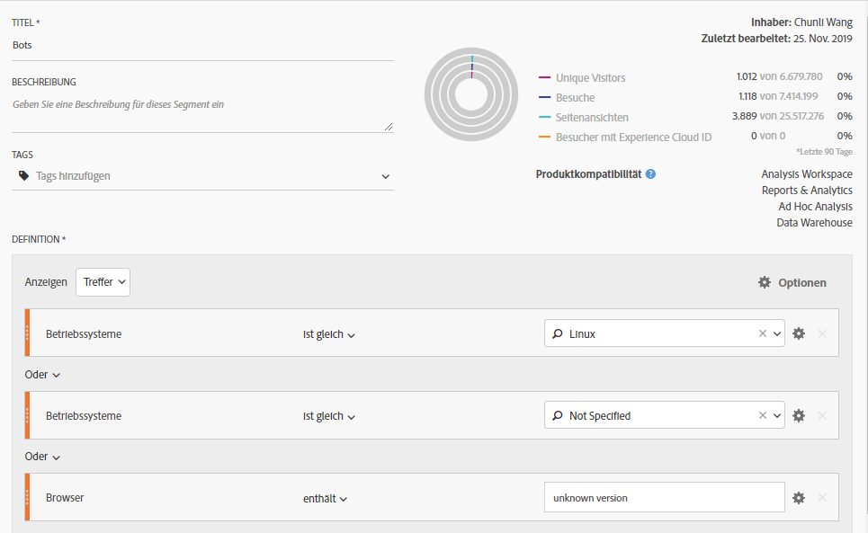
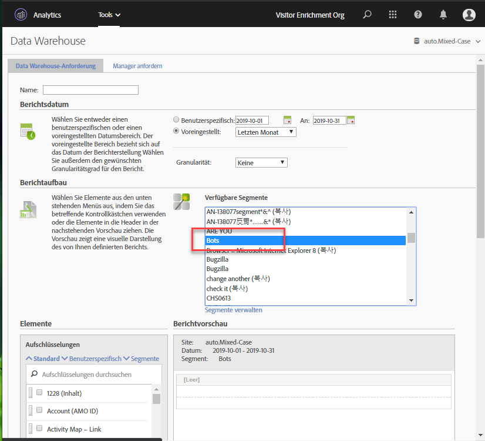
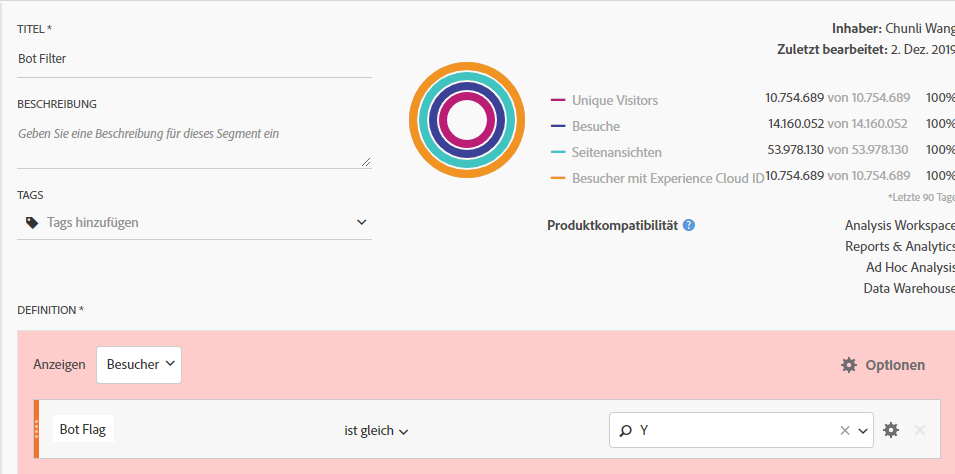
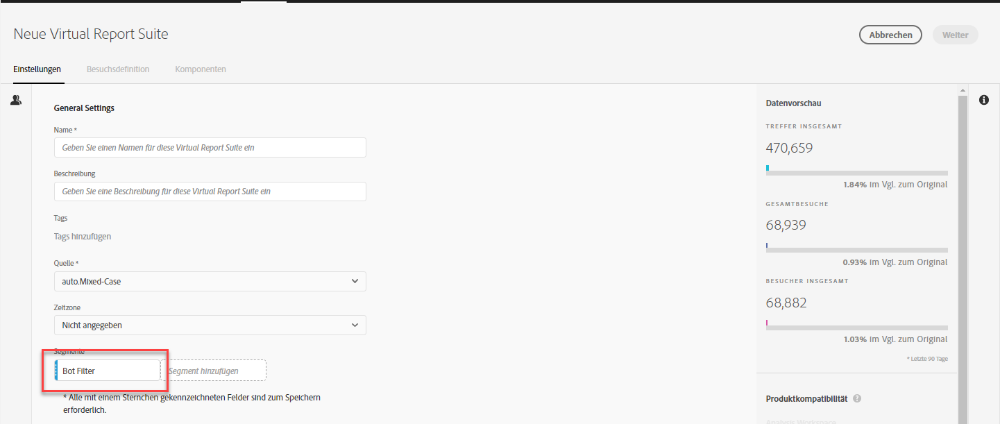

# Entfernen von Bots in Adobe Analytics

In Adobe Analytics stehen Ihnen mehrere Optionen zur Verfügung, um den Bot-Traffic aus der Berichterstellung zu entfernen:

## Verwenden von Bot-Regeln

Sowohl Standard- als auch benutzerdefinierte Bot-Filtermethoden werden in **[!UICONTROL Analytics]** > **[!UICONTROL Admin]** > **[!UICONTROL Report Suites]** > **[!UICONTROL Einstellungen bearbeiten]** > **[!UICONTROL Allgemein]** > **[!UICONTROL Bot-Regeln]** unterstützt:

| Regeltyp | Beschreibung |
|--- |--- |
| Standard-IAB-Bot-Regeln | Wenn Sie **[!UICONTROL IAB Bot-Filterungsregeln aktivieren]** auswählen, wird die Liste „International Spiders &amp; Bots List“ von [IAB](https://www.iab.com/) (International Advertising Bureau) verwendet, um Bot-Traffic zu entfernen. Die meisten Kunden wählen mindestens diese Option aus. |
| Benutzerdefinierte Bot-Regeln | Sie können benutzerdefinierte Bot-Regeln festlegen und hinzufügen, die auf Benutzeragenten, IP-Adressen oder IP-Bereichen basieren. |

Weitere Informationen finden Sie unter [Übersicht über Bot-Regeln](/help/admin/admin/bot-removal/bot-rules.md).

## Verwenden Sie das [!UICONTROL websiteBot]-Plugin, um Bots zu identifizieren.

Mit dem Plugin websiteBot können Sie dynamisch erkennen, ob Desktop-Besucher Bots sind. Mithilfe dieser Daten können Sie eine höhere Genauigkeit bei allen Arten von Berichten erzielen. Dadurch verfügen Sie über eine bessere Möglichkeit, legitimen Sitetraffic zu messen.

Dieses Plug-in führt zwei Prüfungen durch:

* Zunächst wird anhand der Variablen &quot;navigator.UserAgent&quot;ermittelt, ob es sich bei dem Gerät um einen Desktop oder ein Mobilgerät handelt. Smartphones und Tablets werden ignoriert.
* Wenn es sich um ein Desktop-Gerät handelt, wird ein Ereignis-Listener für Mausbewegungen hinzugefügt.

Weitere Informationen finden Sie im [Adobe Analytics Implementierungshandbuch](https://experienceleague.adobe.com/docs/analytics/implementation/vars/plugins/websitebot.html).

## Verwenden einer Kombination aus Adobe-Tools

Da Bots sich schnell wandeln, bietet Adobe außerdem mehrere leistungsstarke Funktionen, die, wenn sie richtig und regelmäßig kombiniert werden, dazu beitragen können, diese Feinde der Datenqualität zu beseitigen. Diese Funktionen sind: Experience Cloud ID-Dienst, Segmentierung, Data Warehouse, Kundenattribute und Virtual Report Suites. Im Folgenden finden Sie eine Übersicht darüber, wie Sie diese Tools nutzen können.

### Schritt 1: Experience Cloud ID Ihrer Besucher in eine neue deklarierte ID übertragen

Zu Beginn sollten Sie eine neue deklarierte ID im [People Core Service](https://docs.adobe.com/content/help/de-DE/core-services/interface/audiences/audience-library.html) erstellen. Sie müssen die Experience Cloud ID Ihres Besuchers in diese neue deklarierte ID übertragen. Verwenden Sie [Adobe Experience Platform Launch](https://docs.adobe.com/content/help/en/launch/using/implement/solutions/idservice-save.html), um dies schnell und einfach auszuführen. Verwenden wir den Namen „ECID“ für die deklarierte ID.


Hier erfahren Sie, wie Sie diese ID über das Datenelement erfassen können. Achten Sie darauf, Ihre Experience Cloud-Organisations-ID korrekt in das Datenelement einzutragen.

```return Visitor.getInstance("REPLACE_WITH_YOUR_ECORG_ID@AdobeOrg").getExperienceCloudVisitorID();```

Nachdem dieses Datenelement eingerichtet wurde, befolgen Sie [diese Anweisungen](https://docs.adobe.com/content/help/en/launch/using/implement/solutions/idservice-save.html), um deklarierte IDs in das ECID-Tool in Launch zu übertragen.

### Schritt 2: Segmentierung verwenden, um Bots zu identifizieren

Nachdem die ECID Ihres Besuchers in eine deklarierte ID übertragen wurde, können Sie die [Segmentierung in Analysis Workspace](https://docs.adobe.com/content/help/de-DE/analytics/analyze/analysis-workspace/components/t-freeform-project-segment.html) verwenden, um Besucher zu identifizieren, die sich wie Bots verhalten. Bots werden oft durch ihr Verhalten definiert: Besuche mit Einzelzugriff, ungewöhnliche Benutzeragenten, unbekannte Geräte-/Browser-Informationen, keine verweisenden Stellen, neue Besucher, ungewöhnliche Landingpages usw. Verwenden Sie die Möglichkeiten von Drilldowns und Segmentierung in Workspace, um die Bots zu identifizieren, die der IAB-Filterung und den Bot-Regeln Ihrer Report Suite entgangen sind. Hier ist zum Beispiel ein Screenshot eines Segments, das Sie verwenden könnten:



### Schritt 3: Alle [!DNL Experience Cloud IDs] aus dem Segment über Data Warehouse exportieren

Nachdem Sie die Bots anhand von Segmenten identifiziert haben, ist der nächste Schritt die Nutzung von Data Warehouse, um alle mit diesem Segment verbundenen Experience Cloud IDs zu extrahieren. Richten Sie Ihre [Data Warehouse](https://docs.adobe.com/content/help/de-DE/analytics/export/data-warehouse/data-warehouse.html)-Anforderung wie folgt ein:



Denken Sie daran, die Experience Cloud-Besucher-ID als Dimension zu verwenden und das Bots-Segment anzuwenden.

### Schritt 4: Diese Liste als Kundenattribut an Adobe zurückgeben

Sobald der Data Warehouse-Bericht eintrifft, verfügen Sie über eine Liste der ECIDs, die aus historischen Daten gefiltert werden müssen. Kopieren Sie diese ECIDs und fügen Sie sie in eine leere .CSV-Datei mit nur zwei Spalten, „ECID“ und „Bot Flag“, ein.

* **ECID**: Stellen Sie sicher, dass diese Spaltenüberschrift mit dem Namen übereinstimmt, den Sie für die neue deklarierte ID oben angegeben haben.
* **Bot Flag**: Fügen Sie diese als Schema-Dimension für Kundenattribute hinzu.

Verwenden Sie diese .CSV-Datei als Importdatei für Kundenattribute und melden Sie dann Ihre Report Suites für das Kundenattribut an, wie in diesem [Blogpost](https://theblog.adobe.com/link-digital-behavior-customers) beschrieben.


### Schritt 5: Segment erstellen, das das neue Kundenattribut nutzt

Nachdem Ihr Datensatz verarbeitet und in Analysis Workspace integriert wurde, erstellen Sie ein weiteres Segment, das Ihre neue Kundenattributdimension „Bot Flag“ und einen [!UICONTROL Ausschließen]-Container nutzt:



### Schritt 6: Dieses Segment als Virtual Report Suite-Filter verwenden

Schließlich sollten Sie eine [Virtual Report Suite](/help/components/vrs/vrs-about.md) erstellen, die dieses Segment nutzt, um die identifizierten Bots auszufiltern:



Diese neu segmentierte Virtual Report Suite führt nun zu einem deutlich saubereren Datensatz, wobei die identifizierten Bots vollständig entfernt werden.

### Schritt 7: Schritte 2, 3 und 4 regelmäßig wiederholen

Legen Sie mindestens eine monatliche Erinnerung fest, um neue Bots zu identifizieren und zu filtern, vielleicht vor der regelmäßig geplanten Analyse.
