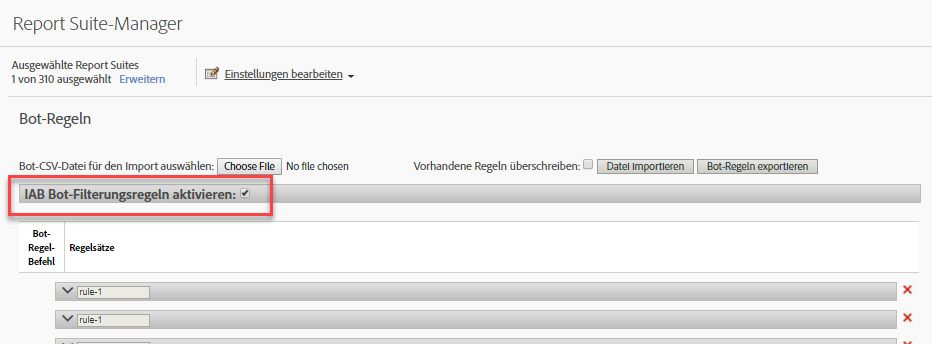

# Übersicht über Bot-Regeln

Mit Bot-Regeln können Sie Traffic aus Ihrer Report Suite entfernen, der von bekannten Spiders und Bots generiert wird. Mit der Entfernung von Bot-Traffic erhalten Sie eine präzisere Messung der Benutzeraktivität auf Ihrer Website.

Nach der Definition von Bot Rules wird aller eingehender Traffic mit den definierten Regeln abgeglichen. Traffic, der mit einer dieser Regeln übereinstimmt, wird nicht in der Report Suite erfasst und nicht in Traffic-Metriken berücksichtigt.

To update or upload bot rules, navigate to **[!UICONTROL Analytics]** &gt; **[!UICONTROL Admin]** &gt; **[!UICONTROL Report Suites]**. Select the correct Report Suite, and then go to **[!UICONTROL Edit Settings]** &gt; **[!UICONTROL General]** &gt; **[!UICONTROL Bot Rules]**.

Mit der Entfernung von Bot-Traffic werden das Traffic-Volumen und die Konversionsmetriken vermindert. Viele Kunden haben die Erfahrung gemacht, dass die Entfernung von Bot-Traffic zu höheren Konversionsraten und Anstiegen in anderen Usability-Metriken führt. Bevor Sie den Bot-Traffic entfernen, machen Sie Stakeholder darauf aufmerksam, damit diese die im Zuge der Änderung notwendigen Anpassungen an wichtige Kennzahlen vornehmen können. Wenn möglich, empfehlen wir, zunächst den Bot-Traffic aus einer kleinen Report Suite zu entfernen, um die potenziellen Auswirkungen abschätzen zu können.

Bot-Traffic-Daten werden in einem separaten Repository zur Anzeige der Berichte, Bots und Bot Pages gespeichert. Es gibt zwei Optionen zum Aktivieren der Bot-Filterung:

| Regeltyp | Beschreibung |
|--- |--- |
| Standardmäßige IAB-Bot-Regeln | Durch Auswahl von [!UICONTROL Aktivieren von IAB Bot Filterregeln] wird die internationale Spiders &amp; Bots-Liste [von IAB](https://www.iab.com) (International Advertising Bureau) verwendet, um Bot-Traffic zu entfernen. Die meisten Kunden wählen diese Option mindestens aus. |
| Benutzerspezifische Bot-Regeln | Sie können benutzerspezifische Bot-Regeln basierend auf Benutzeragenten, IP-Adressen oder IP-Bereichen definieren und hinzufügen. |

## Standardmäßige IAB-Bot-Regeln

Standardmäßige IAB-Bot-Regeln können aktiviert werden, indem das Kontrollkästchen [!UICONTROL IAB Bot Filtergewichtungsregeln] aktivieren aktiviert wird. Diese Auswahl entfernt Bots in der Internationalen Spiders und Bots (International Advertising Bureau) von IAB, um Bot-Traffic zu entfernen. Das IAB aktualisiert diese Liste monatlich.



Adobe kann Kunden leider keine detaillierte IAB-Bot-Liste zur Verfügung stellen. Sie können aber den Bots Report nutzen, um eine Liste der Bots zu sehen, die auf Ihre Website zugegriffen haben. Um einen Bot an die IAB-Liste zu senden, besuchen Sie [IAB](https://www.iab.com).

## Benutzerspezifische Bot-Regeln

>[!Note]
>In der Benutzeroberfläche können 500 Regeln manuell definiert werden. Wenn diese Grenze erreicht wurde, müssen Regeln über die Optionen „Datei importieren“ und „Bot-Regeln exportieren“ stapelweise verwaltet werden.

Mit benutzerspezifischen Bot-Regeln können Sie Traffic auf Grundlage selbst definierter Bedingungen filtern.

Benutzerspezifische Bot-Regeln werden mithilfe der folgenden Bedingungstypen definiert:

* Benutzeragent
* IP-Adresse
* IP-Bereich

Für eine einzige Regel können mehrere Bedingungen definiert werden. Mehrere Bedingungen werden mithilfe des „oder“-Befehls zugewiesen. Wenn Sie beispielsweise einen Wert für Benutzeragent und IP-Adresse bereitstellen, wird der Traffic als Bot-Traffic gewertet, wenn eine dieser beiden Bedingungen erfüllt ist.

### Benutzeragent

Eine Benutzeragent-Bedingung prüft den Benutzeragentenwert, um zu sehen, ob dieser mit der angegebenen Zeichenfolge **[!UICONTROL beginnt]** oder diese **enthält[!UICONTROL .]** Wenn **[!UICONTROL enthält]ausgewählt wurde, wird die Unter-Zeichenfolge zugewiesen, wenn sie an einer beliebigen Stelle im Benutzeragenten auftaucht.**

Optionale Werte können in die Liste **[!UICONTROL enthält nicht]aufgenommen werden, um Werte zu definieren, die der Benutzeragent für eine erfolgreiche Übereinstimmung nicht enthalten darf.** Sie können mehrere Werte spezifizieren, indem Sie einen Wert pro Zeile aufnehmen. Wenn der Benutzeragent die in der Übereinstimmungszeichenfolge spezifizierten Kriterien erfüllt, aber auch eine Zeichenfolge enthält, die auf der „enthält nicht“-Liste steht, wird er nicht als Übereinstimmung gewertet.

**[!UICONTROL Das „enthält“-Feld ist auf 100 Zeichen begrenzt.]** Die „enthält nicht“-Liste ist auf 255 Zeichen abzüglich eines Trennzeichens für jede neue Zeile begrenzt. (Dies entspricht der Anzahl der Zeichenfolgen – 1. Wenn Sie vier *enthält nicht*-Zeichenfolgen spezifizieren, werden drei Trennzeichen benötigt.) Bei allen Zeichenfolgen-Übereinstimmungen wird zwischen Groß- und Kleinschreibung unterschieden.

### IP-Adresse (inklusive Wildcard-Übereinstimmungen)

Weist eine oder mehrere IP-Adressen im selben Block mithilfe von Wildcards (*) zu. Geben Sie die numerischen Werte der IP-Adresse an, für die Sie eine Übereinstimmung suchen. Ersetzen Sie die Werte, für die Sie eine Wildcard-Übereinstimmung suchen, durch ein Sternchen (*). Die folgende Liste enthält Beispiele der IP-Adressen-Übereinstimmungszeichenfolge:

```
10.10.10.1
10.10.10.*
```

### IP-Adressbereich

Geben Sie die Start- und Endbereiche der zuzuweisenden IP-Adressen an. Ersetzen Sie die Werte, für die Sie eine Wildcard-Übereinstimmung suchen, durch ein Sternchen (*).

### Definieren einer benutzerspezifischen Bot-Regel

1. Go to **[!UICONTROL Analytics]** &gt; **[!UICONTROL Admin]**, select one or more report suites and click **[!UICONTROL General]** &gt; **[!UICONTROL Bot Rules]**.
1. Click **[!UICONTROL Add Rule]** and define one or more match conditions.
1. Klicken Sie auf **[!UICONTROL Speichern]**. Die Änderung sollte binnen 30 Minuten in Kraft treten.

## Hochladen von Bot-Regeln

Für einen Massenimport von Bot-Regeln können Sie eine CSV-Datei hochladen, in der die Regeln definiert sind.

Erstellen Sie eine CSV-Datei mit den folgenden Spalten in der angezeigten Reihenfolge:

| Spalte 1 | Spalte 2 | Spalte 3 | Spalte 4 | Spalte 5 |
|--- |--- |---|---|---|
| Bot-Name | IP-Start | IP-Ende | Agent Match Rule<br>(contains or starts with)</br> | Agent Exclude (<br>Max. 255 Zeichen)</br> |

Sie können drei Arten von Bot-Regeln definieren:

* Benutzeragent enthält oder beginnt mit
* Einzelne IP-Adresse oder Wildcard-Übereinstimmung
* IP-Bereichsübereinstimmung

Jede Zeile in der Importdatei kann nur eine der folgenden Bot-Definitionen enthalten:

* **Benutzeragent enthält oder beginnt mit:** Geben Sie eine einzige Benutzeragent-Zeichenfolge zur Übereinstimmung in der Spalte „Agent einschließlich“ ein. Legen Sie den gewünschten Übereinstimmungstyp fest, indem Sie im Feld zur Agent-Übereinstimmungsregel den Vermerk *enthält* oder *beginnt mit* platzieren. An optional value can be included in the Agent Exclude column that defines one or more pipe-delimited ( `|` ) strings that the Agent does not contain. Bei Zeichenfolgen-Übereinstimmungen wird nicht zwischen Groß- und Kleinschreibung unterschieden. Sowohl die Spalte „IP-Start“ als auch „IP-Ende“ müssen leer sein.

* **Einzelne IP-Adresse oder Wildcard-Übereinstimmung**: Um eine einzelne IP-Adresse ( `10.10.10.1`) oder Wildcard-IP-Adresse ( `10.10.*.*`) zuzuordnen, müssen Sie denselben Wert sowohl in der Spalte IP-Start als auch in IP-Ende einfügen. „Übereinstimmungsregel“, „Agent einschließlich“ und „Agent ausschließlich“ müssen leer sein.

* **IP-Bereichs-Übereinstimmung**: Definieren Sie einen Bereich von IP-Adressen mithilfe der Spalten „IP-Start“ und „IP-Ende“. Wildcards can be used to match IP ranges, for example `10.10.10.*` to `10.10.20.*`. „Übereinstimmungsregel“, „Agent einschließlich“ und „Agent ausschließlich“ müssen leer sein.

### Mehrere mit ODER kombinierte Regeln

Um eine Übereinstimmung für einen Bot mithilfe einer ODER-Kombination aus Regeln zu finden (z. B. Benutzeragent ODER IP-Adresse), geben Sie einen identischen Namen für alle Regeln an, die Sie in dem Bot-Namensfeld kombinieren möchten. UND-Übereinstimmungen werden nicht unterstützt.

### Alle Regeln mit einer Upload-Datei überschreiben

Wählen Sie das Kontrollkästchen **[!UICONTROL Bestehende Regeln überschreiben]an, um alle bestehenden Regeln zu löschen und sie durch die in der Upload-Datei definierten Regeln zu ersetzen.**

### Exportregeln

Über die Schaltfläche **[!UICONTROL Hochgeladene Bot-Datei]werden alle in der Benutzeroberfläche definierten Regeln in einem CSV-Format exportiert.**


## Impact of bot rules on data collection {#section_F01A3130E7A04A9993371CF26F6586F2}

Bot-Regeln gelten für alle Analysedaten. Mithilfe von Bot-Regeln entfernte Daten sind nur in den Berichten „Bots“ und „Bots Pages“ sichtbar.

VISTA rules are applied after Bot Rules (see [Processing Order](../../../admin/admin/c-processing-rules/c-processing-rules-configuration/processing-rule-order.md#concept_8A6BBEA7F50C40C8A8D8755D4F579B1E)).

**Verarbeitung von Besuchen mit hoher Hit-Zahl:** Wenn mehr als 100 Hits in einem Besuch auftreten, wird bei der Berichterstellung ermittelt, ob der Zeitraum des Besuchs (in Sekunden) kleiner oder gleich der Anzahl der Hits bei diesem Besuch ist. In dieser Situation beginnt die Berichterstellung mit dem nächsten Besuch neu, da die Verarbeitung langer, intensiver Besuche hohe Kosten verursacht. Besuche mit hoher Hit-Zahl werden in der Regel durch Bot-Angriffe verursacht und gelten nicht als normales Browsen von Besuchern.

>[!NOTE]
>
>Treffer, die als *`bots`*[Serveraufrufe gekennzeichnet werden](https://docs.adobe.com/content/help/en/analytics/admin/server-call-usage/overage-overview.html).

## Impact of IP Obfuscation on bot filtering {#section_92E60B95BE8940D983F28C79E0CD6B12}

Die IAB-Bot-Liste basiert lediglich auf dem Benutzeragenten, so dass das Filtern auf der Basis dieser Liste nicht durch die IP-Verschleierungseinstellungen beeinträchtigt wird. Bei Nicht-IAB-Bot-Filterung (benutzerdefinierte Regeln) kann die IP Bestandteil der Filterkriterien sein. Beim Filtern von Bots mithilfe von IP erfolgt die Bot-Filterung nach Entfernung des letzten Oktetts, sofern diese Einstellung aktiviert ist, jedoch vor den anderen IP-Verschleierungseinstellungen wie z. B. dem Löschen der gesamten IP oder dem Austausch durch eine eindeutige ID.

Wenn die IP-Verschleierung aktiviert ist, wird der IP-Ausschluss durchgeführt, bevor die IP verschleiert wird. Kunden müssen also keine Änderungen vornehmen, wenn sie die IP-Verschleierung aktivieren.

Wenn das letzte Oktett entfernt wird, geschieht dies vor der IP-Filterung. Dabei wird das letzte Oktett mit „0“ ersetzt und die Regeln für den IP-Ausschluss sollten angepasst werden, um IP-Adressen mit einer Null am Ende zu berücksichtigen. Übereinstimmung * sollte mit 0 übereinstimmen.
