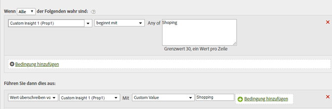

# Bereinigen von Werten in einem Bericht

Sie können Werte auf gängige Fehlschreibungen prüfen und eine Korrektur vornehmen, damit sie in Berichten richtig angezeigt werden.

Um nicht versehentlich gültige Werte zu verändern, verwenden Sie hierbei die restriktivste Option für Übereinstimmungen. Sie können einen Bericht zu einer Variablen ausführen („prop1“ im Beispiel unten) und eine Suche nach den zu ersetzenden Begriffen vornehmen, damit es keine ungewollten Übereinstimmungen gibt. Beim Vergleich von Zeichenfolgen wird die Groß- und Kleinschreibung ignoriert.

| Regelsatz | Wert |
|---|---|
| Bedingung | Falls „prop1“ mit dem Begriff „Shopping“ beginnt |
| Aktion | Wert von „prop1“ auf benutzerdefinierten Wert „Shopping“ überschreiben |

Beispiel:

