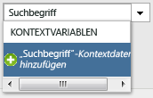
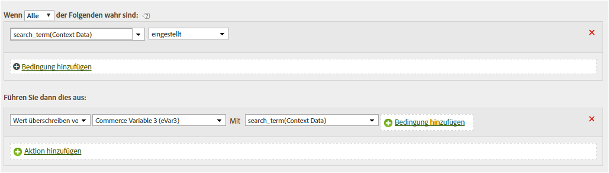
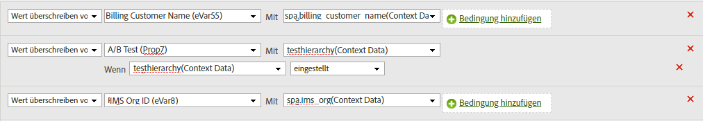

# Kopieren einer Kontextdatenvariable in eine eVar

Verarbeitungsregeln werden verwendet, um Werte von Kontextdatenvariablen in props und eVars zu verschieben. Ohne Verarbeitungsregeln sind Kontextdatenvariablen bedeutungslos und füllen keine Berichte in Analytics aus.

Die [!UICONTROL Kontextvariablenliste] enthält alle Variablen, die in den letzten 30 Tagen an die Report Suite gesendet wurden. Wenn Sie den Namen der Kontextdatenvariablen kennen, diese aber nicht an die aktuelle Report Suite gesendet haben, können Sie einen Wert hinzufügen, indem Sie den Variablennamen eingeben und auf **[!UICONTROL Kontextdaten für Variablennamen hinzufügen]** klicken:

Im folgenden Beispiel wird die Kontextdatenvariable `search_term` genommen und ihr Wert in `eVar3` gesetzt:

Das obige Beispiel funktioniert hervorragend, wenn nur wenige eVars gefüllt werden müssen. Wenn Ihre Organisation über Hunderte von Kontextdatenvariablen verfügt, die jeweils eine eigene eVar benötigen, können Sie bedingte Anweisungen verwenden. Dutzende bedingte Anweisungen können in eine einzige Verarbeitungsregel passen, sodass Ihre Organisation alle eVars in einer Report Suite füllen kann, ohne das Verarbeitungsregellimit von 150 Regeln zu verletzen.

Im folgenden Beispiel wird `prop7` mit der Kontextdatenvariablen `testhierarchy` gefüllt, jedoch nur, wenn `testhierarchy` festgelegt ist:

Weitere Informationen zur Implementierung von Kontextdatenvariablen finden Sie unter [Kontextdatenvariablen](/help/implement/vars/page-vars/contextdata.md) im Benutzerhandbuch zur Implementierung.
