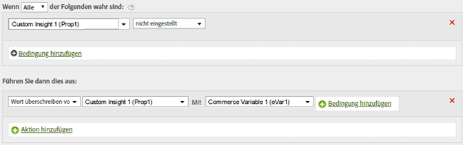

# Bestimmen eines Pfads durch Kopieren eines eVar-Werts in eine Eigenschaft

Sie können den Wert einer eVar-Variable in eine Prop kopieren, um die Pfadsetzung zu aktivieren.

Beim Festlegen von Werten erhält die Variable links den Wert der Variable rechts (auch wenn dieser Wert leer ist).

| Regelsatz | Wert |
|---|---|
| Bedingung | Keine (immer ausführen) |
| Aktion | Wert von Prop1 durch eVar1 überschreiben |

Sie können diese Regel zur Einstellung des Werts von Prop1 nur dann modifizieren, wenn sie nicht bereits einen Wert ähnlich dem Folgenden enthält:

| Regelsatz | Wert |
|---|---|
| Bedingung | Wenn Prop1 nicht eingestellt ist |
| Aktion | Wert von Prop1 durch eVar1 überschreiben |

Beispiel:

