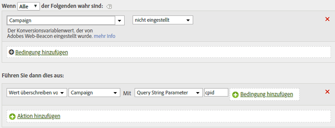

# Füllen einer Kampagnen-ID aus einem Abfragezeichenfolgenparameter

Sie können eine Variable mithilfe eines Abfragezeichenfolgenparameters auffüllen.

In den meisten Fällen erfolgt das Auffüllen von Variablen aus der Abfragezeichenfolge über ein Plug-in. Wenn das Auffüllen aufgrund eines Schreibfehlers oder einer vergleichbaren Ursache fehlschlägt, können Sie die Variable mit Hilfe von Verarbeitungsregeln auffüllen.

Prüfen Sie vor dem Überschreiben stets nach, ob ein Wert leer ist oder den erwarteten Wert enthält.

| Regelsatz | Wert |
|---|---|
| Bedingung | Kampagne nicht festgelegt |
| Aktion | Kampagnenwert durch Abfragezeichenfolgenparameter „cpid“ überschreiben |

Beispiel:

