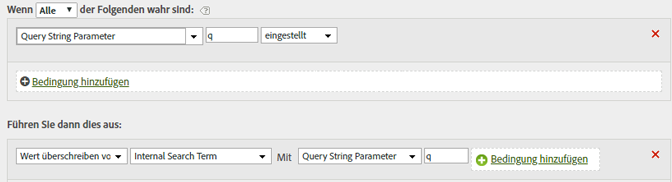

# Füllen interner Suchbegriffe mithilfe eines Abfragezeichenfolgenparameters

Bei Verwendung einer gängigen Variablen wie „q“ können Sie zum Auffüllen von Suchbegriffen auf Verarbeitungsregeln zurückgreifen, mit denen die eVar für die internen Suchbegriffe mit diesen Suchbegriffen aufgefüllt wird.

Für die Nutzung in Verarbeitungsregeln müssen die Werte für die Abfragezeichenfolge in Unicode oder UTF-8 kodiert sein.

| Regelsatz | Wert |
|---|---|
| Bedingung | Falls der Abfragezeichenfolgenparameter „q“ festgelegt ist |
| Aktion | Wert des internen Suchbegriffs durch Abfragezeichenfolgenparameter „q“ überschreiben |

Beispiel:

