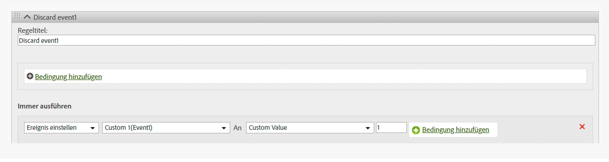

# Entfernen eines Ereignisses aus einem Treffer

Zeigt, wie ein Ereignis mithilfe einer Verarbeitungsregel aus einem Ergebnis gelöscht/entfernt werden kann, ohne dass eine Änderung an der Seite vorgenommen werden muss.

## Remove an event from a hit {#topic_9548385BFE344FC08CA99718A24FC093}

Zeigt, wie ein Ereignis mithilfe einer Verarbeitungsregel aus einem Ergebnis gelöscht/entfernt werden kann, ohne dass eine Änderung an der Seite vorgenommen werden muss.

Konfigurieren Sie eine Verarbeitungsregel so, dass das Ereignis den benutzerdefinierten Wert = 0 erhält, wie in der Abbildung unten gezeigt:

