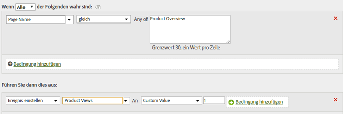

# Festlegen des Produktansichtsereignisses auf der Seite „Produktübersicht“

Ereignisse können auf der Grundlage von Seitenwerten oder von konkreten Variablenwerten festgelegt werden.

| Regelsatz | Wert |
|---|---|
| Bedingung | Falls der Seitenname identisch mit der Produktübersicht ist |
| Aktion | Ereignis „Ereignis-Produktansichten“ auf benutzerdefinierten Wert 1 setzen |

Beispiel:

