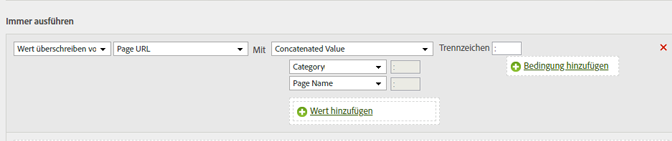

# Hinzufügen einer Unterkategorie durch Verketten von Kategorie und Seitenname

Mit der Option „Verketten“ können Sie Werte durch die Kombination anderer Werte ausfüllen.

<table id="table_FF761C2011CD456B9A466C054A54FC30"> 
 <thead> 
  <tr> 
   <th colname="col1" class="entry"> Regelsatz </th> 
   <th colname="col2" class="entry"> Wert </th> 
  </tr> 
 </thead>
 <tbody> 
  <tr> 
   <td colname="col1"> Bedingung </td> 
   <td colname="col2"> Keine (immer ausführen) </td> 
  </tr> 
  <tr> 
   <td colname="col1"> Aktion </td> 
   <td colname="col2">Wert der Unterkategorie auf verketteten Wert überschreiben 
Kategorie 
 
Seitenname 
 </td> 
  </tr> 
 </tbody> 
</table>

Beispiel:

