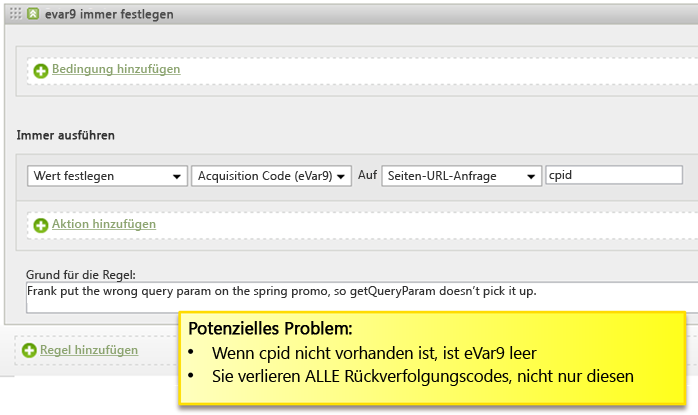
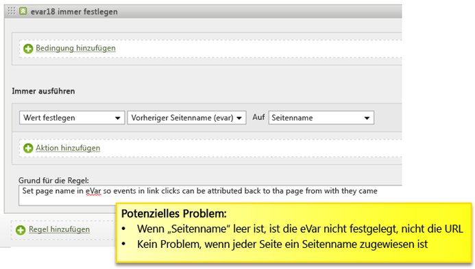
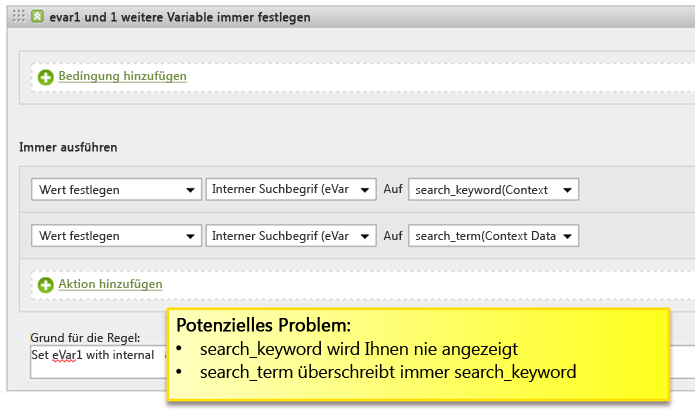
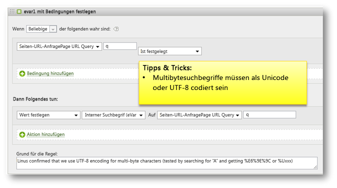
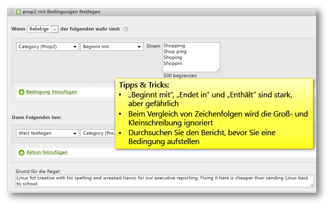

# Verarbeitungsregeln – Tipps und Tricks

Dieser Abschnitt enthält Richtlinien zum Testen von Verarbeitungsregeln und eine Liste häufiger Fehler, die vermieden werden können.

## Testen der Verarbeitungsregeln {#section_F092D2FECDE24082AE9FC6F8BE87F29F}

Dieser Abschnitt enthält einige Anleitungen, die Ihnen helfen, Verarbeitungsregeln zu testen, bevor diese in der Produktion bereitgestellt werden.

**Testen von Regeln, die Suchbegriffe lesen**

Für Kriterien, die auf einer Suche basieren, z. B., ob prop1 das Wort „Neuigkeiten“ enthält, rufen Sie den prop1-Bericht auf und suchen Sie nach „Neuigkeiten“, um zu sehen, ob es Übereinstimmungen gibt, die Sie nicht erwartet haben.

**Testen von Regeln, die Variablen lesen**

Erstellen Sie eine leere HTML-Seite auf Ihrem Desktop, nehmen Sie den s_code von Ihrer Website auf und stellen Sie die `s.account`-Variable auf eine dev-Report Suite ein. Wenn Ihre Regeln auf einer verweisenden Stelle, einer verweisenden Domäne usw. basieren, nehmen Sie einige Beispiel-URLs aus dem Live-Verweisbericht, stellen Sie die `s.referrer`-Variable auf einen dieser Werte ein und laden Sie die Seite. Auf die gleiche Weise können Sie, wenn die Regel auf dem Seiten-URL-Wert basiert, `s.pageURL` einstellen. Dieser Prozess kann für alle Variablen genutzt werden.

**Verwenden einer dev-Report Suite**

Wir empfehlen, Verarbeitungsregeln zu einer dev-Report Suite zu konfigurieren, um sicherzugehen, dass diese korrekt funktionieren. Wenn möglich, sollten Sie die Regeln in eine kleine Produktions-Suite kopieren, bevor Sie sie breit angelegt implementieren.

## Auf leere Werte hin überprüfen  {#section_EE84A5525E26415787930723B0CAAE0F}

Wenn Sie eine Regel erstellen, sollten Sie berücksichtigen, dass ein Wert leer sein könnte. Wenn Sie keine Bedingung hinzufügen, die nach leeren Werten sucht, kann es passieren, dass Variablen unbeabsichtigter Weise durch leere Werte überschrieben werden.

Es ist auch wichtig, die Verarbeitungsreihenfolge zu beachten. Im folgenden Beispiel scheint es, dass die benutzerspezifische eVar für den vorherigen Seitennamen auf die URL gesetzt wird, wenn der Seitenname nicht vorhanden ist. Die URL wird jedoch im Seitennamen platziert, nachdem die Verarbeitungsregeln angewandt wurden, sodass in diesem Fall der Seitenname leer ist, wenn er nicht auf der Seite eingestellt wird.

## Überschreiben von Werten vermeiden  {#section_49FCCA31E31A433EA2EF5EAF91443DAF}

Im folgenden Beispiel werden zwei Kontextdatenvariablen auf der Website zur Erfassung von Suchbegriffen verwendet: „Suchkeyword“ und „Suchbegriff“. Basierend auf der Konfiguration wird jedoch der Wert search_keyword immer überschrieben, selbst wenn „Suchbegriff“ leer ist.

Diese Regel sollte umkonfiguriert werden, sodass jede Kontextdatenvariable auf einen Wert hin getestet wird, bevor der interne Suchbegriff ausgefüllt wird, und optional können die beiden Werte verkettet werden, wenn es sinnvoll erscheint, beide zu behalten.

## Suchbegriffe auf UTF-8 oder Unicode kodieren  {#section_3BBBE1FB8FEA48589362452DE51DB575}

Suchbegriffe, die aus einer Abfragezeichenfolge gezogen werden, müssen korrekt kodiert sein, oder die Zuordnung durch Verarbeitungsregeln erfolgt nicht korrekt.

## „Beginnt mit“, „Enthält“ und „Endet mit“  {#section_80CE853244FC435B844A09EA51868D8D}

Wählen Sie die korrekte Übereinstimmungsbedingung, um die restriktivste Bedingung zu finden, die korrekt übereinstimmt. Sie können nach Werten in einem Bericht suchen, bevor Sie eine Regel erstellen, um sicherzugehen, dass es keine ungewünschten Übereinstimmungen gibt. Beispielsweise sollten Sie den Prop2-Bericht durchsuchen, um alle Stellen zu finden, auf die diese Bedingung zutrifft, bevor Sie diese Regel aktivieren.

