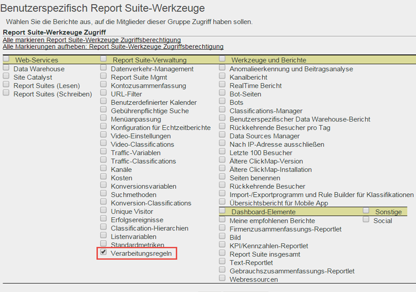
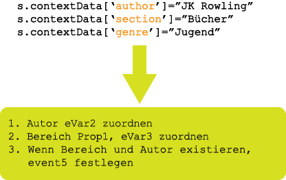

# Übersicht über Verarbeitungsregeln

Verarbeitungsregeln erleichtern die Datenerfassung und ermöglichen die Verwaltung der Inhalte, die an die Berichterstellung gesendet wurden. Verarbeitungsregeln vereinfachen die Interaktion mit IT-Gruppen und Web-Entwicklern, da sie eine Schnittstelle für folgende Aufgaben bereitstellen:

* Festlegen eines Ereignisses auf der Seite mit der Produktübersicht
* Auffüllen von Kampagnen mit einem Abfragezeichenfolgenparameter
* Verketten von Kategorien und Seitennamen in einer Prop zur leichteren Berichterstellung
* Anzeigen von Pfaden durch das Kopieren von eVars in Props
* Korrigieren von Fehlschreibungen bei Sitebereichen
* Extrahieren von Suchbegriffen oder Kampagnen-IDs aus der Abfragezeichenfolge in eine eVar

>[!VIDEO](https://tv.adobe.com/embed/1181/16506/)

*Sehen Sie sich die Übersicht zu Verarbeitungsregeln und die Schulung von Adobe Summit an, um zu erfahren, wozu die Verarbeitungsregeln nützlich sind.*

## Erhalten der Autorisierung zur Verwendung der Verarbeitungsregeln {#section_8A4846688050453784DAE4D89355169A}

Vor dem 20. April 2017 mussten alle Benutzer (einschließlich Administratoren) einen Test bestehen und eine Autorisierung für die Nutzung von Verarbeitungsregeln von der Adobe-Kundenunterstützung erhalten.

Nun sind Administratoren **standardmäßig** dazu berechtigt, Verarbeitungsregeln zu nutzen. Der Test ist nicht mehr erforderlich. Administratoren können diese Rechte über die Admin Tools-Benutzeroberfläche auch Benutzern ohne Administratorstatus gewähren. So geht’s:

1. Wenn nicht bereits geschehen,  [erstellen Sie eine Gruppe](/help/admin/user-management2/c-user-groups/groups.md), die nur die Benutzer ohne Administratorstatus enthält, die zur Verwendung der Verarbeitungsregeln autorisiert sein sollen.
1. [Fügen Sie dieser Gruppe Benutzer ohne Administratorstatus hinzu](/help/admin/user-management2/c-user-management/t-add-user-to-group.md).
1. Navigieren Sie dann zu **[!UICONTROL Analytics]** > **[!UICONTROL Admin]** > **[!UICONTROL User Management]** > **[!UICONTROL Gruppen]** > **[!UICONTROL `group name`]** > **[!UICONTROL Bearbeiten]** > **[!UICONTROL Zugriff auf Berichte]** > **[!UICONTROL Report Suite-Tools]** > **[!UICONTROL Benutzerspezifisch]** > **[!UICONTROL Report Suite-Verwaltung]**.
1. Aktivieren Sie das Kontrollkästchen neben [!UICONTROL Verarbeitungsregeln] und klicken Sie auf **[!UICONTROL OK]**.

>[!IMPORTANT]
>
>Da Verarbeitungsregeln dauerhafte Auswirkungen auf Analytics-Daten haben, empfiehlt Adobe dringend, dass Verarbeitungsregeladministratoren eine Zertifizierungsschulung in Adobe Analytics erhalten und mit allen Datenquellen für Ihre Report Suites (Standard-Websites, mobile Sites, mobile Apps, Dateneinfüge-API usw.) vertraut sein sollten. Kenntnisse der Kontextdatenvariablen sowie der Standardvariablen, die in verschiedenen Plattformen enthalten sind, tragen dazu bei, ein versehentliches Löschen oder Ändern von Daten zu vermeiden.

## Vereinfachung der Datenerfassung durch Kontextdaten  {#section_09EEA03612D24C15839631AA9E9668D8}

Kontextdatenvariablen sind Variablentypen, die nur für Verarbeitungsregeln verfügbar sind. Für die Verwendung von Kontextdatenvariablen werden Schlüssel-Wert-Datenpaare durch unsere Implementierung eingereicht, und es werden Verarbeitungsregeln angewendet, um diese Werte in Standard-Analytics-Variablen zu erfassen. So müssen Programmierer nicht immer genau wissen, welche Prop und/oder eVar welchen Wert enthalten muss.

Weitere Informationen finden Sie unter [Kontextdatenvariablen](https://docs.adobe.com/content/help/de-DE/analytics/implementation/vars/page-vars/contextdata.html) in der Implementierungshilfe.

## Verwenden von Verarbeitungsregeln zum Korrigieren von Daten und zum Auslösen von Ereignissen  {#section_8284E72E999244E091CD7FB1A22342B6}

Mit Verarbeitungsregeln können eingehende Werte überwacht werden. Dabei werden gängige Schreibfehler korrigiert und Ereignisse auf Basis der Berichtsdaten festgelegt. Props können in eVars kopiert werden, Werte lassen sich zu Berichtzwecken miteinander verketten, und Ereignisse können festgelegt werden.

## Verwenden von Kontextdatenvariablen in Berichten  {#section_BD098BC503024A0B8703596628071134}

Sobald in Ihrer Implementierung Kontextdatenvariablen definiert sind, müssen diese in Variablen wie eVars kopiert werden, damit sie in Berichten verwendet werden können.

Weitere Informationen finden Sie  [hier](/help/admin/admin/c-processing-rules/processing-rules-examples/processing-rules-copy-context-data.md) und [hier](/help/admin/admin/c-processing-rules/processing-rules-examples/processing-rules-copy-context-data-event.md).
