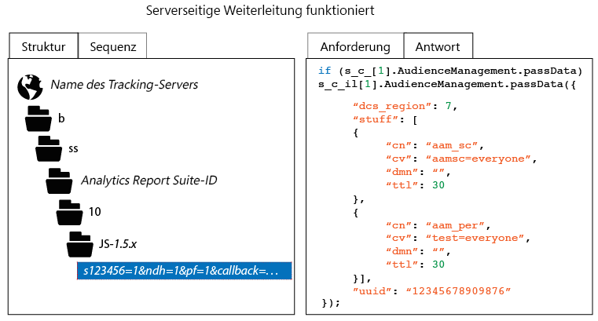

# Überprüfen der serverseitigen Weiterleitungsimplementierung

Zum Überprüfen der ordnungsgemäßen Aktivierung der serverseitigen Weiterleitung müssen Sie die HTTP-Antwort aus der Analytics-Verfolgungsanfrage inspizieren. Dazu können Sie die Entwicklertools eines Browsers oder ein Proxy-Tool wie Charles Web Debugger verwenden. Die folgenden Anweisungen veranschaulichen, welche Indikatoren vorhanden sein müssen, um eine ordnungsgemäße Aktivierung der serverseitigen Weiterleitung zu gewährleisten.

So überprüfen Sie den Status der serverseitigen Weiterleitung:

1. Laden Sie eine Testseite mit aktualisiertem AppMeasurement-Code.
1. Überprüfen Sie in den Debugging-Tools Ihres Browsers oder mithilfe Ihrer Proxy-Software die HTTP-Antwort von der Analytics-Verfolgungsanfrage (Sie können ganz einfach danach filtern, indem Sie einen beliebigen Pfad mit „b/ss“ auswählen).
1. Überprüfen Sie die HTTP-Antwort. Wenn die Antwort Audience Manager-Daten enthält (wie unten dargestellt), funktioniert die serverseitige Weiterleitung.

>[!CAUTION]
>
>Wenn die Antwort das Schlüssel/Wert-Paar „`"status":"SUCCESS"`“ oder ein 2-x-2-Bild enthält, ist die serverseitige Weiterleitung nicht korrekt konfiguriert. Stellen Sie sicher, dass der Identity Service ordnungsgemäß bereitgestellt ist, dass Sie das AppMeasurement-Modul bereitgestellt haben, dass die jeweilige Report Suite der korrekten IMS-Org. zugewiesen wurde und dass die serverseitige Weiterleitung in der Analytics Admin Console aktiviert wurde.

>[!MORELIKETHIS]
>
>* [Charles Web Debugger](https://www.charlesproxy.com/)

