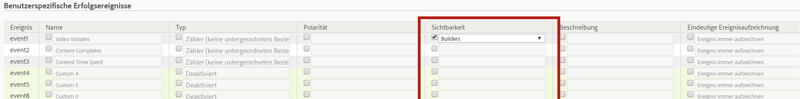

# Konfigurieren von Erfolgsereignissen

In diesen Schritten wird beschrieben, wie Erfolgsereignisse konfiguriert werden.

1. Klicken Sie auf **[!UICONTROL Analytics]** > **[!UICONTROL Admin]** > **[!UICONTROL Report Suites]**.
1. Wählen Sie eine Report Suite aus.
1. Klicken Sie auf **[!UICONTROL Einstellungen bearbeiten]** > **[!UICONTROL Konversion]** > **[!UICONTROL Erfolgsereignisse]**.

   

1. Aktivieren Sie in der Spalte **[!UICONTROL Name]** das Kontrollkästchen neben dem jeweiligen Element, um die Bearbeitung zu aktivieren, und geben Sie anschließend den gewünschten Namen ein.
1. Aktivieren Sie in der Spalte **[!UICONTROL Typ]** das Kontrollkästchen neben dem jeweiligen Element, um die Dropdown-Liste zu aktivieren, und wählen Sie anschließend den gewünschten Typ aus.

   >[!NOTE]
   >
   >Bevor Sie einen Ereignistyp ändern, lesen Sie [Ändern des Ereignistyps](/help/admin/admin/c-success-events/event-type.md).

   Weitere Informationen zu diesen Elementen finden Sie unter [Seite „Erfolgsereignisse“ – Beschreibungen](/help/admin/admin/c-success-events/success-event.md).

1. Geben Sie in der Spalte **[!UICONTROL Polarität]** an, ob ein Aufwärtstrend für diese Metrik positiv oder negativ ist.
1. In der Spalte **[!UICONTROL Sichtbarkeit]** können Sie Standardmetriken (integrierte Metriken), benutzerspezifische Ereignisse und die im Menü, in der Metrikauswahl, im Generator für berechnete Metriken und im Segment Builder integrierten Ereignisse ausblenden.

   Diese Einstellung wirkt sich nicht auf die Datenerfassung für diese Metrik oder das Ereignis aus, sondern nur auf die Sichtbarkeit auf der Benutzeroberfläche. [Mehr …](/help/admin/admin/metric-visibility.md)
1. Geben Sie eine Beschreibung ein.
1. Legen Sie fest, ob das Ereignis immer aufgezeichnet werden soll.
1. Aktivieren oder deaktivieren Sie Beitragsmetriken.

   >[!NOTE]
   >
   >Sie können den Beitrag für bis zu 100 benutzerspezifische Ereignisse aktivieren. Darüber hinaus können Sie im Generator für [berechnete Metriken](/help/components/c-calcmetrics/c-workflow/cm-workflow/c-build-metrics/participation-metric.md) Beitragsmetriken erstellen.

1. Klicken Sie auf **[!UICONTROL Speichern]**.
