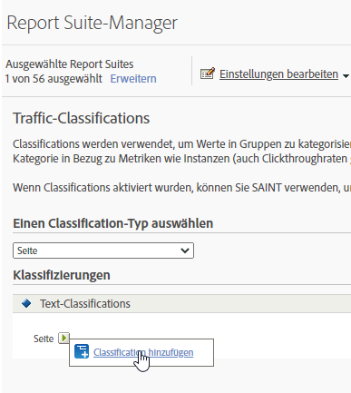

# Traffic-Classifications

Mit Traffic-Classifications können Sie Traffic-Variablen (Eigenschaften) klassifizieren. Traffic-Classifications können nur Text-Classifications nutzen.

## Traffic-Klassifizierungen {#concept_028079B29A9C412AA68910A87E11176F}

Mit Traffic-Classifications können Sie Traffic-Variablen (Eigenschaften) klassifizieren. Traffic-Classifications können nur Text-Classifications nutzen.

Auf der Seite „Traffic-Classifications“ können Sie Classifications für ausgewählte Report Suites erstellen. Nach der Classification kann jeder Bericht, den Sie mithilfe der wichtigen Daten erstellen können, auch mithilfe der zugeordneten Attribute erstellt werden.

Nach der Aktivierung der Classifications verwenden Sie den [Classifications Importer](/help/components/classifications/importer/c-working-with-saint.md), um bestimmte Werte der entsprechenden Classification zuzuweisen.

## Hinzufügen einer Traffic-Klassifizierung {#task_4DB49CCB1D764483907BC33A5CEB7315}

<!-- 

t_classification_add_traffic.xml

 -->

Schritte, die beschreiben, wie Classifications für bestimmte Report Suites hinzugefügt oder bearbeitet werden.

1. Klicken Sie im Suite Header auf  **[!UICONTROL Admin]** > **[!UICONTROL Report Suites]**. 
1. Wählen Sie eine Report Suite aus.
1. Wählen Sie im Feld **[!UICONTROL Einen Klassifizierungstyp auswählen]** die Variable aus, für die Sie eine Klassifizierung hinzufügen möchten.
1. Klicken Sie auf **[!UICONTROL Einstellungen bearbeiten]** > **[!UICONTROL Traffic]** > **[!UICONTROL Traffic-Classifications]**.

   

1. Fahren Sie mit dem Mauszeiger über das Symbol **[!UICONTROL Klassifizierung bearbeiten]** und wählen Sie dann **[!UICONTROL Klassifizierung hinzufügen]** oder **[!UICONTROL Klassifizierung bearbeiten]**.
1. Konfigurieren Sie die Klassifizierung im Dialogfeld **[!UICONTROL Textklassifizierungen]** nach Bedarf:

   **[!UICONTROL Name]**: Geben Sie den Classification-Namen ein.

   **[!UICONTROL Beschreibung:]** Geben Sie eine ausführlichere Beschreibung an.
1. Klicken Sie auf **[!UICONTROL Speichern]**.
