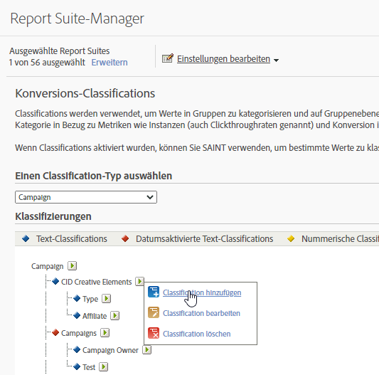

# Konversionsklassifizierungen

Klassifizierungen werden verwendet, um Werte in Gruppen zu kategorisieren und auf Gruppenebene zu berichten. Sie können beispielsweise alle Kampagnen des Typs [!UICONTROL Paid Search] in einer Kategorie wie *Popmusik-Bedingungen* klassifizieren und Berichte zum Erfolg dieser Kategorie anhand von Metriken wie Instanzen (Klicks) und Konversion zu Erfolgsereignissen erstellen. Sie können einer Variablen bis zu 255 Klassifizierungen hinzufügen.

Mit Konversion-Classifications können Sie Konversionsvariablen klassifizieren. Nach der Classification kann jeder Bericht, den Sie mithilfe der wichtigen Daten erstellen können, auch mithilfe der verbundenen Dateneigenschaften erstellt werden.

Nach der Aktivierung der Classifications verwenden Sie den [Classification Importer](/help/components/classifications/importer/c-working-with-saint.md), um bestimmte Werte der entsprechenden Classification zuzuweisen.

>[!WARNING]
>
>Das Umbenennen einer Klassifizierung kann zu Problemen mit vorhandenen Regeln führen, die im [Classification Rule Builder](/help/components/classifications/crb/classification-rule-builder.md) erstellt wurden. Wenn Sie eine Klassifizierung umbenennen, die Klassifizierungsregeln enthält, sollten Sie sicherstellen, dass die einzelnen Regeln so korrigiert werden, dass sie auf die umbenannte Klassifizierung verweisen.

## Konversionsklassifizierungen – Beschreibungen

| Element | Beschreibung |
| --- | --- |
| Name | Der Name der Classification |
| Datum aktiviert (nur Text) | Gibt an, ob die Text-Classification ein Datumsbereich für die Kampagnenvariablen ist. |
| Optionen (nur Text) | Erstellt eine Liste mit für diese Classification verfügbaren Werten. „Optionen“ kann zusammen mit Kampagnenvariablen verwendet werden, um den Benutzern eine Liste mit unterstützten Werten für die Classification im Kampagnen-Manager bereitzustellen. |
| Zahlentyp (nur nummerisch) | Gibt den Typ der Zahl in der nummerischen Classification an. Zu den Optionen gehören Nummerisch, Prozent und Währung. |

## Konversionsklassifizierungen hinzufügen

Schritte, die beschreiben, wie Konversionsklassifizierungen in der Admin-Konsole hinzugefügt werden.

1. Klicken Sie auf **[!UICONTROL Admin]** > **[!UICONTROL Report Suites]**.
1. Wählen Sie eine Report Suite aus.
1. Klicken Sie auf **[!UICONTROL Einstellungen bearbeiten]** > **[!UICONTROL Konversion]** > **[!UICONTROL Konversion-Classifications]**.
1. Wählen Sie in der Dropdownliste **[!UICONTROL Einen Klassifizierungstyp auswählen]** die Variable aus, der Sie eine Klassifizierung hinzufügen möchten.

   

1. Bewegen Sie den Mauszeiger über das Symbol **[!UICONTROL Klassifizierung bearbeiten]** und wählen Sie dann **[!UICONTROL Klassifizierung hinzufügen]**.
1. Wählen Sie im Feld **[!UICONTROL Typ auswählen]** den Classification-typ aus, den Sie der Variablen hinzufügen möchten.

   Zu den Optionen gehören **[!UICONTROL Text]** und **[!UICONTROL Numerisch]**. Weitere Informationen zu Classification-Typen finden Sie unter [Informationen über Classifications](/help/components/classifications/c-classifications.md).
1. Konfigurieren Sie die Klassifizierung im Dialogfeld **[!UICONTROL Textklassifizierungen]** nach Bedarf.

1. Fügen Sie im Dialogfeld **[!UICONTROL Dropdown-Liste]** Optionen hinzu oder entfernen Sie Optionen.

   Durch Hinzufügen von Optionen wird eine Liste mit für diese Classification verfügbaren Classification-Werten erstellt. Diese Option kann zusammen mit Kampagnenvariablen verwendet werden, um den Benutzern eine Liste mit unterstützten Werten für die Classification im Kampagnen-Manager bereitzustellen. Verwenden Sie dies für Classification-Dimensionen, bei denen eine kleine Zahl erlaubter Werte vorliegt, die sich selten oder nie ändern. Sie können zum Beispiel verschiedene Kampagnen durchführen, die auf verschiedene Stufen der Kundenbindung ausgerichtet sind: Silber, Gold und Platin. Sie können dann Dropdown-Listen verwenden, um sicherzustellen, dass nur solche Werte akzeptiert werden, die Ihren drei Stufen entsprechen. Der Versuch, einen anderen Wert zu verwenden, wird verworfen.

1. Klicken Sie auf **[!UICONTROL Speichern]**.

## Löschen von Konversions-Classifications

Löschen Sie nicht mehr benötigte Konversions-Classifications.

1. Öffnen Sie den Report Suite Manager, indem Sie in der Suite-Kopfzeile auf **[!UICONTROL Admin]** > **[!UICONTROL Report Suites]** klicken.
1. Wählen Sie eine Report Suite aus.
1. Klicken Sie auf **[!UICONTROL Einstellungen bearbeiten]** > **[!UICONTROL Konversion]** > **[!UICONTROL Konversion-Classifications]**.
1. Wählen Sie in der Dropdownliste **[!UICONTROL Einen Klassifizierungstyp auswählen]** die Variable aus, in der Sie eine Klassifizierung löschen möchten.
1. Bewegen Sie den Mauszeiger über das Symbol **[!UICONTROL Klassifizierung bearbeiten]** und wählen Sie dann **[!UICONTROL Klassifizierung löschen]**.
1. Klicken Sie im Dialogfeld „Klassifizierung löschen“ auf **[!UICONTROL Löschen]**.
