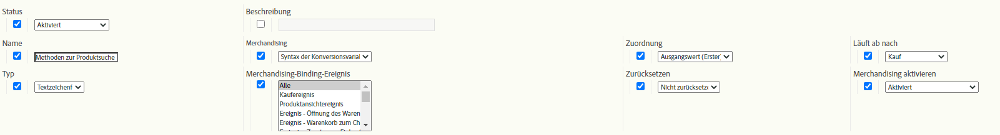

# Merchandising-eVars und Methoden zur Produktsuche

In diesem Dokument werden die Konzepte hinter Merchandising-eVars erläutert, die Daten anders verarbeiten und zuordnen als normale eVars. Außerdem wird erläutert, wie Merchandising-eVars mit Produktsuchmethoden zusammenhängen.

Die meisten Websites für den Einzelhandel bieten zwar viele Möglichkeiten, Produkte zu finden, die Adobe betrachtet jedoch die folgenden grundlegenden Methoden zur Produktsuche, die jeder Einzelhandelskunden in Adobe Analytics verfolgen sollte:

* Interne Suchkeywords
* Interne Kampagnen-Trackingcodes
* Merchandising-/Browse-Kategorien
* Verknüpfungen zum Cross-Selling

Zuordnen von einigen eVars zu den Lösungen für die Zwecke dieses Dokuments sehen wir wie folgt aus:

* eVar2: Interne Suchkeywords
* eVar3: Interne Kampagnen-Trackingcodes
* eVar4: Merchandising-/Browse-Kategorien
* eVar5: Verknüpfungen zum Cross-Selling

Wir können eine zusätzliche eVar verwenden, um die Leistung aller Methoden zur Produktsuche untereinander zu messen. Zusätzlich zu den oben beschriebenen Suchmethoden umfasst das eVar weitere Suchmethoden, z. B. Links zu Produktdetailseiten von externen Websites.

* eVar1: Methoden zur Produktsuche

Konfigurieren Sie keine dieser Variablen als Standard-eVars, sondern als Merchandising-eVars. Durch die Verwendung von Merchandising-eVars können Sie den von eVars erfassten Werten eine beliebige erfolgreiche Aktivität auf *pro Produkt*-Ebene statt auf *pro Besuch/pro Bestellung*-Ebene zuweisen. In diesem Dokument wird der Unterschied zwischen der Zuordnung pro Produkt und pro Bestellung erläutert.

Um zu demonstrieren, wie Sie diese Variablen festlegen, hier ist ein Beispiel, bei dem ein Besucher beschließt, die interne Keyword-Suche &quot;Sandals&quot;zu verwenden, um ein Produkt auf der Site zu finden. Auf der Suchergebnisseite für Suchbegriffe müssen Sie Daten in mindestens zwei eVars erfassen:

* `eVar2` entspricht dem Suchbegriff, der in der Suche verwendet wurde (&quot;Sandals&quot;)
* `eVar1` entspricht der verwendeten Suchmethode für das Produkt (&quot;interne Keyword-Suche&quot;).

Wenn Sie diese beiden Variablen auf diese spezifischen Werte setzen, wissen Sie, dass der Besucher den internen Keyword-Suchbegriff &quot;Sandalen&quot;verwendet, um ein Produkt zu finden. Gleichzeitig wissen Sie, dass der Besucher nicht die anderen Produktsuchmethoden verwendet, um Produkte zu finden (z. B. durchsucht er nicht die Produktkategorien, während er eine Suchbegriffsuche durchführt). Um sicherzustellen, dass eine ordnungsgemäße Zuordnung pro Produkt erfolgt, sollten diese nicht verwendeten Methoden nicht für die Suche nach einem Produkt angerechnet werden, das über eine interne Keyword-Suche gefunden wurde. Daher müssen Sie eine Logik in den Code einfügen (z. B. AppMeasurement, AEP Web SDK usw.), der die mit diesen anderen Suchmethoden verknüpften eVars automatisch auf einen Wert der &quot;Nicht-Suchmethode&quot;setzt.

Wenn ein Benutzer beispielsweise mithilfe des Suchbegriffs &quot;sandals&quot;nach Produkten sucht, sollte die Logik des Analytics-Codes die Variablen auf der Seite mit den internen Suchergebnissen für Suchbegriffe auf die folgenden setzen:

* eVar2=&quot;sandals&quot;: das Keyword &quot;Sandals&quot;in der internen Keyword-Suche verwendet wurde
* eVar1=&quot;Interne Keyword-Suche&quot;: die Suchmethode &quot;Suche nach internen Keywords&quot;verwendet wurde
* eVar3=&quot;Nicht-interne Kampagne&quot;: Es wurde keine interne Kampagne für den Zugriff auf die Suchergebnisseite verwendet.
* eVar4=&quot;non-browse&quot;: Auf der Suchergebnisseite wurde keine Kategorie &quot;Durchsuchen&quot;aufgerufen.
* eVar5=&quot;non-cross-sell&quot;: Auf der Seite Suchergebnisse wurde kein Querverkaufslink angeklickt

## Merchandising-eVars-Einstellungen

Bevor Sie mit dem Beispiel &quot;Sandalen&quot;fortfahren, finden Sie hier die verschiedenen Einstellungen, die Sie mit Ihren Merchandising-eVars verwenden können.  Der folgende Screenshot stammt aus dem Report Suite Manager. Rufen Sie sie auf, indem Sie zu Analytics > Admin > Report Suites > Einstellungen bearbeiten > Konversion > Konversionsvariablen > Neu hinzufügen > Merchandising aktivieren navigieren.

Die Abschnitte unter der Tabelle enthalten weitere Details zu diesen Einstellungen.

| Einstellung | Beschreibung |
|--- | --- |
| Name | Der Name oder die Berichtsdimension, mit der die Variable verknüpft werden soll. Wenn `eVar1` Produktsuchmethoden erfassen soll, sollte das Feld Name für `eVar1` auf &quot;Produktsuchmethoden&quot;gesetzt werden. |
| Merchandising | Die Syntax, die zum Erfassen der Merchandising-eVar verwendet wird |
| Zuordnung | Hilft bei der Bestimmung des Merchandising-eVar, dem eine Gutschrift zugeschrieben werden soll, wenn ein erfolgreiches Ereignis stattfindet. |
| Läuft ab nach | Bestimmt, wann bestehende eVar- und Merchandising-Bindungen nicht mehr wirksam sein sollten. |
| Typ | Die Art der Daten, die im Merchandising-eVar erfasst werden |
| Merchandising-Binding-Ereignis | Die Ereignisse, die bestimmen, wann ein eVar an einen Merchandising-Wert gebunden werden soll |
| Zurücksetzen | Ein Trigger, der zu diesem Zeitpunkt alle Backend-Daten für die eVar zurücksetzt |
| Merchandising aktivieren | Eine Markierung, die auf &quot;Aktiviert&quot;gesetzt werden muss, um den eVar von einem standardmäßigen eVar in ein Merchandising-eVar zu verwandeln |

### Merchandising

Diese Option ist nicht für reguläre eVars verfügbar. Mit der Einstellung [!UICONTROL Merchandising] können Sie entweder [!UICONTROL Konversionsvariablensyntax] oder [!UICONTROL Produktsyntax] als Methode zur Erfassung des Merchandising-eVar auswählen.

**[!UICONTROL Konversionsvariablensyntax]** bedeutet, dass Sie den eVar in einer eigenen Variablen festlegen. Mit der Konversionsvariablensyntax wird beispielsweise der `eVar1`-Wert von &quot;Interne Keyword-Suche&quot;im Seiten-Code (oder im AppMeasurement-Code, AEP Web SDK-Code usw.) wie folgt festgelegt:

`s.eVar1="internal keyword search";`

Bei **[!UICONTROL Produktsyntax]** wird der eVar jedoch nur innerhalb der Adobe Analytics-Produktvariablen festgelegt. Die Analytics-Produktvariable ist in sechs verschiedene Teile pro Produkt unterteilt:

`s.products="[category];[productID];[quantity];[revenue];[events];[eVars]"`

*  Kategorie ist eine veraltete Funktion und wird nicht mehr als praktikable Option zur Nachverfolgung der Produktkategorieleistung empfohlen.  Die bloße Existenz zeigt, warum bei den meisten Implementierungen der Variablen &quot;products&quot;ein einzelnes Semikolon dem productID-Teil des Variablenwerts vorangeht.
*  Menge und   Umsatz sind nützlich, wenn ein Produktkauf verfolgt wird.
*  Ereignisse sind nützlich für die Aufzeichnung benutzerdefinierter inkrementeller oder Währungsereigniswerte, die nicht als Umsatz gezählt werden sollen (z. B. Versand, Rabatte usw.)

Merchandising-eVars, die für die Verwendung der Produktsyntax konfiguriert sind, werden im letzten Teil der Variablen &quot;products&quot;festgelegt. Angenommen, ein Besucher verwendet eine interne Keyword-Suche, um die Produkt-ID &quot;12345&quot;zu finden. Die produktsyntaxbasierte Methode zum Festlegen von eVar1 in diesem Beispiel würde wie folgt aussehen:

`s.products=";12345;;;;eVar1=internal keyword search";`

Beachten Sie, dass wir weiterhin durch Semikolon getrennte Platzhalter für die Menge, den Umsatz und die Ereignisbereiche der Produktvariablen haben.  Ohne diese Platzhalter würde die Einstellung `eVar1` der internen Keyword-Suche vollständig ignoriert.

### Zuordnung

Der Begriff &quot;Zuordnung&quot;für Merchandising-eVars ist falsch, insbesondere für Merchandising-eVars, die die Syntax von Konversionsvariablen verwenden. Alle eVars, die die Standardsyntax verwenden, können über eine eigene individuelle Zuordnungseinstellung verfügen. Merchandising-eVars mit Konversionsvariablensyntax verwenden jedoch nur die Zuordnungseinstellung &quot;Zuletzt verwendet (Letzter)&quot;unabhängig von den Zuordnungseinstellungen im Report Suite Manager.

Um zu verstehen, was diese Einstellung bewirkt, müssen Sie den Unterschied zwischen der Zuordnung von eVar und der Bindung von Merchandising-eVar verstehen.  Bei Merchandising-eVars kann &quot;Merchanding eVar Binding&quot;als richtigerer Name für diese Einstellung &quot;Zuordnung&quot;betrachtet werden.
Wenn eVar mit Standardsyntax aus einer Bildanforderung erfasst werden, fügen die Adobe Analytics-Verarbeitungsserver Daten in eine andere Datenbankspalte, die als post_evar -Spalte bezeichnet wird, neben der regulären eVar ein.  Da eVars persistent sein sollen (d. h. sie laufen in den meisten Fällen nach dem aktuellen Treffer ab), setzen die Server diese post_evar -Spalte bei jeder nachfolgenden Bildanforderung und setzen sie auf den letzten Wert, der an die entsprechende eVar übergeben wird. Bei standardmäßigen eVars (d. h. ohne Merchandising) verwendet Adobe Analytics beim Eintreten eines Erfolgsereignisses die Spalte post_evar anstelle der regulären eVar, um den eVar zu bestimmen, dem das Ereignis gutgeschrieben werden soll.
Bei Standard-eVars (d. h. nicht Merchandising) bestimmt die Zuordnungseinstellung, ob der erste oder der letzte eVar, der während eines bestimmten Zeitraums erfasst wurde, in die Spalte post_evar eingefügt wird. Wenn die Zuordnungseinstellung für einen Standard-eVar gleich &quot;Ausgangswert (Erster)&quot;ist, wird der erste vom Besucher erfasste eVar für alle nachfolgenden Bildanforderungen in die Spalte post_evar eingefügt.  Dies gilt für alle zukünftigen Anfragen, die vom Browser dieses Besuchers gesendet werden, bis der eVar gemäß seiner Einstellung &quot;Läuft ab nach&quot;abläuft.\
Wenn die Zuordnungseinstellung eines standardmäßigen eVar gleich &quot;Zuletzt verwendet (Letzter)&quot;ist, wird der neueste vom Besucher erfasste eVar für alle nachfolgenden Bildanforderungen in die Spalte post_evar eingetragen. Die Zuordnung &quot;Zuletzt verwendet (Letzter)&quot;bedeutet, dass sich der post_evar-Wert jedes Mal ändert, wenn der entsprechende eVar in einer Bildanforderung auf einen neuen Wert gesetzt wird.  Die Zuordnung &quot;Ausgangswert (Erster)&quot;bedeutet, dass sich die Spalte &quot;post_evar&quot;nicht über Treffer hinweg ändert, obwohl die zugehörige eVar in einer zukünftigen Bildanforderung möglicherweise auf einen anderen Wert festgelegt ist.
Wie bereits erwähnt, wird allen Merchandising-eVars mit Konversionsvariablensyntax nur die Zuordnung &quot;Zuletzt (Letzter)&quot;zugewiesen (gemäß der Standarddefinition).  Daher muss ich erklären, was die Einstellung &quot;Zuordnung&quot;tatsächlich für Merchandising-eVars bedeutet.  Wie bereits erwähnt, bestimmt diese Einstellung nicht, welche Werte in die Spalte post_evar eingefügt werden, da ein Besucher die Site weiterhin verwendet.  Stattdessen bestimmt die Zuordnungseinstellung für Merchandising-eVars, welcher eVar an ein Produkt gebunden ist und wie diese Produkte zuweisen

