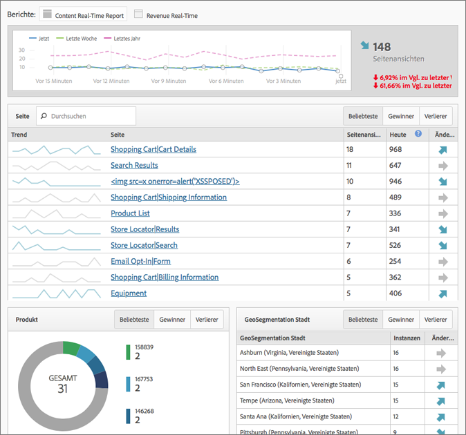

# Echtzeitberichte

Zeigt den Webseitentraffic an und sortiert Seitenansichten in Echtzeit nach Rangfolge. Liefert relevante Daten, auf die Sie Ihre Geschäftsentscheidungen stützen können.

>[!NOTE]
>
>Für den Echtzeitbericht sind keine zusätzlichen Implementierungen oder Taggings erforderlich. Sie nutzt die vorhandene Implementierung von Adobe Analytics. Informationen zum Konfigurieren von Echtzeitberichten finden Sie unter   [Konfiguration von Echtzeit-Berichten](/help/admin/admin/realtime/t-realtime-admin.md).

**[!UICONTROL Site-Metriken]** > **[!UICONTROL Echtzeit]**

Beantwortet in Echtzeit die folgenden Fragen: Welche Trends sind auf meiner Site zu beobachten und warum? Marketingexperten können schnell auf die Leistung ihrer Marketinginhalte und Kampagnen reagieren und diese verwalten. Die gelieferten Echtzeitdaten verfügen über eine Latenz von weniger als zwei Minuten und werden minutenweise automatisch aktualisiert.

Das Dashboard umfasst Hochfrequenzmetriken und Websiteanalysen von Adobe Analytics, um die Trends in Bezug auf Traffic und Seitenansichten auf dynamischen Nachrichten- und Einzelhandelswebsites visuell darzustellen. Durch die Echtzeitaktualisierung werden Trends in Ihren Daten minutenweise aktualisiert, und Sie können sie in Sekundenschnelle nachvollziehen. Durch Echtzeitkorrelation sowie Verfolgung von Inhalt und Konversion werden die Daten erfasst und in eine automatisch aktualisierende Benutzeroberfläche gestreamt.

Zwei der häufigsten Nutzungsszenarios sind: Herausgeber, die Meldungen bei veränderter Benutzeraktivität herauf-/herabstufen möchten, und Marketingexperten, die den Start einer neuen Produktreihe verfolgen möchten.

Als Administrator haben Sie folgende Möglichkeiten:

* Sie können mit den vorhandenen Dimensionen oder Classifications und Metriken bis zu drei Echtzeitberichte pro Report Suite erstellen. Sie können die sekundären Dimensionen zur Korrelation mit (oder Aufteilung) der primären Dimension verwenden.
* Neben einer Metrik für die gesamte Site können drei Dimensionen (oder Classifications) pro Bericht (ein primärer und zwei sekundäre) hinzugefügt werden.
* Sie können beliebige benutzerdefinierte Ereignisse, Warenkorbereignisse oder Instanzen verwenden.
* Sie können bis zu zwei Stunden historischer Echtzeitdaten anzeigen und folgende Einstellung modifizieren:

   * Letzte 15 Minuten: Granularität von 1 Minute
   * Letzte 30 Minuten: Granularität von 1 Minute
   * Letzte 1 Stunde: Granularität von 2 Minuten
   * Letzte 2 Stunden: Granularität von 4 Minuten

* Vergleichen Sie z. B. die Werte der letzten Woche mit den Werten des letzten Jahres (sowie mit der Gesamtsumme von heute).

Denken Sie daran, dass eVars (Konversionsmetriken) nicht unterstützt werden, da kein Persistenzkonzept existiert. Sie können zwar die Konversionsmetriken auswählen, sie funktionieren aber nur, wenn sie auf derselben Seite wie die Dimension(en) gesetzt werden. Weitere Informationen finden Sie in der Warnmeldung unter [Einrichten von Echtzeitberichten](/help/admin/admin/realtime/t-realtime-admin.md).

Das Einrichten und Anzeigen von Echtzeitberichten ist auf Administratoren oder Benutzer der Berechtigungsgruppen „Zugriff auf alle Berichte“ und „Fortschrittliche Berichterstellung“ beschränkt. Die Echtzeitanzeige respektiert jedoch die Zugriffsberechtigungen. Wenn Sie beispielsweise über keine Berechtigungen zum Anzeigen von Umsätzen verfügen, können Sie keine Echtzeitberichte anzeigen, die Umsatzdaten enthalten.

## Datenlatenz als Folge der A4T-Konfiguration   {#section_806CE36354FC4C539A0DED9266A5C704}

Nach Aktivierung der A4T-Integration in Adobe Target ist in Adobe Analytics eine zusätzliche Latenz von 5 bis 10 Minuten festzustellen. Diese Steigerung der Latenz ermöglicht die Speicherung von Daten aus Analytics und Target für den gleichen Treffer, sodass Sie Tests nach Seite und Site-Abschnitt aufschlüsseln können.

Diese Steigerung spiegelt sich in sämtlichen Services und Tools von Adobe Analytics wider, einschließlich Live-Stream und Echtzeit-Berichterstattung, und gilt für folgende Szenarien:

* Bei Livestream, Echtzeitberichten &amp; API-Anforderungen sowie aktuellen Daten für Traffic-Variablen werden nur Treffer mit einer zusätzlichen Daten-ID verzögert.
* Für aktuelle Daten zu Konversionsmetriken, endgültige Daten und Datenfeeds werden alle Treffer um zusätzliche 5 bis 7 Minuten verzögert.

Achten Sie darauf, dass die Erhöhung der Latenz nach der Implementierung des Identity Service beginnt, auch wenn Sie diese Integration nicht vollständig implementiert haben.
