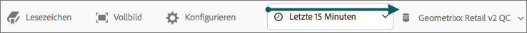
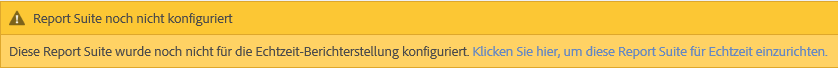
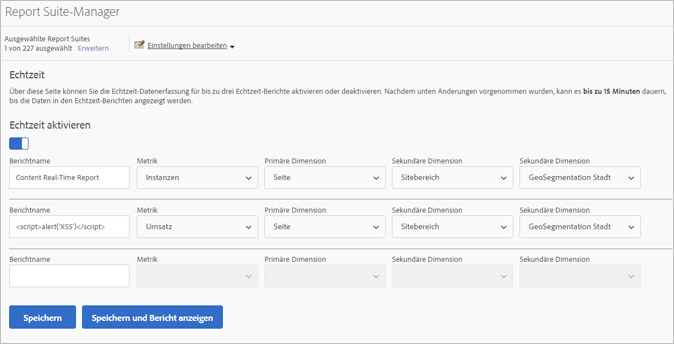
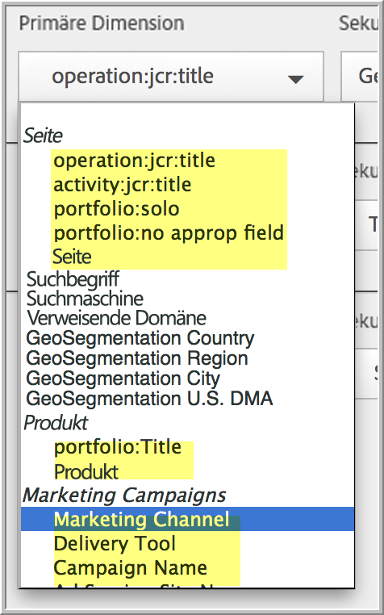

# Konfiguration von Echtzeitberichten

Administrative Schritte zum Einrichten von Echtzeit-Berichten.

Um Echtzeit-Berichte in Marketing Reports &amp; Analytics einzurichten, wählen Sie die Report Suite aus und konfigurieren Sie bis zu drei Berichte.

1. Wählen Sie die Report Suite aus, für die Sie Echtzeitberichte aktivieren möchten.

   Navigieren Sie zu **[!UICONTROL Analytics]** > **[!UICONTROL Berichte]** > **[!UICONTROL Alle Berichte anzeigen > Site-Metriken]** > **[!UICONTROL Echtzeit]** und wählen Sie die Report Suite oben aus dem Dropdown-Menü aus:

   

   Wenn Sie versuchen, Echtzeitberichte für eine Report Suite anzuzeigen, die nicht für Echtzeitberichte eingerichtet wurde, wird eine Meldung angezeigt, die Ihnen das Einrichten der Report Suite ermöglicht.

   

1. Klicken Sie auf **[!UICONTROL Konfigurieren]** (Zahnradsymbol), um den [!UICONTROL Report Suite Manager] auszuführen.

   (Auch verfügbar unter **[!UICONTROL Analytics]** > **[!UICONTROL Admin > Report Suites]** > **[!UICONTROL Einstellungen bearbeiten]** > **[!UICONTROL Echtzeit]**)

1. Aktivieren Sie die Einstellung **[!UICONTROL Echtzeit aktivieren]**.
1. Richten Sie die Echtzeit-Datenerfassung für bis zu drei Berichte ein, wobei pro Bericht eine Metrik und drei Dimensionen oder Classifications erstellt werden.

   

   Informationen zu unterstützten Echtzeit-Metriken und -Dimensionen finden Sie unter [Unterstützte Metriken und Dimensionen](/help/admin/admin/realtime/realtime-metrics.md).

   Falls Sie Classifications erstellt haben, werden sie unter der Dimension angezeigt, für die sie definiert wurden:

   

   >[!NOTE]
   >
   >Für einzelne Echtzeitberichte wird die Aktivierung doppelter Dimensionen derzeit nicht unterstützt, auch wenn für jede Dimension eine andere Classification ausgewählt wird.

   Weitere Informationen zu Klassifizierungen finden Sie unter [Informationen über Klassifizierungen](/help/components/classifications/c-classifications.md).

   >[!NOTE]
   >
   >Manche Dimensionen wie „Keyword“ oder „Produkt“ sind im Gegensatz zu anderen Funktionsbereichen in Adobe Analytics in Echtzeit nicht persistent. Wenn Sie eine nicht persistente Metrik auswählen, erscheint folgende Warnmeldung:

   

1. Klicken Sie auf **[!UICONTROL Speichern]** oder **[!UICONTROL Speichern und Bericht anzeigen]**.

   Nach diesem ersten Bericht-Setup kann es bis zu 20 Minuten dauern, bis Daten gestreamt werden. Daraufhin sind die Daten sofort verfügbar. Informationen zum Anzeigen von Echtzeitberichten erhalten Sie unter [Einen Echtzeitbericht ausführen](https://docs.adobe.com/content/help/de-DE/analytics/analyze/reports-analytics/t-running-report-types.html).

1. Standardmäßig haben alle Benutzer Zugriff auf Echtzeitberichte.
