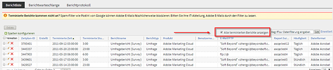
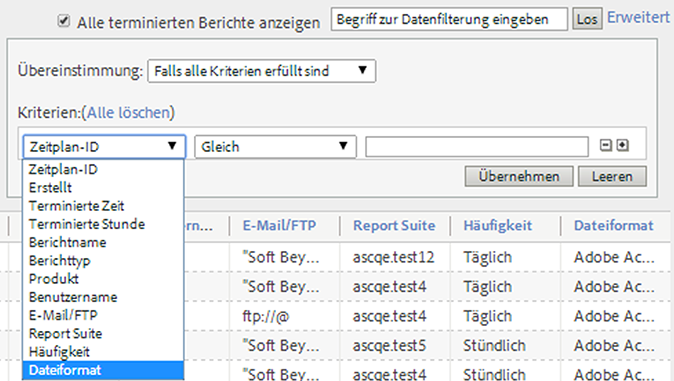
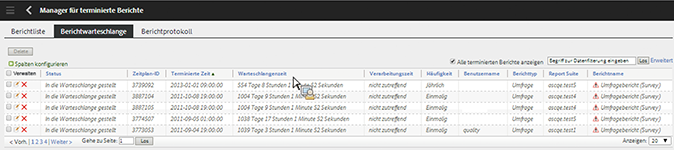

# Warteschlange für terminierte Berichte

Damit können Administratoren terminierte Berichte für die ganze Organisation anzeigen und verwalten.

**[!UICONTROL Analytics]** > **[!UICONTROL Komponenten]** > **[!UICONTROL Terminierte Berichte]**

Zu den Admin-spezifischen Fähigkeiten des Managers für terminierte Berichte gehören:

* Die Option [Alle terminierten Berichte anzeigen](/help/admin/admin/scheduled-reports-admin.md#section_3F167CAAEEC24140B476CF95B7402690) für Ihre Organisation.
* [Erweiterte Filterfunktionen](/help/admin/admin/scheduled-reports-admin.md#section_206A52A85DE84947AAB3AD082FBF6275) für die gesamte Organisation.
* Die neue Registerkarte [Berichtwarteschlange](/help/admin/admin/scheduled-reports-admin.md#section_03C866115D354BB182E90BF4D52F1E0B) mit allen Berichten, die zur Ausführung auf Berichtsservern in die Warteschlange gestellt wurden.
* Anzeige der [Zeitplan-ID](/help/admin/admin/scheduled-reports-admin.md#section_568B70F4228C4229977CB85D2DCD53A1) in der Benutzeroberfläche der Berichtwarteschlange.

## Alle terminierten Berichte anzeigen {#section_3F167CAAEEC24140B476CF95B7402690}

Auf der Registerkarte **[!UICONTROL Berichtsliste]** können Sie neben den von Ihnen terminierten Berichten mit der Option **[!UICONTROL Alle terminierten Berichte anzeigen]** alle terminierten Berichte in Ihrer Organisation anzeigen.

>[!NOTE]
>
>Die Spalte **[!UICONTROL Berichtsname]** zeigt den Namen des terminierten Berichts an, und die Spalte **[!UICONTROL Dateiname]** zeigt benutzerdefinierte Dateinamen an, die Sie unter „Erweiterte Bereitstellungsoptionen“ eingestellt haben. In Folge zeigt der Manager für terminierte Berichte mehrere Einträge mit dem gleichen Berichtsnamen, aber unterschiedlichen Dateinamen an, wenn Sie mehrere Berichte des gleichen Berichtstyps terminieren und jeweils benutzerdefinierte Namen angeben. Das liegt daran, dass der terminierte Back-End-Bericht identisch ist, so dass die Spalte „Berichtsname“ dieselben Berichtsnamen für alle außer den (festgelegten) benutzerdefinierten Dateinamen enthalten würde.

## Erweiterte Filterfunktionen  {#section_206A52A85DE84947AAB3AD082FBF6275}

Beispiel: Wenn Sie nach allen Berichten filtern möchten, die für die stündliche Ausführung geplant sind, geben Sie **[!UICONTROL Häufigkeit = Stündlich]** in den Filter **[!UICONTROL Erweitert]** ein und klicken Sie auf **[!UICONTROL Übernehmen]**:

## Berichtwarteschlange {#section_03C866115D354BB182E90BF4D52F1E0B}

In dieser Warteschlange können Sie alle terminierten Berichte verwalten und nach Bedarf terminierte Berichte löschen, die die Warteschlange blockieren. (Normalerweise tritt nach vier Stunden ein Timeout bei Berichten auf.)

Die Berichtwarteschlange bietet außerdem die Option „Terminierten Bericht einmal überspringen“. Klicken Sie einfach auf das blaue Symbol in der Spalte **[!UICONTROL Verwalten]**.

## Zeitplan-ID {#section_568B70F4228C4229977CB85D2DCD53A1}

Die Anzeige der **[!UICONTROL Zeitplan-ID]** in der Benutzeroberfläche der Berichtwarteschlange ist nützlich, wenn Sie die Kundenunterstützung von Adobe kontaktieren müssen, um ein Problem mit terminierten Berichten zu lösen.

