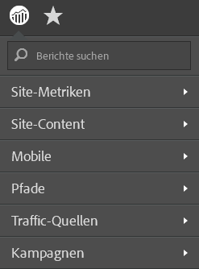
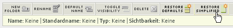

# Vereinfachtes Berichtsmenü

In diesen Schritten wird beschrieben, wie das vereinfachte Menü „Berichte“ in Reports and Analytics implementiert wird.

Das Adobe Reports &amp; Analytics-Menü ermöglicht die Auswahl eines alternativen vereinfachten Menüs mit neu strukturierten Unterordnern. Das vereinfachte Menü zeigt standardmäßig die folgenden Optionen an:

>[!NOTE]
>
>Wenn Sie das vereinfachte Menü anwenden, werden alle Anpassungen aufgehoben, die Sie an der Standardmenüstruktur vorgenommen haben. Die vereinfachte Menüstruktur wird außerdem für alle Marketing Reports and Analytics-Benutzer in Ihrer Organisation implementiert. Bedenken Sie vorher, welche Auswirkungen (z. B. für Schulungen, die sich auf die vorhandene Menüstruktur beziehen) die Implementierung des neuen Menüs haben wird, da sich Anpassungen der vorhandenen Menüstruktur danach nicht wiederherstellen lassen.

1. Navigieren Sie zu **[!UICONTROL Analytics]** > **[!UICONTROL Admin]** > **[!UICONTROL Report Suites]**, um den Report Suite Manager zu öffnen.
1. Wählen Sie die Report Suite aus, für die Sie die vereinfachte Menüstruktur implementieren möchten.
1. Navigieren Sie zu **[!UICONTROL Einstellungen bearbeiten]** > **[!UICONTROL Allgemein]** > **[!UICONTROL Menüs anpassen]**.
1. Klicken Sie auf **[!UICONTROL Vereinfacht wiederherstellen]**, um die vereinfachte Menüstruktur zu implementieren.

   

1. Um das (nicht angepasste) Standardmenü wiederherzustellen, klicken Sie auf **[!UICONTROL Standardangaben wiederherstellen]**.
