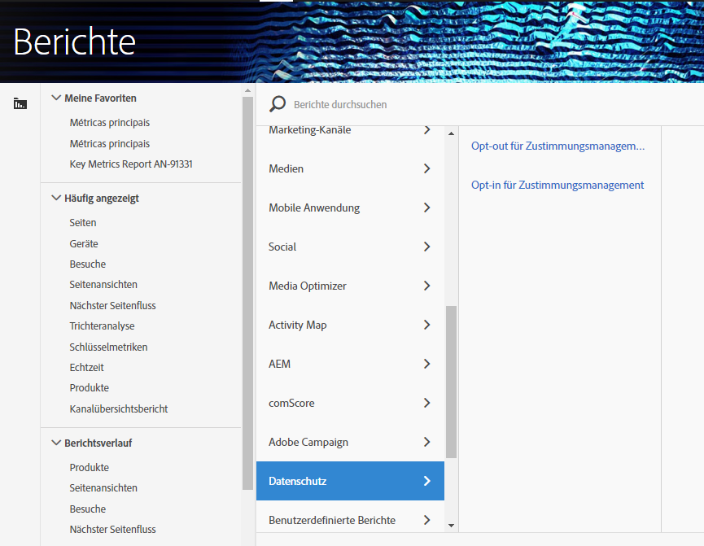

# Variablen des Einwilligungsmanagements

Um zusätzliche Unterstützung bei der Verwaltung von Datenschutzdaten zu bieten, stehen eine Reihe reservierter Variablen zur Verfügung, die zusammen mit bestimmten Kontextdatenvariablen verwendet werden können.
Diese Variablen zur Verwaltung der Zustimmung bieten ein einfach zu verwendendes Framework zur Erfassung des Genehmigungsstatus bei jedem Treffer der Analyse.

## Variablen

* Einwilligungsmanagement Opt-out
   * Reservierte Variable: Listen-Prop
   * Typ: Kommagetrennte Zeichenfolge
   * Enthält:
      * `contextData.['cm.ssf']=1` angezeigt als SSF
      * `contextData.['opt.dmp']=N` angezeigt als DMP
      * `contextData.['opt.sell']=N` als SELL angezeigt

* Einwilligungsmanagement Opt-in
   * Reservierte Variable: Listen-Prop
   * Typ: Kommagetrennte Zeichenfolge
   * Enthält:
      * `contextData.['opt.dmp']=Y` angezeigt als DMP
      * `contextData.['opt.sell']=Y` als SELL angezeigt

## Berichterstellung  

Die Verwaltungsvariablen für die Zustimmung können über eine neue Datenschutzeinstellung aktiviert werden, die in der Analytics Admin-Konsole verfügbar ist.

Jede Report Suite kann konfiguriert werden für:
1. Klicken Sie in Reports &amp; Analysen auf Admin &gt; Report Suites.
1. Select the report suite(s) where you are collecting media data and click [!UICONTROL Edit Settings &gt; Privacy Management]

   

1. Klicken Sie auf die Schaltfläche [!UICONTROL Datenschutzberichte] aktivieren.  Hinweis: Nach der Aktivierung können diese Variablen nicht mehr deaktiviert werden.

   

1. Nach der Aktivierung wird eine Bestätigungsmeldung angezeigt.

   

1. Die reservierten Variablen stehen jetzt für die Berichterstellung zur Verfügung.  Siehe Opt-out- und Zustimmungsverwaltung für die Verwaltung.

   

## Implementierung

Drei Kontextdatenvariablen wurden vordefiniert, um mit den Variablen für die Verwaltung der Zustimmung zu arbeiten.  Es ist Sache jedes Implementierungstechnikers, zu bestimmen, wie die Einstellung dieser Variablen verwaltet und beibehalten wird.

Allgemeine Anleitungen zur Implementierung von Kontextdatenvariablen finden Sie unter [Kontextdatenvariablen](https://docs.adobe.com/help/en/analytics/implementation/javascript-implementation/variables-analytics-reporting/context-data-variables.html) .

### SSF

* Kontextdaten: `contextData.['cm.ssf']`
* Akzeptierte Werte:
   * `1` - Beim Senden des Werts `1`bedeutet dies, dass die serverseitige Weiterleitung einen Ausschluss-Status aufweist. Der mit dieser Variablen `1` gepaarte Wert blockiert die Freigabe dieses Treffers für Adobe Audience Manager. Siehe [AAM-Datenschutzbestimmungen.](https://docs.adobe.com/help/en/analytics/integration/audience-analytics/audience-analytics-workflow/ssf-gdpr.html)
   * Für diesen Parameter werden keine anderen Werte akzeptiert

### DMP

* Kontextdaten: `contextData.['opt.dmp']`
* Akzeptierte Werte:
   * `N` - Beim Senden des Werts `N`deutet dies darauf hin, dass der Verbraucher die Freigabe für Datenverwaltungsplattformen ablehnt. Beachten Sie, dass dies nicht die aktuelle Blockfreigabe für AAM bedeutet.  Verwenden Sie für diese Funktion SSF.
   * `Y` - Beim Senden des Werts `Y`deutet dies darauf hin, dass sich der Verbraucher für die Freigabe an Datenverwaltungsplattformen entscheidet.

### SELL

* Kontextdaten: `contextData.['opt.sell']`
* Akzeptierte Werte:
   * `N` - Wenn der Wert gesendet wird `N`, deutet dies darauf hin, dass der Verbraucher die Freigabe oder den Verkauf der Daten an Dritte ablehnt.
   * `Y` - Wenn der Wert gesendet wird `Y`, deutet dies darauf hin, dass der Verbraucher sich für die Freigabe oder den Verkauf der Daten an Dritte entscheidet.
