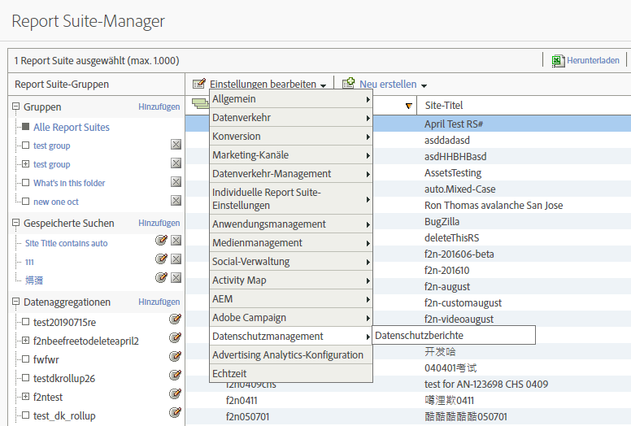
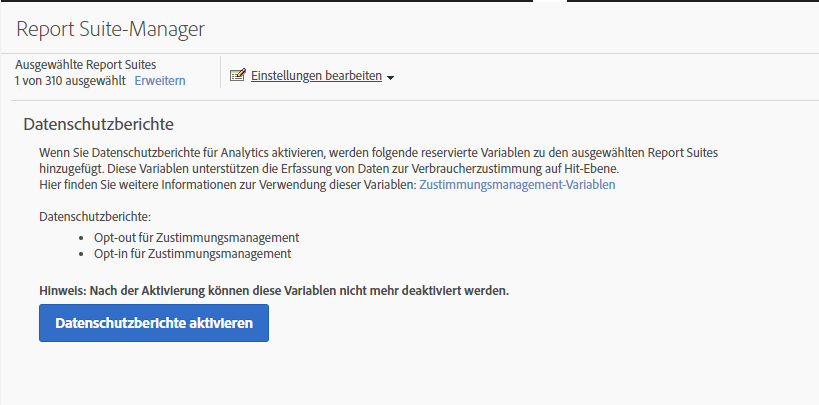
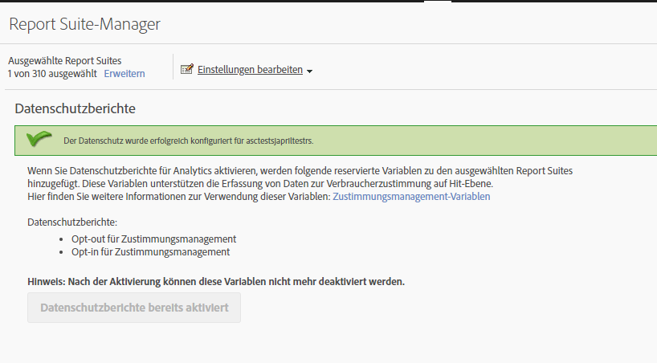
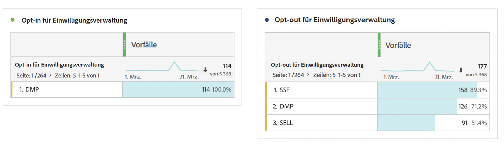

# Variablen für Datenschutzberichte

Als zusätzliche Unterstützung bei der Verwaltung von Datenschutzdaten stehen eine Reihe reservierter Variablen zur Verfügung, die zusammen mit bestimmten Kontextdatenvariablen verwendet werden können.
Diese Variablen für die Datenschutzberichterstellung bieten ein benutzerfreundliches Framework zur Erfassung des Datenschutzstatus bei jedem Treffer in der Analyse.

## Variablen

* Einwilligungsmanagement Opt-out
   * Reservierte Variable: Listen-Prop
   * Typ: Kommagetrennte Zeichenfolge
   * Enthält:
      * `contextData.['cm.ssf']=1` angezeigt als SSF
      * `contextData.['opt.dmp']=N` angezeigt als DMP
      * `contextData.['opt.sell']=N` angezeigt als SELL

* Einwilligungsmanagement Opt-in
   * Reservierte Variable: Listen-Prop
   * Typ: Kommagetrennte Zeichenfolge
   * Enthält:
      * `contextData.['opt.dmp']=Y` angezeigt als DMP
      * `contextData.['opt.sell']=Y` angezeigt als SELL

## Berichterstellung

Sie können die Variablen für Datenschutzberichte über eine neue Datenschutzeinstellung der Analytics Admin Console aktivieren.

Jede Report Suite kann wie folgt konfiguriert werden:
1. Klicken Sie in „Reports &amp; Analytics“ auf **[!UICONTROL Admin > Report Suites]**.
1. Wählen Sie die Report Suites aus, in denen Sie Mediendaten erfassen, und klicken Sie anschließend auf **[!UICONTROL Einstellungen bearbeiten > Datenschutzmanagement]**.

   

1. Klicken Sie auf die Schaltfläche **[!UICONTROL Datenschutzberichte aktivieren]**.

   >[!NOTE]
   >
   >Nach der Aktivierung können diese Variablen nicht mehr deaktiviert werden.

   

1. Nach der Aktivierung wird eine Bestätigungsmeldung angezeigt.

   

1. Die reservierten Variablen stehen nun in „Reports &amp; Analytics“ und „Workspace“ zur Analyse zur Verfügung. Siehe „Einwilligungsmanagement Opt-out und Opt-in“.

   

## Implementierung

Drei Kontextdatenvariablen sind vordefiniert, um mit den vom Datenschutzmanagement reservierten Variablen zu arbeiten.  Die Bestimmung der Verwaltung und des Beibehaltens der Einstellung dieser Variablen liegt bei den einzelnen Implementierungstechnikern.

Allgemeine Anleitungen zur Implementierung von Kontextdatenvariablen finden Sie unter [Kontextdatenvariablen](https://docs.adobe.com/content/help/de-DE/analytics/implementation/vars/page-vars/contextdata.html).

### SSF

* Kontextdaten: `contextData.['cm.ssf']`
* Akzeptierte Werte:
   * 1 – Wenn der Wert „1“gesendet wird, bedeutet dies, dass die serverseitige Weiterleitung einen Opt-out-Status aufweist. Der Wert „1“ in Verbindung mit dieser Variablen blockiert die Freigabe dieses Treffers für Adobe Audience Manager. Siehe [AAM-ePrivacy – Einhaltung](https://docs.adobe.com/help/en/analytics/integration/audience-analytics/audience-analytics-workflow/ssf-gdpr.html).
   * 0 – Optional. Verwenden Sie den Wert „0“ für Kunden, die einem gezielten Marketing zugestimmt haben. Wenn Sie die Variable nicht festlegen, führt dies ebenfalls zu denselben Ergebnissen.

### DMP

* Kontextdaten: `contextData.['opt.dmp']`
* Akzeptierte Werte:
   * N – Wenn der Wert „N“ gesendet wird, deutet dies darauf hin, dass der Verbraucher die Freigabe für Daten-Management-Plattformen ablehnt.  **Hinweis**: Ab dem 15. Januar 2020 blockiert die Einstellung dieser Variable auf „N“ die Server-seitige Freigabe dieses Treffers für AAM.
   * Y – Wenn der Wert „Y“ gesendet wird, deutet dies darauf hin, dass der Verbraucher die Freigabe für Daten-Management-Plattformen genehmigt.

### SELL

* Kontextdaten: `contextData.['opt.sell']`
* Akzeptierte Werte:
   * N – Wenn der Wert „N“ gesendet wird, deutet dies darauf hin, dass der Verbraucher die Freigabe oder den Verkauf der Daten an Dritte ablehnt.
   * Y – Wenn der Wert „Y“ gesendet wird, deutet dies darauf hin, dass der Verbraucher die Freigabe oder den Verkauf der Daten an Dritte genehmigt.
