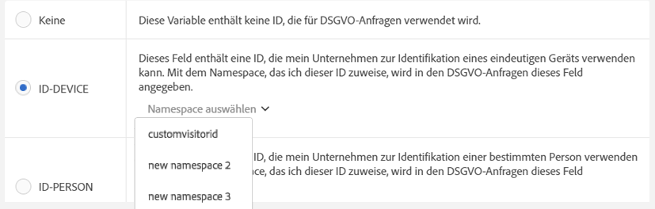
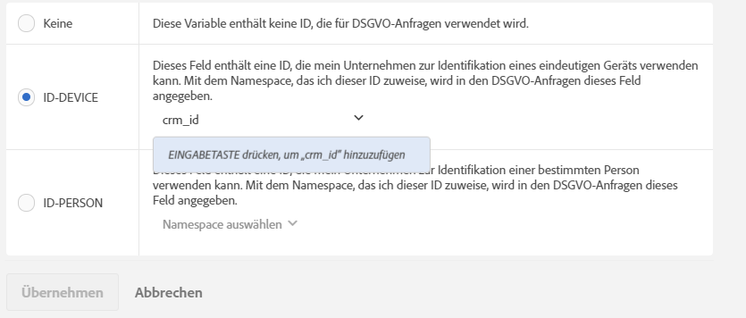

# Datenschutzbezeichnungen für Analytics-Variablen

## Grund der Datenbeschriftung {#section_A075CDF3AD0744BD8CEB41CE3FB7BFB3}

Viele Adobe-Kunden verfügen über juristische Teams, die die Datenschutzgesetze (DSGVO, CCPA usw.) geprüft haben. Sie haben eigene Schlussfolgerungen bezüglich des Umgangs mit Daten gezogen, um Datenschutzgesetze einzuhalten. Die rechtliche Interpretation unterscheidet sich möglicherweise zwischen den verschiedenen Unternehmen – und mit ihr auch die Datenverarbeitung der einzelnen Kunden. Um diesen unterschiedlichen Vorstellungen bei der Datenverarbeitung unter Einhaltung des Datenschutzes und den verschiedenen Datensätzen beizukommen, können Datenverantwortliche die Einstellungen für die Datenverarbeitung unter Einhaltung des Datenschutzes ihrer individuellen Daten nach eigenen Wünschen anpassen. So kann jeder Unique Customer Datenschutzanfragen so verarbeiten, wie es für seine Marke und seine Datensätze am sinnvollsten ist.

Adobe Analytics stellt Werkzeuge zur Verfügung, um Daten entsprechend ihrer Sensibilität und ihren vertraglichen Beschränkungen zu kennzeichnen. Kennzeichnungen sind wichtig und nützlich, denn sie helfen (1) die betroffenen Personen zu identifizieren, (2) zu bestimmen, welche Daten im Rahmen einer Zugriffsanforderung zurückgegeben werden sollen, und (3) Datenfelder zu identifizieren, die im Rahmen einer Löschanfrage gelöscht werden müssen.

Bevor Sie ermitteln, welche Beschriftungen den einzelnen Variablen und Feldern hinzugefügt werden müssen, sollten Sie zunächst die [Grundlagen zu den IDs](/help/admin/c-data-governance/gdpr-analytics-ids.md) kennen, die Sie in Ihren Analytics-Daten erfassen, und entscheiden, welche hiervon Sie für Datenschutzanfragen verwenden wollen.

Die Adobe Analytics-Datenschutzimplementierung unterstützt folgende Beschriftungen für Identitätsdaten, vertrauliche Daten und Data Governance.

## DULE-Beschriftungen {#section_B2E78130957647338495EF37DE21D6BC}

>[!NOTE]
>
>Das DULE-Framework (Data Usage Labeling &amp; Enforcement) wurde entwickelt, um über alle Lösungen, Services und Plattformen von Adobe hinweg eine einheitliche Methode zur Erfassung, Kommunikation und Verwendung von Metadaten zu Daten in der Adobe Experience Cloud bereitzustellen. Über die Metadaten können Datenverantwortliche angeben, bei welchen Daten es sich um personenbezogene Informationen handelt, welche Daten vertraulich sind und welche vertraglichen Beschränkungen für die Daten gelten. In dieser ersten Version zeigt Analytics nur die DULE-Beschriftungen, die für den Datenschutz relevant sind. Im Zuge der Implementierung der Unterstützung von DULE-Beschriftungen in anderen Adobe-Produkten werden in künftigen Versionen zusätzliche Beschriftungen für vertrauliche Daten sowie vertragliche Beschriftungen eingeführt, die helfen, sicherzustellen, dass die zwischen Produkten freigegebenen Daten nur so verwendet werden, wie es das Gesetz vorschreibt.

## Beschriftungen für Identitätsdaten (DULE) {#identity-data-labels}

Die Beschriftungen für Identitätsdaten („I“) werden verwendet, um Daten zu kategorisieren, über die eine bestimmte Person identifiziert oder kontaktiert werden kann.

<table id="table_6B5368D714424E52835D5DFE189BD080"> 
 <thead> 
  <tr> 
   <th colname="col1" class="entry"> Beschriftung </th> 
   <th colname="col2" class="entry"> Definition </th> 
   <th colname="col3" class="entry"> Weitere Anforderungen </th> 
  </tr>
 </thead>
 <tbody> 
  <tr> 
   <td colname="col1"> <p>I1 </p> </td> 
   <td colname="col2"> <p><b>Direkt identifizierbar</b>: Daten, die zur Identifikation oder direkten Kontaktaufnahme von bzw. mit Personen genutzt werden können, wie z. B. Name oder E-Mail-Adresse </p> </td> 
   <td colname="col3"> 
    <ul id="ul_4E2AD59D119E40D28B869D0BB63B9FD9"> 
     <li id="li_AC3E99B57E3A4AE2A12BE219680AFC58">Kann nicht für Ereignisse festgelegt werden </li> 
     <li id="li_BB66992863C8402F8D58656293F31E71">Kann nicht für Merchandising-eVars festgelegt werden </li> 
    </ul> </td> 
  </tr> 
  <tr> 
   <td colname="col1"> <p>I2 </p> </td> 
   <td colname="col2"> <p><b>Indirekt identifizierbar</b>: Daten, die in Kombination mit beliebigen anderen Daten dazu verwendet werden können, eine Person oder ein Gerät zu identifizieren oder direkt zu kontaktieren. </p> <p>Ermöglicht nicht die direkte Identifikation einer Person, sondern muss mit anderen Informationen (ob in Ihrem Besitz oder nicht) kombiniert werden, um die Person zu bestimmen. Hierzu zählen beispielsweise Kundentreue- oder im Unternehmens-CRM-System verwendete IDs, die für jeden Kunden eindeutig sind. </p> </td> 
   <td colname="col3"> 
    <ul id="ul_A0EF0F3DC5804D4FBE228946D697ABEB"> 
     <li id="li_A592EA6DA82C4D8C80E03F02ADF4E20E">Kann nicht für Ereignisse festgelegt werden </li> 
     <li id="li_46CE7B1E84884CDAB356A6DF89397849">Kann nicht für Merchandising-eVars festgelegt werden </li> 
    </ul> </td> 
  </tr> 
 </tbody> 
</table>

## Beschriftungen für vertrauliche Daten (DULE) {#sensitive-data-labels}

Die Beschriftungen für vertrauliche Daten („S“) werden verwendet, um vertrauliche Daten, wie z. B. geografische Daten, zu kategorisieren. In Zukunft werden zusätzliche Datenbeschriftungen eingeführt, um andere Arten vertraulicher Informationen zu identifizieren.

<table id="table_A778A508620545CCB37830E5CF1C75B7"> 
 <thead> 
  <tr> 
   <th colname="col1" class="entry"> Beschriftung </th> 
   <th colname="col2" class="entry"> Definition </th> 
  </tr>
 </thead>
 <tbody> 
  <tr> 
   <td colname="col1"> <p>S1 </p> </td> 
   <td colname="col2"> <p> Präzise Geostandortdaten mit Längen- und Breitengrad, die verwendet werden können, um den genauen Standort eines Geräts zu ermitteln (mit einer Abweichung von 100 Metern oder weniger). </p> </td> 
  </tr> 
  <tr> 
   <td colname="col1"> <p>S2 </p> </td> 
   <td colname="col2"> <p> Geostandortdaten, die verwendet werden können, um weit gefasste Geofencing-Bereiche zu bestimmen. </p> </td> 
  </tr> 
 </tbody> 
</table>

## Data Governance-Beschriftungen (Datenschutz) {#data-governance-labels}

Über Beschriftungen für Data Governance können Benutzer Daten klassifizieren, die datenschutzbezogene Überlegungen und vertragliche Bedingungen zur Einhaltung von Verordnungen und Unternehmensrichtlinien enthalten.

**Datenschutz-Zugriffsbeschriftungen**

<table id="table_663EFF43A454498386F7F3E60875E0F8"> 
 <thead> 
  <tr> 
   <th colname="col1" class="entry"> Beschriftung </th> 
   <th colname="col2" class="entry"> Definition </th> 
   <th colname="col3" class="entry"> Weitere Anforderungen </th> 
  </tr>
 </thead>
 <tbody> 
  <tr> 
   <td colname="col1"> <p>Keine </p> </td> 
   <td colname="col2"> <p>Wählen Sie diese Option aus, wenn diese Variable keine Daten enthält, die im Rahmen einer Datenschutz-Zugriffsanfrage in die an das Datensubjekt zurückzugebenden Daten eingefügt werden müssen. </p> </td> 
   <td colname="col3"> </td> 
  </tr> 
  <tr> 
   <td colname="col1"> <p>ACC-ALL </p> </td> 
   <td colname="col2"> <p>Werte in diesem Feld sollten in <u>allen</u> Datenschutzanfragen enthalten sein. </p> <p>Wenn dieser Hit von einem Gerät stammt, das von mehreren Personen genutzt wird, können Sie als Datenverantwortlicher über diese Beschriftung festlegen, dass es zulässig ist, die Daten in diesem Feld an Personen mit Zugriff auf das gemeinsam genutzte Gerät zu übermitteln. </p> </td> 
   <td colname="col3"> <p>Felder mit dieser Beschriftung werden bei allen Datenschutzanfragen zurückgegeben. </p> </td> 
  </tr> 
  <tr> 
   <td colname="col1"> <p>ACC-PERSON </p> </td> 
   <td colname="col2"> <p> Werte in diesem Feld sollten nur zu Datenschutzanfragen hinzugefügt werden, wenn Sie sich ausreichend sicher sind, dass der Hit vom Datensubjekt stammte. Dies gilt, wenn die ID einer Datenschutzanfrage mit dem Wert im Feld ID-PERSON übereinstimmt. </p> </td> 
   <td colname="col3"> <p>Sie müssen auch eine ID-PERSON-Beschriftung in einigen Variablen in dieser Report Suite festgelegt haben und Anfragen mit der entsprechenden ID einreichen. Andernfalls wird diese Beschriftung nie angewendet. </p> </td> 
  </tr> 
 </tbody> 
</table>

Obwohl nur wenige Variablen andere Beschriftungen erhalten werden, ist davon auszugehen, dass auf eine Vielzahl Ihrer Variablen Zugriffsbeschriftungen angewendet werden. Es obliegt jedoch Ihnen, nach Absprache mit Ihrer Rechtsabteilung zu entscheiden, welche von Ihnen erfassten Daten für die Datensubjekte freigegeben werden sollen.

**Datenschutz-Löschbeschriftungen**

<table id="table_59DFCE4D90214CB5972BDDE5B7391B4D"> 
 <thead> 
  <tr> 
   <th colname="col1" class="entry"> Beschriftung </th> 
   <th colname="col2" class="entry"> Definition </th> 
   <th colname="col3" class="entry"> Weitere Anforderungen </th> 
  </tr>
 </thead>
 <tbody> 
  <tr> 
   <td colname="col1"> </td> 
   <td colname="col2"> <p>Im Gegensatz zu anderen Beschriftungen schließen sich diese Löschbeschriftungen nicht gegenseitig aus. Sie können eine von ihnen, beide oder keine auswählen. Eine separate None-Beschriftung ist nicht erforderlich, da None durch die fehlende Aktivierung einer der Löschoptionen angegeben wird. </p> </td> 
   <td colname="col3"> <p>Eine Löschbeschriftung ist nur für Felder mit einem Wert erforderlich, der die Zuordnung eines Treffers zum Datensubjekt zulässt (d. h., der die Identifizierung des Datensubjekts ermöglicht). </p> <p> Andere persönliche Daten (Favoriten, Browser-/Einkaufsverlauf, Gesundheitszustand usw.) müssen nicht gelöscht werden, da die Zuordnung zum Datensubjekt erschwert wird. </p> </td> 
  </tr> 
  <tr> 
   <td colname="col1"> <p>DEL-DEVICE </p> </td> 
   <td colname="col2"> <p>Bei Datenschutz-Löschanfragen sollten Werte in diesem Feld nur bei Anfragen anonymisiert werden, bei denen eine bestimmte ID-DEVICE im Treffer vorhanden ist. </p> <p>Wenn derselbe Wert in anderen Hits auftritt, die nicht gelöscht werden, werden diese Instanzen nicht geändert. So ändern sich die Werte bei Berichten, die eindeutige Anzahlen in diesem Feld berechnen. Auf gemeinsam genutzten Geräten werden hierdurch möglicherweise IDs von anderen Personen als nur dem Datensubjekt entfernt. </p> <p>Die Werte ändern sich nicht, wenn dieses Feld eine ID-DEVICE-Beschriftung enthält und der Wert in diesem Feld als ID für eine Datenschutzanfrage verwendet wurde. </p> </td> 
   <td colname="col3"> 
    <ul id="ul_45C3A09E1F05492B97C3F3DEA7C78FBC"> 
     <li id="li_BAB277F92F284ADE9D7B6839BDD716E2">Erfordert auch eine I1- oder I2-/S1-Beschriftung </li> 
     <li id="li_6DDFC0571457489CBA9D76F547247F20">Kann nicht für Ereignisse festgelegt werden </li> 
     <li id="li_E79C6DFC6C58478EAA1504E3820D512C">Kann nicht für Merchandising-eVars festgelegt werden </li> 
     <li id="li_B78E273212E447D49D0707E174B66DEC">Kann nicht für Classifications festgelegt werden </li> 
     <li id="li_F0F52D0DE7454557A6A97063C1FBC372">Sie müssen Anfragen mit einer ID-DEVICE-Beschriftung senden oder „expandIDs“ auf „true“ festlegen. Andernfalls wird diese Beschriftung nie angewendet. </li> 
    </ul> </td> 
  </tr> 
  <tr> 
   <td colname="col1"> <p>DEL-PERSON </p> </td> 
   <td colname="col2"> <p>Bei Datenschutz-Löschanfragen sollten Werte in diesem Feld nur bei Anfragen anonymisiert werden, bei denen eine bestimmte ID-PERSON im Hit vorhanden ist. </p> <p>Wenn derselbe Wert in anderen Hits auftritt, die nicht gelöscht werden, werden diese Werte nicht geändert. So ändern sich die Werte bei Berichten, die eindeutige Anzahlen in diesem Feld berechnen. Die Werte ändern sich nicht, wenn dieses Feld eine ID-PERSON-Beschriftung enthält und der Wert in diesem Feld als ID für eine Datenschutzanfrage verwendet wurde. </p> </td> 
   <td colname="col3"> 
    <ul id="ul_6722E42E036E47B4B5E17DC213636D51"> 
     <li id="li_6C1A64FF68AF428A827D8C6C33E22970">Erfordert auch eine I1- oder I2-/S1-Beschriftung </li> 
     <li id="li_8053533FFE874EE795C8B6043A4F73B3">Kann nicht für Ereignisse festgelegt werden </li> 
     <li id="li_D6700CF4D03E44DDA83C4DDBB5B70CC3">Kann nicht für Merchandising-eVars festgelegt werden </li> 
     <li id="li_B6C2B15484B344889DBF29B62E2EA8FD">Kann nicht für Classifications festgelegt werden </li> 
     <li id="li_3BBD0C27D9644C2B9618457A0BFC15EF">Sie müssen auch eine ID-PERSON-Beschriftung in einigen Variablen in dieser Report Suite festgelegt haben und Anfragen mit der entsprechenden ID einreichen. Andernfalls wird diese Beschriftung nie angewendet. </li> 
    </ul> </td> 
  </tr> 
 </tbody> 
</table>

**Datenschutz-Identitätsbeschriftungen**

<table id="table_F6BBC868457443A19A7B693BD6C55B4B"> 
 <thead> 
  <tr> 
   <th colname="col1" class="entry"> Beschriftung </th> 
   <th colname="col2" class="entry"> Definition </th> 
   <th colname="col3" class="entry"> Weitere Anforderungen </th> 
  </tr>
 </thead>
 <tbody> 
  <tr> 
   <td colname="col1"> <p>Keine </p> </td> 
   <td colname="col2"> <p>Diese Variable enthält keine ID, die für Datenschutzanfragen verwendet wird. </p> </td> 
   <td colname="col3"> <p>Sie müssen nur dann eine dieser anderen Beschriftungen festlegen, wenn dieses Feld eine ID enthält, die Sie beim Senden von Zugriffs- oder Löschanfragen über die Datenschutz-API oder -UI senden. </p> </td> 
  </tr> 
  <tr> 
   <td colname="col1"> <p>ID-DEVICE </p> </td> 
   <td colname="col2"> <p>Dieses Feld enthält eine ID, die Sie zur Identifizierung eines Geräts für eine Datenschutzanfrage verwenden können. Sie kann jedoch nicht zwischen den verschiedenen Benutzern eines gemeinsam genutzten Geräts unterscheiden. </p> <p>Sie müssen diese Beschriftung nicht für alle Variablen angeben, die IDs enthalten (dazu dienen die I1/I2-Beschriftungen). Verwenden Sie diese Beschriftung, wenn Sie mithilfe von in dieser Variablen gespeicherten IDs Datenschutzanfragen senden und wenn Sie diese Variable für die angegebene ID suchen möchten. </p> </td> 
   <td colname="col3"> 
    <ul id="ul_618019CB8FCA4A5C94C47636240197B2"> 
     <li id="li_0E5ADED36FF24A348FDD434E2CC8C8EE">Erfordert auch eine I1- oder I2-Beschriftung </li> 
     <li id="li_20BCFF07B2BF468C8E0D477C10B2EF9F">Kann nicht für Ereignisse festgelegt werden </li> 
     <li id="li_0BD73EEF4184475D8E97878CF8DBEB90">Kann nicht für Merchandising-eVars festgelegt werden </li> 
     <li id="li_129851035C4A4BF0922296B4C3BEE39B">Kann nicht für Classifications festgelegt werden </li> 
    </ul> </td> 
  </tr> 
  <tr> 
   <td colname="col1"> <p>ID-PERSON </p> </td> 
   <td colname="col2"> <p>Dieses Feld enthält eine ID, die verwendet werden kann, um einen authentifizierten Benutzer (eine bestimmte Person) für eine Datenschutzanfrage zu identifizieren. </p> <p>Sie müssen diese Beschriftung nicht für alle Variablen angeben, die IDs enthalten (dazu dienen die I1/I2-Beschriftungen). Verwenden Sie diese Beschriftung, wenn Sie mithilfe von in dieser Variablen gespeicherten IDs Datenschutzanfragen senden und wenn Sie diese Variable für die angegebene ID suchen möchten. </p> </td> 
   <td colname="col3"> 
    <ul id="ul_0C7EEC8FCB5C4BCDA5D48F3C98770A67"> 
     <li id="li_2E781AE8D7A046A7996C7300CA854B86">Erfordert auch eine I1- oder I2-Beschriftung </li> 
     <li id="li_EB4C6430C218405DAAE81DEE010DCAA2">Kann nicht für Ereignisse festgelegt werden </li> 
     <li id="li_05AA67B45974474F9DA520E8B877BA11">Kann nicht für Merchandising-eVars festgelegt werden </li> 
     <li id="li_8A6BF4B40ED249289EAD46FE1C755FB0">Kann nicht für Classifications festgelegt werden </li> 
    </ul> </td> 
  </tr> 
 </tbody> 
</table>

## Namespace-Bereitstellung beim Beschriften einer Variablen als ID-DEVICE oder ID-PERSON {#section_F0A47AF8DA384A26BD56032D0ABFD2D7}

Wenn Sie eine Variable als ID-DEVICE oder ID-PERSON beschriften, werden Sie zum Bereitstellen eines Namespace aufgefordert. Sie können entweder einen zuvor definierten Namespace verwenden oder einen neuen definieren.

**Verwenden eines zuvor definierten Namespace**

Wenn Sie zuvor anderen Variablen in einer beliebigen Report Suite in Ihrem Anmeldeunternehmen eine ID-Beschriftung zugewiesen haben, können Sie einen dieser vorhandenen Namespaces auswählen. Sie sollten den Namespace wiederverwenden, wenn diese Variable denselben ID-Typ enthält wie andere Variablen, die bereits mit diesem Namespace beschriftet sind, und Sie beim Senden einer Anfrage alle Variablen durchsuchen wollen.

1. Klicken Sie auf **[!UICONTROL Namespace auswählen]**, und wählen Sie einen der vorhandenen Namespaces aus.
1. Klicken Sie auf **[!UICONTROL Übernehmen]**.



**Definieren eines neuen Namespace**

Sie können auch einen neuen Namespace definieren. Es wird empfohlen, Namespace-Zeichenfolgen auf alphanumerische Zeichen sowie Unterstriche, Bindestriche und Leerzeichen zu beschränken. Alle Zeichen werden in Kleinschreibung konvertiert.

1. Klicken Sie auf **[!UICONTROL Namespace auswählen]**, und geben Sie den Namespace-Titel ein.

   

1. Drücken Sie die **[!UICONTROL Eingabetaste]**, um diesen Namespace hinzuzufügen. Erst jetzt ist die Schaltfläche „Übernehmen“ aktiviert.
1. Klicken Sie auf **[!UICONTROL Übernehmen]**.

Die von Ihnen als Namespace angegebene Zeichenfolge ist dieselbe Zeichenfolge, die Sie beim Senden von Anfragen über die Datenschutz-API als Wert des Parameters „namespace“ verwenden sollten. Aufgrund der Anfrage durchsucht Adobe Analytics anschließend alle Variablen in allen Report Suites, in denen dieser Namespace verwendet wird, nach der ID, die Sie in der Anfrage angegeben haben.

Sie müssen die Beschriftungen ID-DEVICE oder ID-PERSON nicht für alle Variablen angeben, die IDs enthalten (dazu dienen die I1/I2-Beschriftungen). Verwenden Sie diese Beschriftung, wenn Sie mithilfe von in dieser Variablen gespeicherten IDs Datenschutzanfragen senden und wenn Sie diese Variable für die angegebene ID suchen möchten. Beispiel: eVar1 kann eine E-Mail-Adresse enthalten, während eVar2 einen Benutzernamen für die Anmeldung beinhaltet. Sie senden jedoch Anfragen ausschließlich mithilfe des Benutzernamens. In diesem Fall können Sie eVar1 als I1, ACC-PERSON, DEL-PERSON und eVar2 als I2, ACC-PERSON, DEL-PERSON, ID-PERSON mit dem Namespace „user name“ beschriften. Anschließend können Sie eine Anfrage mit einem JSON-Block für den Benutzerabschnitt senden, z. B.:

```
{
     "namespace": "user name",
     "type": "analytics",
     "value": "rocketman123"
}
```

Sie können denselben Namespace für verschiedene Variablen innerhalb derselben Report Suite verwenden. Bei einigen benutzerdefinierten Implementierungen wird beispielsweise eine CRM-ID in einem Prop- und einem eVar-Objekt gespeichert. Wenn die CRM-ID immer in einer der Variablen auftritt (z. B. in der eVar) und nur gelegentlich in der anderen enthalten ist (Prop) bzw. niemals in der Prop enthalten ist, wenn sie auch nicht in der eVar vorkommt, ist nur für das eVar-Objekt eine ID-Beschriftung und ein Namespace erforderlich, da Adobe nur diese eVar nach der ID durchsuchen kann. Wenn jedoch die CRM-ID manchmal in einer Variablen und manchmal in der anderen auftritt, sollten beide denselben Namespace haben. Adobe durchsucht dann beide Variablen nach Vorkommen der ID, die im Rahmen einer Datenschutzanfrage mit diesem Namespace angegeben wird. Sie sollten weiterhin DEL-Beschriftungen für all diese Variablen festlegen, damit der Wert anonymisiert wird, egal, wo er auftritt.

Als weiteres Beispiel dient der Fall, in dem Sie eine CRM-ID verwenden, die manchmal via eVar1 und manchmal via prop7 gesendet wird. Mithilfe einer Verarbeitungsregel wird der Wert auf eVar1 (sofern vorhanden) in eVar3 kopiert. Andernfalls wird der Wert von prop7 in eVar3 kopiert. In diesem Szenario enthält eVar3 immer die CRM-ID (sofern sie bekannt ist), sodass nur für eVar3 eine ID-PERSON-Beschriftung erforderlich ist.

>[!CAUTION]
>
>Die Namespaces „visitorId“ und „customVisitorId“ sind zur Identifikation des früheren Tracking-Cookies von Analytics und der benutzerdefinierten Besucher-ID von Analytics reserviert. Verwenden Sie diese Namespaces nicht für benutzerdefinierte Traffic-Variablen oder Konversionsvariablen.

## Variablentypen und unterstützte Datenschutz-/DULE-Beschriftungen {#section_CE7C3EDE1344466A98BC45E394B40762}

Datenschutz-/DULE-Beschriftungen wirken sich auf vier Klassen von Analytics-Variablen aus. Nicht alle Variablen unterstützen alle Beschriftungen. Die folgende Tabelle zeigt, welche Variablen welche Beschriftungen unterstützen.

<table id="table_95D4416B3A8A40C28B2610D0003456E6"> 
 <thead> 
  <tr> 
   <th colname="col1" class="entry"> Variablentyp </th> 
   <th colname="col2" class="entry"> Unterstützte Beschriftungen </th> 
   <th colname="col3" class="entry"> Nicht unterstützte Beschriftungen </th> 
  </tr>
 </thead>
 <tbody> 
  <tr> 
   <td colname="col1"> 
    <ul id="ul_0615B545A5AD43F2A6F25698A47AAD3E"> 
     <li id="li_A4B3E8E241B149C99F2A71B21227AD72">Benutzerspezifische Erfolgsereignisse </li> 
     <li id="li_8AEF688AE9B8426C82D199E4B195330D">Merchandising-eVars </li> 
     <li id="li_DFFCA65DCC6146AEB6D47476B4D4CC3B">Mehrwertige Variablen (mvVars) </li> 
     <li id="li_3192D08B12C249D1AAA8AAEEDE2FD7D7">Hierarchievariablen </li> 
    </ul> </td> 
   <td colname="col2"> <p>S1/S2 </p> <p>ACC-ALL, ACC-PERSON </p> </td> 
   <td colname="col3"> <p>I1/I2 </p> <p>ID-DEVICE, ID-PERSON </p> <p>DEL-DEVICE, DEL-PERSON </p> </td> 
  </tr> 
  <tr> 
   <td colname="col1"> <p>Classifications </p> </td> 
   <td colname="col2"> <p>I1/I2, S1/S2 </p> <p>ACC-ALL, ACC-PERSON, </p> </td> 
   <td colname="col3"> <p>ID-DEVICE, ID-PERSON </p> <p>DEL-DEVICE, DEL-PERSON </p> </td> 
  </tr> 
  <tr> 
   <td colname="col1"> 
    <ul id="ul_1C2FD4D606664965A88F10818E1C11A9"> 
     <li id="li_590975F5C7304317B22C80B20718E914">Traffic-Variablen (Props) </li> 
     <li id="li_6E614B7036994434BFDA71A4424529A0">Commerce-Variablen (Nicht-Merchandising-eVars) </li> 
    </ul> </td> 
   <td colname="col2"> <p>Alle Beschriftungen </p> </td> 
   <td colname="col3"> – </td> 
  </tr> 
  <tr> 
   <td colname="col1"> <p>Die meisten anderen Variablen </p> <p><i>(Ausnahmen finden Sie in der unten stehenden Tabelle.)</i> </p> </td> 
   <td colname="col2"> <p>ACC-ALL, ACC-PERSON </p> </td> 
   <td colname="col3"> <p>I1/I2, S1/S2 </p> <p>ID-DEVICE, ID-PERSON </p> <p>DEL-DEVICE, DEL-PERSON </p> </td> 
  </tr> 
 </tbody> 
</table>

## Variablen, denen andere Beschriftungen als ACC-ALL/ACC-PERSON zugewiesen werden können/geändert {#section_4FA003003D1B4E2EBCFCDB1A7CD4A824}

<table id="table_0972910DB2D7473588F23EA47988381D"> 
 <thead> 
  <tr> 
   <th colname="col1" class="entry"> Gruppe </th> 
   <th colname="col2" class="entry"> Variablen </th> 
   <th colname="col3" class="entry"> Änderbare Beschriftungen </th> 
   <th colname="col4" class="entry"> Kommentar </th> 
  </tr>
 </thead>
 <tbody> 
  <tr> 
   <td colname="col1" morerows="1"> 
    <ul id="ul_62FA1BAA3B9245909509566D8C03F900"> 
     <li id="li_38F7C4E18ECB42C292370713F502B8EB">Konversion-Dimensionen </li> 
     <li id="li_41CB61F927CB4402AAB4A62E219CD153">Benutzerspezifische Traffic-Dimensionen </li> 
    </ul> </td> 
   <td colname="col2"> <p>Alle außer Classifications </p> </td> 
   <td colname="col3"> <p>Alle </p> </td> 
   <td colname="col4"> </td> 
  </tr> 
  <tr> 
   <td colname="col2"> <p>Classifications </p> </td> 
   <td colname="col3"> <p>None/I1/I2 </p> <p>None/S1/S2 </p> </td> 
   <td colname="col4"> </td> 
  </tr> 
  <tr> 
   <td colname="col1"> <p>Konversionsereignisse </p> </td> 
   <td colname="col2"> <p>Alle </p> </td> 
   <td colname="col3"> <p>None/S1/S2 </p> </td> 
   <td colname="col4"> </td> 
  </tr> 
  <tr> 
   <td colname="col1"> <p>Lösungsdimensionen und Ereignisse </p> </td> 
   <td colname="col2"> <p>Activity Map-Link, </p> <p>Activity Map-Seite </p> </td> 
   <td colname="col3"> <p>None/I1/I2 </p> <p>None/DEL-DEVICE/DEL-PERSON </p> </td> 
   <td colname="col4"> <p>Variablen können URL-Parameter enthalten, die möglicherweise direkt oder indirekt identifizierbare Daten beinhalten. Wenn Ihre Implementierung keine direkt oder indirekt identifizierbaren Daten in diesen Variablen erfasst, benötigen sie keine Identitäts- oder Löschbeschriftungen. </p> <p>Hinweis: Beim Löschen werden die URL-Parameter entfernt, aber die Basis-URL wird beibehalten. </p> </td> 
  </tr> 
  <tr> 
   <td colname="col1"> <p>Datenverarbeitungsdimensionen </p> </td> 
   <td colname="col2"> <p>Benutzerspezifische Besucher-ID </p> </td> 
   <td colname="col3"> <p>ID-DEVICE/ID-PERSON </p> <p>DEL-DEVICE/DEL-PERSON </p> </td> 
   <td colname="col4"> <p>Die ID- oder DEL-Beschriftungen (mit „None“ festgelegt) können zwar nicht entfernt werden, Sie können sie aber je nach benutzerdefinierter ID-Implementierung in die DEVICE- oder PERSON-Variante ändern. </p> <p>Wenn Sie die benutzerdefinierte Besucher-ID nicht verwenden, hat die Einstellung keine Bedeutung. </p> </td> 
  </tr> 
  <tr> 
   <td colname="col1" morerows="1"> 
    <ul id="ul_5EB0193732D44A20AEA08CE9DFE01DBD"> 
     <li id="li_F70D969F83314A94BD8567449968EE2F">Standarddimensionen </li> 
     <li id="li_6046764B19FF4679B51E55671C2C0ADB">Datenverarbeitungsdimensionen </li> 
    </ul> </td> 
   <td colname="col2"> <p>IP-Adresse </p> <p>IP-Adresse 2 </p> </td> 
   <td colname="col3"> <p>DEL-DEVICE/DEL-PERSON </p> </td> 
   <td colname="col4"> <p>Sie können die DEL-Beschriftung zwar nicht ändern, Sie können sie jedoch zu DEL-DEVICE oder DEL-PERSON oder beidem ändern. </p> </td> 
  </tr> 
  <tr> 
   <td colname="col2"> <p>ClickMap-Aktion (Legacy), </p> <p>ClickMap-Kontext (Legacy), </p> <p>Seite, </p> <p>Seiten-URL, </p> <p>URL der ursprünglichen Entrypage, </p> <p>Verweisende Stelle, </p> <p>URL der Besuchsstartseite </p> </td> 
   <td colname="col3"> <p>None/I1/I2 </p> <p>None/DEL-DEVICE/DEL-PERSON </p> </td> 
   <td colname="col4"> <p>Variablen können URL-Parameter enthalten, die möglicherweise direkt oder indirekt identifizierbare Daten beinhalten. Wenn Ihre Implementierung keine direkt oder indirekt identifizierbaren Daten in diesen Variablen erfasst, benötigen sie keine Identitäts- oder Löschbeschriftungen. </p> <p>Hinweis: Beim Löschen werden die URL-Parameter entfernt, aber die Basis-URL wird beibehalten. </p> </td> 
  </tr> 
 </tbody> 
</table>

## Löschverarbeitung {#section_F3DEE591671A4B16A8E043F91C137ECB}

Die Adobe Analytics-Unterstützung für Datenschutz-Löschanfragen soll die Auswirkungen auf das Reporting minimieren. In den meisten Fällen sollten sich die in Berichten angezeigten Metriken nicht ändern. Ein Verlaufsbericht, der vor der Datenschutzlöschung ausgeführt wurde, stimmt mit dem Bericht nach der Löschung überein. Dies wird erreicht, indem die gelöschten Daten vollständig von der betroffenen Person getrennt werden, während nicht identifizierbare Daten beibehalten werden, damit die angezeigten Werte gleich bleiben.

Die folgende Tabelle zeigt, wie verschiedene Variablen „gelöscht“ werden. Die Liste ist nicht vollständig.

<table id="table_A329C2E2645F4685BC208826D070A5F6"> 
 <thead> 
  <tr> 
   <th colname="col1" class="entry"> Variablen </th> 
   <th colname="col2" class="entry"> Löschmethode </th> 
  </tr>
 </thead>
 <tbody> 
  <tr> 
   <td colname="col1"> <p>• Traffic-Variablen (Props) </p> <p>• Commerce-Variablen (eVars) </p> </td> 
   <td colname="col2"> <p>Der bestehende Wert wird durch einen neuen Wert der Form „Datenschutz-356396D55C4F9C7AB3FBB2F2FA223482“ ersetzt, wobei der 32-stellige Hexadezimalwert nach dem Präfix „Datenschutz-“ eine kryptografisch starke 128-Bit-Pseudozufallszahl ist. Da der Wert im Wesentlichen durch eine zufällige Zeichenfolge ersetzt wird, gibt es keine Möglichkeit, den ursprünglichen Wert aus diesem neuen Wert zu bestimmen, und keine Möglichkeit, den neuen Wert abzuleiten, wenn der ursprüngliche Wert bekannt ist. </p> <p>Wenn bei einer Variablen der ersetzte Wert auch in anderen Treffern auftritt, die im Rahmen derselben Datenschutzanfrage ebenfalls gelöscht werden, werden alle Instanzen dieses Werts durch den neuen Wert ersetzt. </p> <p>Wenn einige Instanzen eines Werts mit einer Löschanfrage ersetzt werden und im Rahmen einer späteren Anfrage andere (neue) Instanzen des ursprünglichen Werts gelöscht werden, unterscheidet sich der neue Ersatzwert vom ursprünglichen Ersatzwert. </p> </td> 
  </tr> 
  <tr> 
   <td colname="col1"> <p>Kauf-ID </p> </td> 
   <td colname="col2"> <p>Der bestehende Wert wird durch einen neuen Wert der Form „G-7588FCD8642718EC50“ ersetzt, wobei der 18-stellige Hexadezimalwert nach dem Präfix „G-“ den ersten 18 Stellen einer kryptografisch starken 128-Bit-Pseudozufallszahl entspricht. Alle Kommentare, die sich auf das Löschen von Traffic- und Commerce-Variablen beziehen, gelten auch hier. </p> <p>Die Kauf-ID ist eine Transaktions-ID, die primär sicherstellen soll, dass ein Kauf nicht zweimal berechnet wird, z. B. wenn jemand die Bestätigungsseite aktualisiert. Die ID selbst kann den Kauf mit einer Zeile in Ihrer eigenen Datenbank verknüpfen, wo der Kauf aufgezeichnet wird. In den meisten Fällen ist es nicht notwendig, diese ID zu löschen, sodass sie standardmäßig nicht gelöscht wird. Wenn Sie nach der Datenschutz-Löschanfrage Ihrer eigenen Daten den Kauf noch an einen Benutzer binden können, müssen Sie dieses Feld möglicherweise löschen, damit die Analytics-Daten für diesen Besucher nicht an den Käufer gebunden werden können. </p> </td> 
  </tr> 
  <tr> 
   <td colname="col1"> <p>Visitor ID </p> </td> 
   <td colname="col2"> <p>Der Wert ist eine 128-Bit-Ganzzahl und wird durch einen kryptographisch starken 128-Bit-Pseudozufallswert ersetzt. </p> </td> 
  </tr> 
  <tr> 
   <td colname="col1"> <p>• MCID </p> <p>• Benutzerspezifische Besucher-ID </p> <p>• IP-Adresse </p> <p>• IP-Adresse 2 </p> </td> 
   <td colname="col2"> <p>Der Wert wird gelöscht (entweder durch eine leere Zeichenfolge oder „0“, je nach Variablentyp). </p> </td> 
  </tr> 
  <tr> 
   <td colname="col1"> <p>• ClickMap-Aktion (Legacy) </p> <p>• ClickMap-Kontext (Legacy) </p> <p>• Seite </p> <p>• Seiten-URL </p> <p>• URL der ursprünglichen Entrypage </p> <p>• Verweisende Stelle </p> <p>• URL der Besuchsstartseite </p> </td> 
   <td colname="col2"> <p>Die URL-Parameter werden gelöscht/entfernt. Wenn der Wert nicht wie eine URL aussieht, wird der Wert gelöscht (auf die leere Zeichenfolge gesetzt). </p> </td> 
  </tr> 
  <tr> 
   <td colname="col1"> <p>• Breitengrad </p> <p>• Längengrad </p> </td> 
   <td colname="col2"> <p>Die Genauigkeit wird auf maximal einen Kilometer reduziert. </p> </td> 
  </tr> 
 </tbody> 
</table>

## Variablen, die die erwarteten Löschbeschriftungen nicht unterstützen {#section_956B766EFFEC427E87E6CFF3A4217E86}

Diese Abschnitt enthält Informationen zu Analytics-Variablen, die die Löschung nicht unterstützen. Manchmal werden diese Variablen von anderen Personen als Analytics-Benutzern (z. B. von der Rechtsabteilung) gelöscht, die den in der Variablen enthaltenen Datentyp nicht kennen und deshalb anhand des Variablennamens von einem falschen Typ ausgehen. Im Folgenden finden Sie eine Liste dieser Variablen und erfahren, warum sie keine Löschung erfordern bzw. warum sie nicht über eine spezifische Löschbeschriftung verfügen.

<table id="table_6FECF3D654514862912D371E6BE4143B"> 
 <thead> 
  <tr> 
   <th colname="col1" class="entry"> Variable </th> 
   <th colname="col2" class="entry"> Kommentare </th> 
  </tr>
 </thead>
 <tbody> 
  <tr> 
   <td colname="col1"> <p>Neue Besucher-ID </p> </td> 
   <td colname="col2"> <p>„Neue Besucher-ID“ ist ein boolescher Wert, der beim ersten Auftritt der entsprechenden Besucher-ID „true“ lautet. Sie müssen den Wert nicht löschen, nachdem die Besucher-ID anonymisiert wurde. Nach der Anonymisierung entspricht der Wert dem ersten Auftritt der anonymisierten ID. </p> </td> 
  </tr> 
  <tr> 
   <td colname="col1"> <p>Postleitzahl </p> <p>Geo-Postleitzahl </p> </td> 
   <td colname="col2"> <p>Postleitzahlen werden nur für Hits aus den USA festgelegt. Für Hits aus der EU werden sie nicht verwendet. Selbst wenn sie festgelegt werden, beschreiben sie nur einen breiten geografischen Bereich, der die Identifizierung der betroffenen Person schwierig gestaltet. </p> </td> 
  </tr> 
  <tr> 
   <td colname="col1"> <p>Geo-Breitengrad </p> <p>Geo-Längengrad </p> </td> 
   <td colname="col2"> <p>Diese bieten einen ungefähren Standort, der aus der IP-Adresse abgeleitet wird. Die Genauigkeit ist im Allgemeinen ähnlich wie bei einer Postleitzahl, also einige Dutzend Kilometer vom tatsächlichen Standort. </p> </td> 
  </tr> 
  <tr> 
   <td colname="col1"> <p>Benutzeragent </p> </td> 
   <td colname="col2"> <p>Der User Agent identifiziert die Version des verwendeten Browsers. </p> </td> 
  </tr> 
  <tr> 
   <td colname="col1"> <p>Benutzer-ID </p> </td> 
   <td colname="col2"> <p> Gibt die Analytics Report Suite (als Nummer) an, die die Daten enthält. </p> </td> 
  </tr> 
  <tr> 
   <td colname="col1"> <p>Report Suite-ID </p> </td> 
   <td colname="col2"> <p> Gibt den Namen der Analytics Report Suite an, die die Daten enthält. </p> </td> 
  </tr> 
  <tr> 
   <td colname="col1"> <p>Visitor ID </p> <p>MCID/ECID </p> </td> 
   <td colname="col2"> <p> Diese IDs verfügen über eine DEL-DEVICE-Beschriftung, jedoch kann keine DEL-PERSON-Beschriftung hinzugefügt werden. Wenn Sie die <a href="/help/admin/c-data-governance/gdpr-id-expansion.md"> ID-Erweiterung</a> bei jeder Anfrage angeben, werden diese IDs automatisch für alle Löschanfragen gelöscht, selbst wenn sie eine ID-PERSON verwenden. </p> <p>Wenn Sie die ID-Erweiterung nicht verwenden, aber diese Cookie-IDs in Hits anonymisieren wollen, die eine übereinstimmende ID in einer Prop oder eVar enthalten, können Sie diese Beschriftungsbeschränkung umgehen, indem Sie der Prop oder eVar eine ID-DEVICE-Beschriftung hinzufügen, selbst wenn sie eigentlich eine Person identifiziert (darüber hinaus müssen alle DEL-PERSON-Beschriftungen zu DEL-DEVICE-Beschriftungen geändert werden). Da in diesem Fall nur einige Instanzen der Besucher-ID oder ECID anonymisiert werden, ändern sich die Werte für Unique Visitors im Verlaufsbericht. </p> </td> 
  </tr> 
  <tr> 
   <td colname="col1"> <p>AMO-ID </p> </td> 
   <td colname="col2"> <p> Bei der Adobe Advertising Cloud-ID handelt es sich um eine Lösungsvariable, die über eine nicht veränderbare DEL-DEVICE-Beschriftung verfügt. Sie wird über ein Cookie festgelegt, genau wie die Besucher-ID und die MCID. Sie sollte aus Hits gelöscht werden, wenn diese anderen IDs gelöscht werden. Weitere Informationen finden Sie in den Beschreibungen der entsprechenden Variablen. </p> </td> 
  </tr> 
 </tbody> 
</table>

## Datumsfelder für Zugriffsanfragen {#section_6678FB4FF42B481C9B78E64F61782397}

Es gibt fünf Standardvariablen, die Zeitstempel enthalten:

<table id="table_49A9255366254F799E1682C30CBD98EB"> 
 <thead> 
  <tr> 
   <th colname="col1" class="entry"> Zeitstempel </th> 
   <th colname="col2" class="entry"> Definition </th> 
  </tr>
 </thead>
 <tbody> 
  <tr> 
   <td colname="col1"> <p>Hit Time UTC </p> </td> 
   <td colname="col2"> <p>Der Zeitpunkt, zu dem der Treffer von Adobe Analytics empfangen wurde. </p> </td> 
  </tr> 
  <tr> 
   <td colname="col1"> <p>Custom Hit Time UTC </p> </td> 
   <td colname="col2"> <p>Der Zeitpunkt, zu dem der Treffer stattgefunden hat, der bei einigen mobilen Apps und anderen Implementierungen vor dem Zeitpunkt liegen kann, zu dem der Treffer empfangen wurde. Wenn beispielsweise eine Netzwerkverbindung zum Zeitpunkt des Auftretens nicht verfügbar war, kann die App den Treffer halten und übermitteln, wenn eine Verbindung verfügbar wird. </p> </td> 
  </tr> 
  <tr> 
   <td colname="col1"> <p>Date Time </p> </td> 
   <td colname="col2"> <p>Derselbe Wert wie „Custom Hit Time UTC“, jedoch in der Zeitzone der Report Suite und nicht in GMT.</p> </td> 
  </tr> 
  <tr> 
   <td colname="col1"> <p>First Hit Time GMT </p> </td> 
   <td colname="col2"> <p>Der „Custom Hit Time UTC“-Wert für den ersten Treffer, der für den Besucher-ID-Wert für diesen Treffer empfangen wurde. </p> </td> 
  </tr> 
  <tr> 
   <td colname="col1"> <p>Visit Start Time UTC </p> </td> 
   <td colname="col2"> <p>Der „Custom Hit Time UTC“-Wert für den ersten Treffer, der für den aktuellen Besuch für diese Besucher-ID empfangen wurde.</p> </td> 
  </tr> 
 </tbody> 
</table>

Für den Code zur Generierung der für Datenschutz-Zugriffsanfragen zurückgegebenen Dateien ist es erforderlich, dass mindestens eine der ersten drei Zeitstempelvariablen in die Zugriffsanfrage aufgenommen wird (mit einer ACC-Beschriftung, die für die Art der Anforderung gilt). Wenn keine davon enthalten ist, wird „Custom Hit Time UTC“ so behandelt, als hätte es eine „ACC-ALL“-Beschriftung.

Die CSV-Datei auf Trefferebene, die für Datenschutz-Zugriffsanfragen zurückgegeben wird, konvertiert die Werte in diesen Feldern von Unix-Zeitstempeln in Datums-/Zeitfelder im Format JJJJ-MM-TT HH:MM:SS (z. B. 2018-05-01 13:49:22). In der zusammenfassenden HTML-Datei werden diese Zeitstempelwerte abgeschnitten, sodass nur das Datum JJJJ-MM-TT enthalten ist, um die Anzahl der eindeutigen Werte, die für diese Felder auftreten, zu reduzieren.
