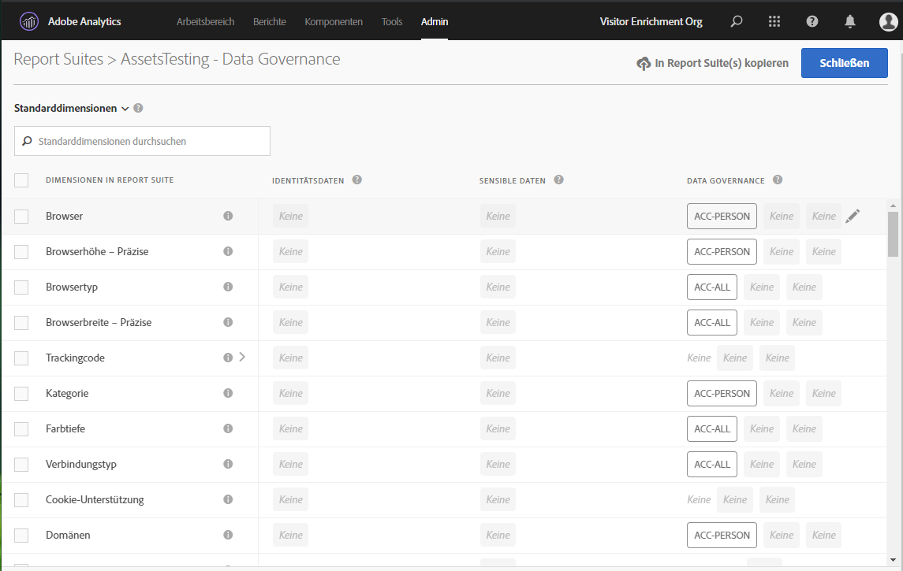
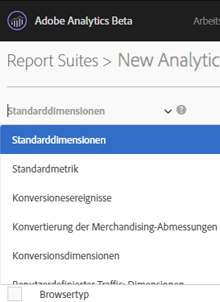
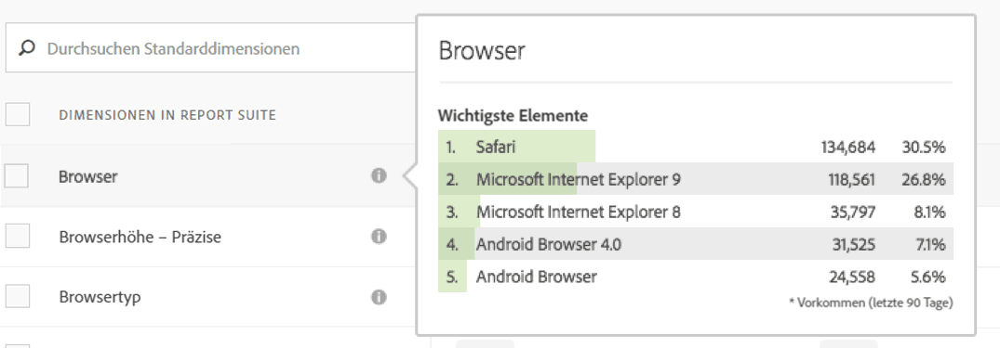
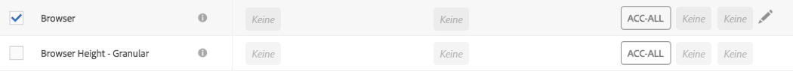
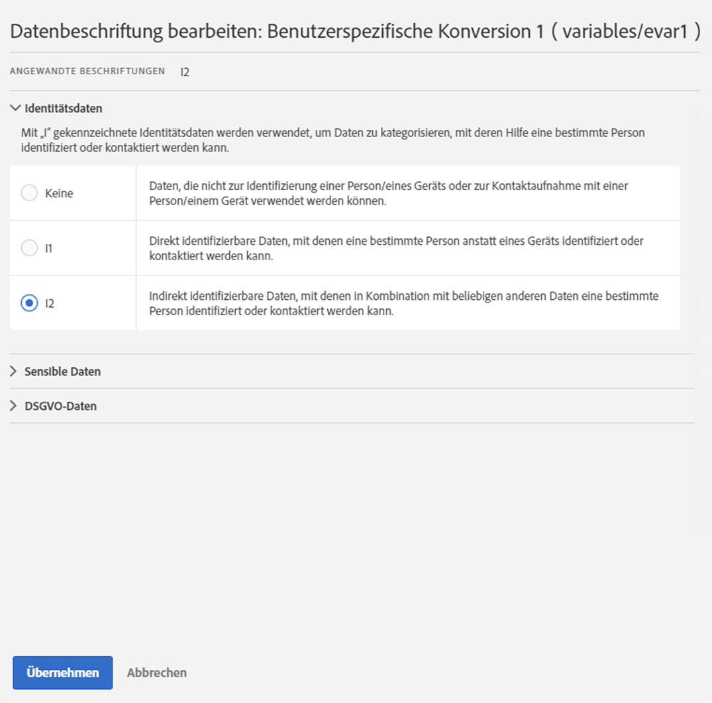
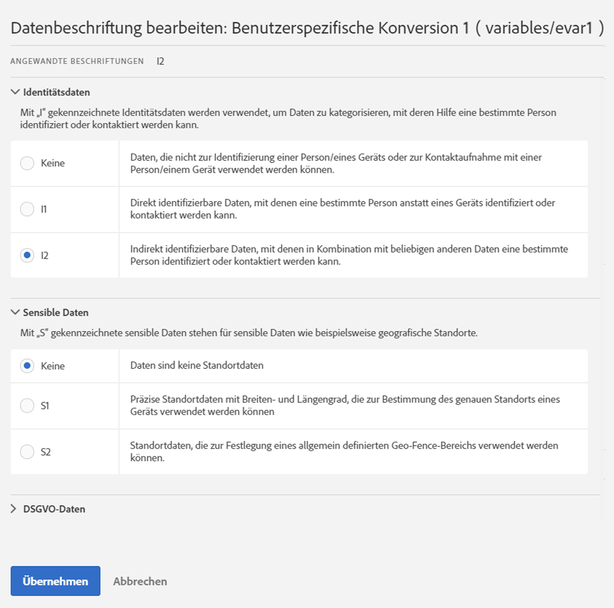
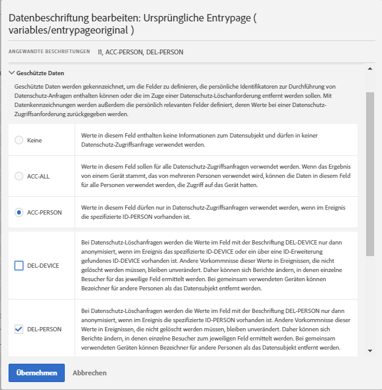
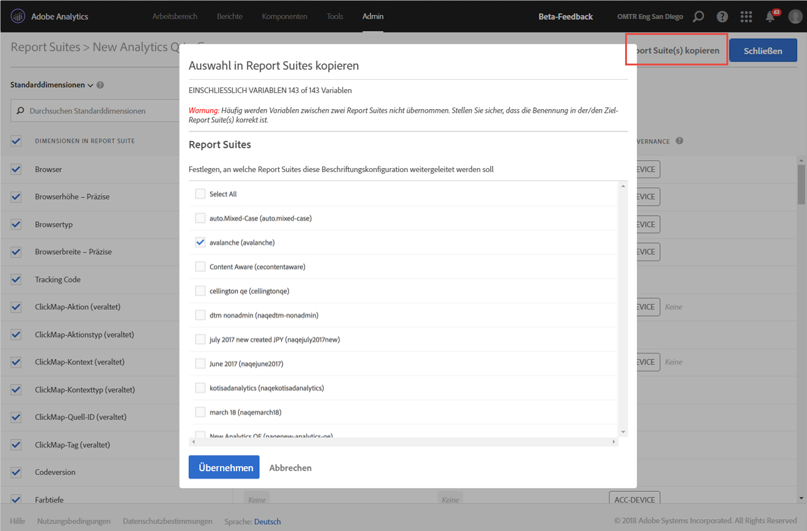

# Report Suite-Daten beschriften

Die Beschriftung von Report Suite-Daten bedeutet, dass Sie jeder Variablen in Ihren Report Suites Beschriftungen zu Identität, Vertraulichkeit und Data Governance zuweisen. Machen Sie sich hierzu zunächst mit den Beschriftungen und ihren Definitionen vertraut.

>[!NOTE]
>
>Beachten Sie, dass die Beschriftung jedes Mal überprüft werden muss, wenn eine neue Report Suite erstellt wird oder in einer vorhandenen Report Suite eine neue Variable aktiviert wird. Sie müssen die Beschriftung möglicherweise auch dann überprüfen, wenn neue Lösungsintegrationen aktiviert werden, da sie neue Variablen zur Verfügung stellen können, für die eine Beschriftung erforderlich ist. Durch eine erneute Implementierung Ihrer Mobile Apps oder Websites kann sich die Art und Weise der Verwendung vorhandener Variablen ändern. Dadurch kann ebenfalls eine Aktualisierung der Beschriftungen erforderlich sein.

## Report Suite-Beschriftungen zuweisen oder bearbeiten {#section_39F829F35A274EACA532E2F6FF392996}

**Beispiel**: Sie als Datenverantwortlicher planen die Erfassung von E-Mail-Adressen und Cookie-IDs von Datensubjekten, um ihre Datenschutzanfragen zu verarbeiten. Diese Cookie-IDs werden in einer Adobe Analytics Report Suite gespeichert. Um eine Beschriftung für E-Mail-Adressen und Cookie-IDs zu erstellen, müssen Sie das Adobe Cloud Platform-DULE-Framework (Data Usage Labeling &amp; Enforcement) in Analytics verwenden.

1. Öffnen Sie hierzu in Analytics **[!UICONTROL Admin]** > **[!UICONTROL Data Governance]** > **[!UICONTROL (Wählen Sie die gewünschte Report Suite aus)]** 

1. Wählen Sie aus, welche Variablengruppe Sie beschriften wollen.

   

   * **Standarddimensionen** (standardmäßig verfügbare Adobe Analytics-Dimensionen)
   * **Standardmetriken** (standardmäßig verfügbare Adobe Analytics-Metriken)
   * **Konversionsereignisse** (benutzerspezifische Erfolgsereignisse)
   * **Merchandising-Konversionsdimensionen** (Merchandising-eVars)
   * **Konversionsvariablen** (Nicht-Merchandising-eVars)
   * **Benutzerspezifische Traffic-Dimensionen** (Props)
   * **Lösungsdimensionen und Ereignisse** (Dimensionen/Ereignisse bezüglich Lösungen wie Mobile, Video, Activity Map usw. und Integrationen in Lösungen wie Adobe Campaign, Adobe Experience Manager, Advertising Cloud usw.)
   * **Datenverarbeitungs-Dimensionen** (Variablen, die nicht direkt im Reporting über die Adobe Analytics-UI verfügbar sind, die Ihnen jedoch über Daten-Feeds und/Data Warehouse-Anfragen zur Verfügung stehen)

1. (Optional) Klicken Sie auf das Informationssymbol (i) neben den einzelnen Variablen, um die häufigsten Werte der letzten 90 Tage besser nachvollziehen zu können. (Diese Funktionalität steht für Dimensionen zur Datenverarbeitung nicht zur Verfügung, da sie in der Analytics-UI nicht verfügbar sind.)

   

1. Wählen Sie mindestens eine Variable aus, indem Sie das entsprechende Kontrollkästchen aktivieren, und klicken Sie auf das Symbol **[!UICONTROL Bearbeiten]** (rechts), um sie zu bearbeiten.

   

1. Das Dialogfeld für **Identitätsdaten**-Beschriftungen öffnet sich automatisch. Diese Beschriftungen geben an, welche Daten allein oder in Kombination mit anderen Daten verwendet werden können, um eine Person zu identifizieren oder direkten Kontakt herzustellen. Weitere Informationen zu diesen Optionen finden Sie unter [Beschriftungen für Identitätsdaten (DULE).](/help/admin/c-data-governance/gdpr-labels.md#identity-data-labels)

   >[!NOTE]
   >
   >Das DULE-Framework (Data Usage Labeling &amp; Enforcement) wurde entwickelt, um über Lösungen, Services und Plattformen hinweg eine einheitliche Methode zur Erfassung, Kommunikation und Verwendung von Metadaten zu Daten in der Adobe Experience Cloud bereitzustellen. Über die Metadaten können Datenverantwortliche angeben, bei welchen Daten es sich um personenbezogene Informationen handelt, welche Daten vertraulich sind und welche vertraglichen Beschränkungen für die Daten gelten.

   

1. Öffnen Sie den Bereich **Vertrauliche Daten**, um Beschriftungen für vertrauliche Daten festzulegen, mit deren Hilfe die geografischen Daten kategorisiert werden. Weitere Informationen zu diesen Optionen finden Sie unter [Beschriftungen für vertrauliche Daten (DULE).](/help/admin/c-data-governance/gdpr-labels.md#sensitive-data-labels)

   

1. Öffnen Sie den Bereich „Datenschutzdaten“, um **Data Governance**-Beschriftungen festzulegen. In diesem Bereich können Sie Adobe anweisen, wie die einzelnen Variablen für Datenschutz-Zugriffs- und -Löschanfragen verarbeitet werden, und Sie können definieren, welche Variablen überprüft werden sollen, um die Datensubjekt-IDs für diese Anfragen zu finden. Weitere Informationen zu diesen Optionen finden Sie unter [Beschriftungen für Data Governance (Datenschutz).](/help/admin/c-data-governance/gdpr-labels.md#data-governance-labels)

   

1. Nachdem Sie sämtliche Beschriftungen abgeschlossen haben, klicken Sie auf **[!UICONTROL Übernehmen]**.

## Beschriftungen zu Report Suite(s) kopieren {#section_7C6FDAFF049F4126B84F6261F72668EE}

Wenn Sie DULE-/Datenschutzeinstellungen auf mehr als eine Report Suite anwenden möchten, führen Sie folgende Schritte aus:

1. Wählen Sie die Variablengruppe aus (Standarddimensionen, Konversionsdimensionen usw.), die die Variable enthält, die Sie kopieren möchten. Beachten Sie, dass Sie jeweils nur die Beschriftungen für eine Variablengruppe kopieren können.
1. Wählen Sie eine oder alle Variablen in dieser Gruppe aus.
1. Klicken Sie oben rechts im Dialogfenster „Data Governance“ auf **[!UICONTROL Beschriftungen zu Report Suite(s) kopieren]**.

   

1. Aktivieren Sie entweder das Kontrollkästchen **[!UICONTROL Alle auswählen]**, um Beschriftungen für die ausgewählten Variablen in alle Report Suites zu kopieren, oder wählen Sie die einzelnen Report Suites aus, in die Sie die Beschriftungen kopieren möchten.

   >[!IMPORTANT]
   >
   >Denken Sie daran, dass alle ausgewählten Report Suites Ihrer Experience Cloud-Organisation zugeordnet sein müssen.

   Wenn Sie die Beschriftungen für eine Variable oder Variablengruppe in eine andere Report Suite kopieren, wird die Kopie an der entsprechenden Stelle in der Ziel-Report Suite abgelegt. Bei Standarddimensionen, Standardmetriken, Lösungsdimensionen und Ereignissen sowie Datenverarbeitungs-Dimensionen werden die Beschriftungen in die Variable mit **demselben Namen** in der Ziel-Report Suite kopiert.

   Bei Konversionsvariablen (eVars), Merchandising-Konversionsdimensionen und benutzerspezifischen Traffic-Dimensionen (Props) wird die Kopie jedoch unter der Variable mit **derselben Nummer** in der Ziel-Report Suite erstellt. eVar12 wird beispielsweise zu eVar12 in allen Ziel-Report Suites kopiert. Die Namen dieser Variablen werden bei der Bestimmung des Ziels der Kopie ignoriert. Wenn die entsprechende Variable in der Ziel-Report Suite nicht aktiviert ist, schlägt die Kopie für diese Variable fehl.

   Beim Kopieren der Beschriftungen für Klassifizierungen, die für eine Variable definiert sind, werden die Beschriftungen in eine Klassifizierung für die entsprechende Variable in der Ziel-Report Suite kopiert (z. B. eVar7 zu eVar7), deren Name identisch mit der kopierten Klassifizierung ist. Andernfalls schlägt die Kopie für die Beschriftungen der betreffenden Classification fehl.

   Nach dem Anwenden eines Beschriftungssatzes wird eine Statusmeldung angezeigt. Die Statusmeldung enthält die Namen der Zielvariablen oder Klassifizierungen und die zugehörigen Report Suites, für die die Kopie fehlgeschlagen ist.

   >[!IMPORTANT]
   >
   >Sie sollten immer die Ziel-Report Suites überprüfen, um sicherzustellen, dass die Beschriftungen korrekt kopiert wurden. Dies ist insbesondere für Variablen mit ID- oder DEL-Beschriftungen wichtig.

1. Klicken Sie auf **[!UICONTROL Übernehmen]**.

