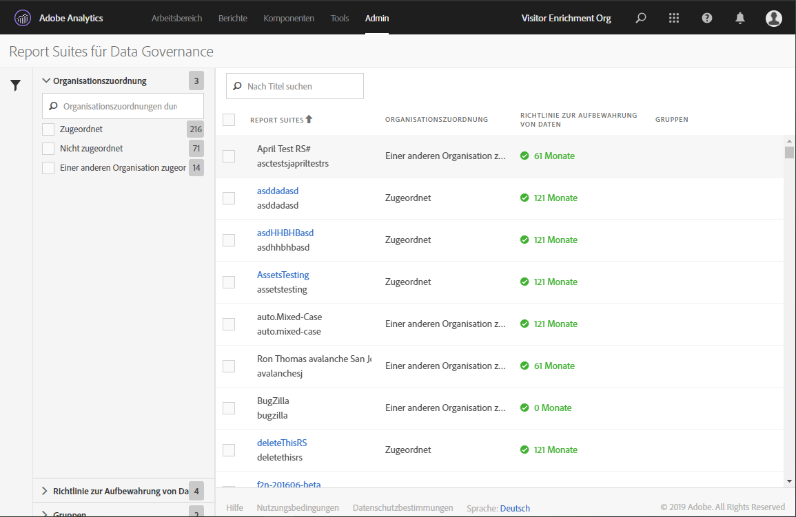
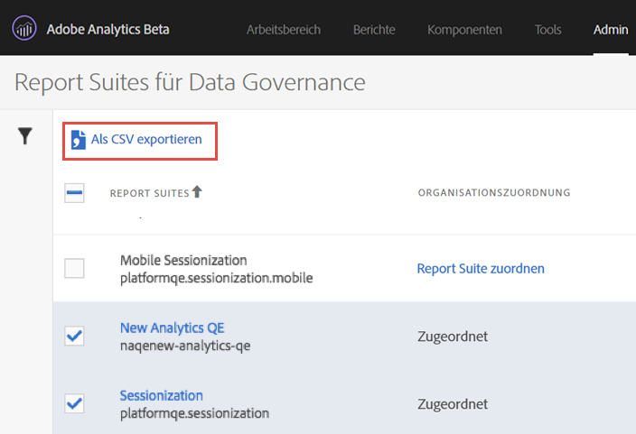

# Data-Governance-Einstellungen von Report Suites anzeigen/verwalten

Über das Data-Governance-Dialogfeld in den Admin Tools können Sie einsehen, welche Report Suites für Data Governance konfiguriert wurden, ob sie einer Experience Cloud-Organisation zugeordnet wurden und ob für die entsprechende Report Suite eine Richtlinie zur Datenaufbewahrung vorhanden ist.

1. Melden Sie sich bei Adobe Experience Cloud an.
1. Öffnen Sie **[!UICONTROL Analytics]** > **[!UICONTROL Admin]** > **[!UICONTROL Data Governance]**.

   Hier werden Ihnen die Report Suites des Anmeldeunternehmens angezeigt:

   

<table id="table_448292730FF0475E9DCB731882F9A29B"> 
 <thead> 
  <tr> 
   <th colname="col1" class="entry"> Einstellung </th> 
   <th colname="col2" class="entry"> Beschreibung </th> 
  </tr> 
 </thead>
 <tbody> 
  <tr> 
   <td colname="col1"> 
Report Suites 
 </td> 
   <td colname="col2"> 
Die erste Zeile enthält den Anzeigenamen der Report Suite. Die zweite Zeile enthält den internen Namen der Report Suite. Wenn Sie Beschriftungen für eine Report Suite festlegen dürfen, befindet sich in der ersten Zeile ein Link, auf den Sie klicken können und über den Sie zur Beschriftungsseite gelangen. 
 </td> 
  </tr> 
  <tr> 
   <td colname="col1"> 
Organisationszuordnung 
 </td> 
   <td colname="col2"> 
    <ul id="ul_EF8F613B0C5E42D19DB60BD0C89C114B"> 
     <li id="li_B35EE88555F547EFBF55ADE9D0C9EC3B"><b>Zugeordnet</b>: Diese Report Suite wurde bereits derselben Experience Cloud-Organisation wie das Analytics-Anmeldeunternehmen zugeordnet, bei dem Sie angemeldet sind. Es können nur Report Suites mit dieser Einstellung beschriftet werden. </li> 
     <li id="li_4E800BF80CFF477BAA091EF272D9071C"><b>Report Suite zuordnen</b>: Klicken Sie auf diesen Link, um die entsprechende Report Suite einer Experience Cloud-Organisation <a href="https://docs.adobe.com/content/help/de-DE/core-services/interface/about-core-services/report-suite-mapping.html">zuzuordnen</a>. 
So werden Sie zur Experience Cloud-Seite zur Report Suite-Zuordnung weitergeleitet, auf der Sie die Report Suite auswählen und der entsprechenden Organisation zuordnen müssen. Kehren Sie daraufhin zur Data-Governance-Oberfläche zurück. 
 </li> 
     <li id="li_FF825A65D089487BBF5FCB0D74D41CD7"><b>Einer anderen Organisation zugeordnet</b>: Diese Report Suite wurde bereits einer anderen Experience Cloud-Organisation zugeordnet. </li> 
    </ul> </td> 
  </tr> 
  <tr> 
   <td colname="col1"> 
Richtlinie zur Datenaufbewahrung 
 </td> 
   <td colname="col2"> 
Für die Datenschutzimplementierung in Analytics müssen Sie eine Richtlinie zur Datenaufbewahrung erstellen. 
 
Diese Einstellung zeigt: 
 
    <ul> 
     <li>ob eine Richtlinie zur Datenaufbewahrung für die entsprechende Report Suite vorhanden ist und </li> 
     <li>wie lange die Daten von Adobe aufbewahrt werden, bis sie gelöscht werden. Standardmäßig beträgt der Aufbewahrungszeitraum 25 Monate. </li> 
    </ul> 
Hinweis: Adobe Analytics kann Sie bei der Verarbeitung von Anfragen an die Datenschutz-API – also bei der Verarbeitung von Zugriffs- oder Löschanfragen, die Sie von Ihren Endbenutzern erhalten – nicht unterstützen, wenn kein Zeitraum zur Datenaufbewahrung festgelegt wurde. Wenden Sie sich an Ihren Customer Success Manager, um den Zeitraum der Datenaufbewahrung festzulegen. 
 </td> 
  </tr> 
  <tr> 
   <td colname="col1"> 
Gruppen 
 </td> 
   <td colname="col2"> 
Die Gruppierungsfunktionalität ist derzeit nicht implementiert. 
 </td> 
  </tr> 
  <tr> 
   <td colname="col1"> 
Linke Sidebar 
 </td> 
   <td colname="col2"> 
Klicken Sie auf das Trichtersymbol, um die Sidebar zu öffnen oder zu schließen. 
 
Im Bereich „Organisationszuordnung“ wird die Anzahl Report Suites angezeigt, die in die einzelnen beschriebenen Kategorien fallen. 
 
Im Bereich „Richtlinie zur Datenaufbewahrung“ werden die eindeutige momentan für Ihre Organisation verwendete Datenaufbewahrungsrichtlinie sowie die Anzahl Report Suites angezeigt, die dieser Aufbewahrungsrichtlinie zugeordnet wurde. 
 </td> 
  </tr> 
  <tr> 
   <td colname="col1"> 
In CSV exportieren 
 </td> 
   <td colname="col2"> 
Wenn Sie das Kontrollkästchen neben einer oder mehreren Report Suites aktivieren, wird die Option In CSV exportieren angezeigt. Mithilfe dieser Option können Sie eine CSV-Datei mit allen aktuellen Beschriftungsdefinitionen für sämtliche Variablen aller ausgewählten Report Suites herunterladen. 
 
Es wird empfohlen, dass Ihre Rechtsabteilung die Beschriftungseinstellungen überprüft. Diese Überprüfung wird mithilfe dieser Option vereinfacht. Statt die Überprüfung durchführen zu müssen, während Sie bei der Data-Governance-Benutzeroberfläche angemeldet sind, können Sie einfach die CSV-Datei weitergeben. 
 
 
 </td> 
  </tr> 
 </tbody> 
</table>

