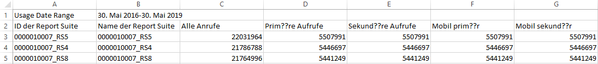

# Anzeigen der Nutzung der Report Suite

Die Registerkarte „Nutzung der Report Suite“ bietet Daten über die Server-Nutzung jeder Report Suite aller Anmeldeunternehmen innerhalb der aktuellen Nutzungsperiode, die mit Ihrem Abrechnungsunternehmen zusammenhängen.

**[!UICONTROL Analytics]** > **[!UICONTROL Admin]** > **[!UICONTROL Nutzung der Server-Aufrufe]** > **[!UICONTROL Nutzung der Report Suite]**

>[!IMPORTANT]
>
>Falls eine Report Suite nicht mit einer [Experience Cloud-Organisation verbunden ist](https://docs.adobe.com/content/help/de-DE/core-services/interface/about-core-services/report-suite-mapping.html), werden ihre Nutzungsdaten nicht im Dashboard angezeigt. Außerdem kann eine Abrechnungs-ID mit mehreren Experience Cloud-Organisationen zusammenhängen. Das Verhältnis zwischen einer Organisation und einer Abrechnungs-ID ist nicht immer 1:1.

Das Dashboard zur Nutzung der Report Suite

* Zeigt die Nutzung der Server-Aufrufe für die aktuelle Nutzungsperiode (alle Aufrufe, primär, sekundär, primär mobil, sekundär mobil) für alle Report Suits innerhalb Ihrer Experience Cloud-Organisation an.
* Zeigt den Anteil der Gesamtnutzung pro Server-Aufruf-Kategorie an.
* Wird täglich aktualisiert.
* Kann heruntergeladen werden.
* Lässt Sie auf die Benutzeroberfläche **[!UICONTROL Warnhinweise verwalten]** zugreifen.

| Spalte | Definition |
|--- |--- |
| Report Suite  Name | Anzeigename der Report Suite |
| Alle Aufrufe (% der Gesamtzahl) | Alle Server-Aufrufe, die innerhalb der aktuellen Nutzungsperiode erfolgt sind. |
| Primäre Aufrufe (%) | Alle primären Server-Aufrufe (und ihr Anteil an der Gesamtzahl), die innerhalb der aktuellen Nutzungsperiode erfolgt sind. |
| Sekundäre Aufrufe (%) | Alle sekundären Server-Aufrufe (und ihr Anteil an der Gesamtzahl), die innerhalb der aktuellen Nutzungsperiode erfolgt sind. |
| Primäre mobile Aufrufe (%) | Alle primären mobilen Server-Aufrufe (und ihr Anteil an der Gesamtzahl), die innerhalb der aktuellen Nutzungsperiode erfolgt sind. |
| Sekundäre mobile Aufrufe (%) | Alle sekundären mobilen Server-Aufrufe (und ihr Anteil an der Gesamtzahl), die innerhalb der aktuellen Nutzungsperiode erfolgt sind. |

## Nutzungsbericht herunterladen   {#section_D7345660B5E043CD8850954216509A3D}

Mit dieser Option können Sie Nutzungsdaten und Daten aus Zeiträumen vor der aktuellen Nutzungsperiode herunterladen (bis Januar 2015). Der Bericht wird als .csv-Datei heruntergeladen.

1. Wählen Sie mindestens eine Report Suite aus.
1. Klicken Sie auf **[!UICONTROL Bericht herunterladen]**.

   

| Berichtselement | Beschreibung |
|--- |--- |
| Dateiname | Hartkodierter Name: Gebrauchsbericht `day and time of report creation.csv` |
| Enthaltene Report Suites | Diese Liste enthält jegliche Report Suites, die Sie auf der „Nutzung der Report Suite“-Seite ausgewählt haben. |
| Enthaltene Aufrufarten | Legen Sie eine beliebige Kombination aus Folgendem fest: Alle Aufrufe (Standard), Primär, Sekundär, Primär mobil, Sekundär mobil. |
| Zeitraum | Sie können die aktuelle Nutzungsperiode auswählen oder selbst einen Zeitraum definieren.  Wenn Sie selbst einen Zeitraum definieren möchten, dann geben Sie bitte einen Beginn des Zeitraums und ein Ende des Zeitraums ein.  **Hinweis:** Sie können keine Nutzungsdaten herunterladen, die vor Januar 2015 aufgezeichnet wurden . |

1. Klicken Sie auf **[!UICONTROL Herunterladen]**.

Im Folgenden finden Sie einen Screenshot, wie die heruntergeladene .csv-Datei aussieht. Sie enthält eine Spalte für die Report Suite-ID. Die Report Suite-ID gibt eine eindeutige ID an, die nur alphanumerische Zeichen enthalten darf. Diese ID kann nach der Erstellung einer Report Suite nicht mehr geändert werden.

