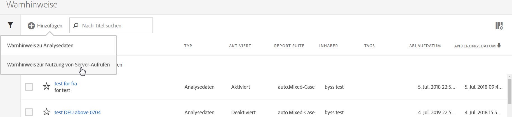
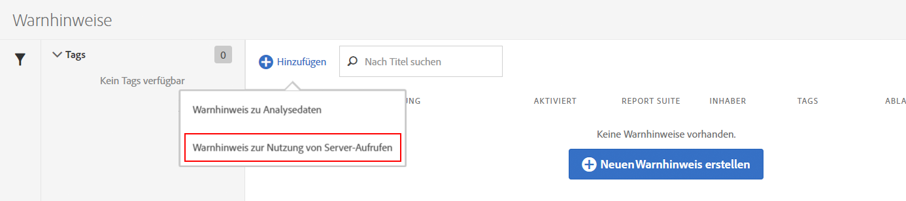
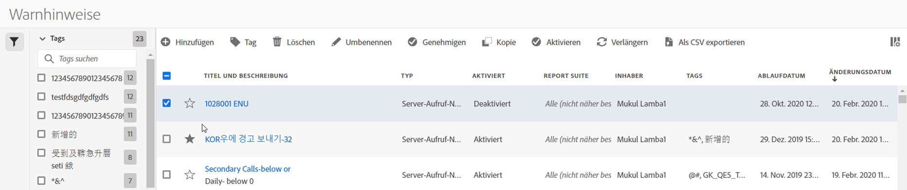

# Warnhinweise zur Nutzung von Server-Aufrufen

Wenn Sie einen Warnhinweis einrichten, dann gilt dieser für alle Report Suites und Anmeldeunternehmen eines Abrechnungsunternehmens.

## Überblick

Eine neue Warnhinweiskategorie namens **[!UICONTROL Warnhinweise zur Nutzung von Server-Aufrufen]** ist Teil der bestehenden Benutzeroberfläche [Warnhinweisverwaltung](https://docs.adobe.com/content/help/de-DE/analytics/analyze/analysis-workspace/virtual-analyst/intelligent-alerts/intellligent-alerts.html).

Diese Kategorie enthält **standardmäßig einen Warnhinweis**, der innerhalb jedes Anmeldeunternehmens auftaucht, das Zugriff auf die Funktion „Nutzung der Server-Aufrufe“ hat. Dieser Warnhinweis löst eine Benachrichtigung an alle Administratoren des Anmeldeunternehmen aus, wenn eines der folgenden Kriterien erfüllt ist:

* „Beliebige“ Nutzung der Server-Aufrufe, die bei „über oder gleich“ 100 % irgendeiner Art von Server-Aufrufen liegt, zu denen sie berechtigt sind, ODER
* „Beliebige“ Nutzung der Server-Aufrufe, die bei „über oder gleich“ 90 % irgendeiner Art von Server-Aufrufen liegt, zu denen sie berechtigt sind, ODER
* „Beliebige“ Nutzung der Server-Aufrufe, die bei „über oder gleich“ 75 % irgendeiner Art von Server-Aufrufen liegt, zu denen sie berechtigt sind, UND „Verbrauchte Nutzungsperiode“ liegt bei „unter oder gleich“ 75 % der Nutzungsperiode.

Sie können mithilfe von zwei Methoden auf die Warnhinweise zur Nutzung von Server-Aufrufen zugreifen:

* Klicken Sie auf **[!UICONTROL Warnhinweise verwalten]** in der oberen rechten Ecke der Registerkarte „Aktuelle Nutzung“ oder der Registerkarte „Nutzung der Report Suite“; oder
* Navigieren Sie in Adobe Analytics zu **[!UICONTROL Komponenten]** > **[!UICONTROL Warnhinweise]**.

## Erstellen von Warnhinweisen zur Nutzung von Server-Aufrufen {#section_2A2882C6D48D47C1944D52FB7C766BEC}

Um zusätzliche Warnhinweise zu erstellen:

1. Klicken Sie auf **[!UICONTROL + Hinzufügen]** und wählen Sie **[!UICONTROL Warnhinweise zur Nutzung von Server-Aufrufen]** aus.

   

1. Definieren Sie den Warnhinweis.

   

   * **Titel** Geben Sie einen beschreibenden Namen ein. Sie können einen Warnhinweis nicht ohne Namen speichern.
   * **Zeitgranularität**: Bestimmt, wie oft der Warnhinweis überprüft wird. *Momentan unterstützen wir nur eine wöchentliche Granularität.* Das bedeutet, dass der Warnhinweis wöchentlich überprüft wird. Dabei werden die Daten der aktuellen Nutzungsperiode berücksichtigt.
   * **Empfänger**: Bestimmen Sie beliebige Personen aus der Organisation, die eine E-Mail erhalten sollen, wenn der Warnhinweis den festgelegten Schwellenwert überschreitet.
   * **Ablaufdatum**: Standardmäßig liegt das Ablaufdatum ein Jahr nach dem Erstellungsdatum des Warnhinweises.
   * **Warnhinweis senden, wenn**:

      * eine dieser Metriken auslöst
Fügen Sie hinzu, welche Art von Server-Aufruf(en) als Metrik dienen soll und legen Sie den Schwellenwert des Warnhinweises fest, indem Sie den Modifikator und den Schwellenwert auswählen:
         * ist größer oder gleich
         * ist kleiner oder gleich
      * mit
Legen Sie den Schwellenwert und die Bedingung (ist höher oder gleich oder niedriger oder gleich) für die verbrauchte Nutzungsperiode fest.

1. Klicken Sie auf **[!UICONTROL Speichern]**.

## Verwalten von Warnhinweisen zur Nutzung von Server-Aufrufen {#section_8FF98170763C4B5CBEC6DD43F893177A}

Warnhinweise verwalten:

1. Wählen Sie das Kästchen neben einem oder mehreren Warnhinweisen aus. Oben werden die Verwaltungsoptionen für Warnhinweise angezeigt.
1. Führen Sie eine oder mehrere dieser Aktionen durch:

   | Aktion | Definition |
   |--- |--- |
   | + Hinzufügen | Die [Warnhinweiserstellung](/help/admin/c-server-call-usage/scu-alerts.md) per Klick auf [!UICONTROL + Hinzufügen] öffnen. |
   | Tag | Markieren Sie Warnhinweise, um sie leichter zu verwenden. |
   | Löschen | Sie können alle Warnhinweise mit Ausnahme des standardmäßigen Warnhinweises löschen. |
   | Umbenennen | Sie können alle Warnhinweise mit Ausnahme des standardmäßigen Warnhinweises umbenennen. |
   | Genehmigen | Genehmigen Sie Warnhinweise, um sie „offiziell“ zu machen. |
   | Aktivieren/deaktivieren | Sie können alle Warnhinweise mit Ausnahme der standardmäßigen Warnhinweise aktivieren oder deaktivieren. |
   | Verlängern | Wenn ein oder mehrere Warnhinweise ausgewählt sind, können diese verlängert werden. Dadurch werden die Ablaufdaten ab dem Tag, an dem auf [!UICONTROL Verlängern] geklickt wurde, unabhängig vom ursprünglichen Ablaufdatum um 1 Jahr verlängert. |
   | In CSV exportieren | Siehe [Nutzungsbericht herunterladen](/help/admin/c-server-call-usage/report-suite-usage.md) |

