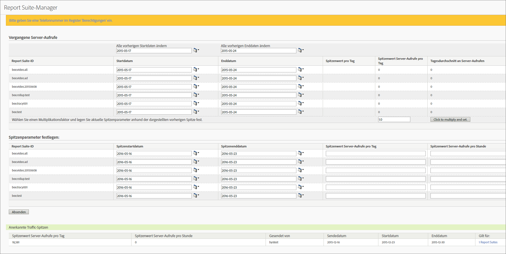

# Schätzen vergangener Server-Aufrufe und Planen einer Traffic-Spitze

Hiermit können Sie die durchschnittliche Anzahl der Server-Aufrufe pro Tag im letzten Jahr innerhalb eines bestimmten Zeitraums abrufen und die erwartete Steigerung des Server-Aufrufvolumens für das aktuelle Jahr anzeigen. Anschließend können Sie anhand dieses Multiplikationsfaktors eine Traffic-Spitze planen.

1. Melden Sie sich bei Analytics als Administrator an und gehen Sie zu **[!UICONTROL Admin]** > **[!UICONTROL Alle Administratoren]** > **[!UICONTROL Traffic-Verwaltung]**.

1. Klicken Sie auf **[!UICONTROL Erweitern]**, um die Report Suite-Liste zu erweitern, und klicken Sie auf **[!UICONTROL Report Suites auswählen]**, um mehrere Report Suites auszuwählen.

1. Klicken Sie auf **[!UICONTROL Spitzen planen]**.
1. Wählen Sie unter **[!UICONTROL Vergangene Server-Aufrufe]** für die ausgewählten Report Suites ein Start- und ein Enddatum aus.

   Die Werte für „Spitzenwert pro Tag“, „Spitzenwert Server-Aufrufe pro Tag“ und „Tagesdurchschnitt an Server-Aufrufen“ werden generiert.

1. Geben Sie einen Wert für den Multiplikationsfaktor ein und klicken Sie auf **[!UICONTROL Zum Multiplizieren und Festlegen klicken]**.

   Die Werte der einzelnen Spalten werden für die einzelnen Reports Suites multipliziert.

1. Senden Sie unter **[!UICONTROL Spitzenparameter festlegen]** die Spitzenparameter für die ausgewählten Report Suites.

   Die Spitze ist jetzt für jede ausgewählte Report Suite geplant.

