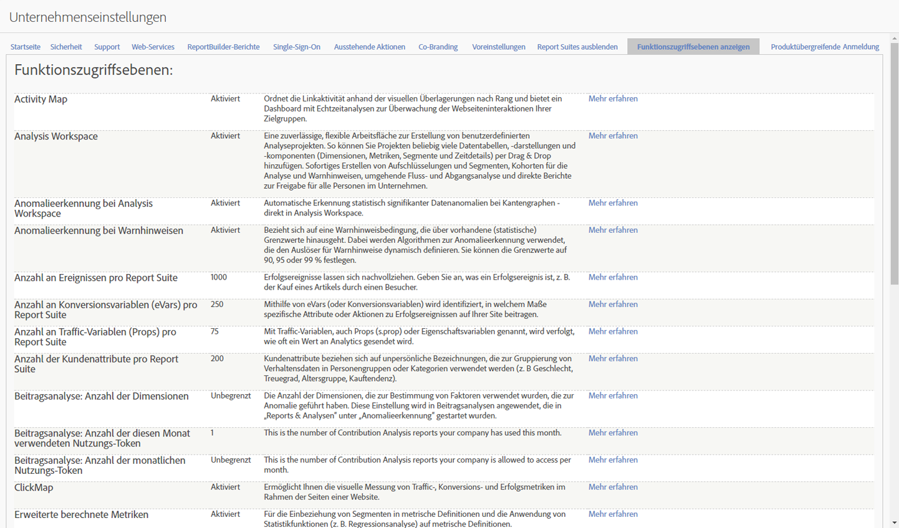

# Funktionszugriffsebenen

**[!UICONTROL Admin]**  >  **[!UICONTROL Alle Admin]**  > Einstellungen für die  **[!UICONTROL Firma]** > Zugriffsebenen für  **[!UICONTROL Ansichten]**

Mit dieser Gruppe von Einstellungen können Sie die Zugriffsstufe auf Adobe Analytics-Pakete und -Funktionen, für die Ihre Firma berechtigt ist, Ansicht werden. Einige Funktionen sind nur mit fortschrittlicheren Produktpaketen (SKUs) wie [Adobe Analytics Ultimate](https://www.adobe.com/de/data-analytics-cloud/analytics/ultimate.html) verfügbar.

