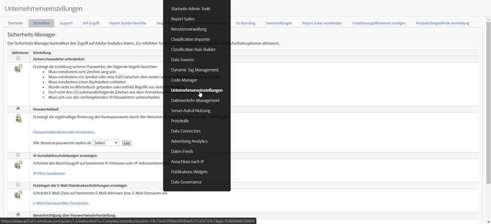

# Abschaffung der Funktion [!UICONTROL IP-Anmeldebeschränkungen erzwingen]

Mit der Funktion **[IP-Anmeldebeschränkungen erzwingen](/help/admin/company/security-manager.md)** in Adobe Analytics können Sie bestimmte IP-Adressen (die als sicher gelten) zu einer Zulassungsliste hinzufügen, um eine erfolgreiche Anmeldung und den Zugriff auf Ihre Adobe Analytics-Umgebung zu ermöglichen. In vielen Fällen wird diese Funktion verwendet, um eine Unternehmens-IP-Adresse als einzige sichere IP-Adresse einzurichten, von der aus Benutzer sich anmelden können. Um Adobe Analytics verwenden zu können, müssen sich die Benutzer daher entweder in einem Unternehmensbüro befinden oder sich über VPN im Netzwerk anmelden.

Wir planen, diese Funktion im Januar 2021 zu beenden.

## Warum schaffen wir diese Funktion ab?

Diese Funktion wird unter bestimmten Umständen durch die Migration der Experience Cloud-Anmeldung und/oder die Experience Cloud-Anmeldung beeinträchtigt. Es ist bekannt, dass sie bei Kunden mit **[!UICONTROL Kundenattributen]** oder **[!UICONTROL Zielgruppenbibliothek]** beeinträchtigt wird.

Wenn Sie über mehrere Experience Cloud-Lösungen verfügen, können Sie diese Anforderung umgehen, indem Sie sich mit einer der anderen Lösungen bei der Experience Cloud anmelden, da diese Funktion außerhalb von Analytics selbst nicht vorhanden ist oder nicht unterstützt wird. Benutzer können dies auch über IP-Spoofing umgehen.

Schließlich verfügt Adobe über eine funktionierende und weit überlegene Alternativlösung mit Single Sign-On und Federated IDs. Diese Funktion bietet Ihnen mehr Kontrolle und Sicherheit über die Anmeldeerfahrung Ihrer Benutzer. Weitere Informationen finden Sie unten.

## Wie wirkt sich die Abschaffung dieser Funktion auf Sie aus?

Für alle Kunden, die **[!UICONTROL IP-Anmeldebeschränkungen erzwingen]** eingerichtet haben, wird diese Funktion im Januar 2021 entfernt. Zu diesem Zeitpunkt werden noch festgelegte IP-Anmeldebeschränkungen nicht mehr erzwungen. Wenn Sie die Anmeldung weiterhin nach IP-Adresse beschränken müssen, sollten Sie die empfohlene Lösung für Single Sign-On und Federated IDs (weitere Informationen und Ressourcen unten) prüfen und implementieren.

Zusätzlich wird die Einstellung **[!UICONTROL IP-Anmeldebeschränkungen erzwingen]** aus **[!UICONTROL Admin] > [!UICONTROL Firma-Einstellungen] > [!UICONTROL Sicherheitsmanager]** in der Analytics-Benutzeroberfläche entfernt (wie unten gezeigt).

## Welche anderen Optionen haben Sie?

Wie oben erläutert, wird diese Analytics-Funktion abgeschafft. Damit Sie Zeit haben, SSO- und Federated IDs zu implementieren, haben wir das EOL-Datum auf Januar 2021 verschoben.

Sowohl SSO als auch Federated IDs sind modernere und überlegene Lösungen für die IP-Anmeldebeschränkung und bieten Ihnen mehr Kontrolle und Sicherheit und mehr Funktionen. Informationen zum Einrichten von SSO/Federated IDs finden Sie in der folgenden Hilfedokumentation. Sie sollten sie gründlich lesen und mit Ihrer IT-Abteilung bei der Implementierung zusammenarbeiten:

* [Single Sign-On und die Experience Cloud](https://spark.adobe.com/page/JeSB8EPEQIvjD/)
* [Admin Console – Dokumentation zur Identitätseinrichtung](https://helpx.adobe.com/de/enterprise/using/set-up-identity.html)
* [Admin Console – Tutorial zur Identitätseinrichtung (Video)](https://helpx.adobe.com/de/enterprise/how-to/identity-directories-domains.html?playlist=/ccx/v1/collection/product/enterprise/topics/enterprise-identity/collection.ccx.js&amp;ref=helpx.adobe.com)
* [Tutorial zur Konfiguration von Federated IDs (Video)](https://helpx.adobe.com/de/enterprise/how-to/identity-configure-ids.html?playlist=/ccx/v1/collection/product/enterprise/topics/enterprise-identity/collection.ccx.js&amp;ref=helpx.adobe.com)
* [Single Sign-On – Häufig gestellte Fragen](https://helpx.adobe.com/de/enterprise/using/sso-faq.html)
* [Von Adobe unterstützte Identitätstypen](https://helpx.adobe.com/de/enterprise/using/identity.html)

Wenn Sie weiterhin Ihre Unterstützung für IP-Anmeldebeschränkungen äußern und beantragen möchten, dass diese Funktion von Experience Cloud bereitgestellt wird, können Sie auf unserer [Forumsseite](https://forums.adobe.com/ideas/11648) für diese Funktion stimmen.