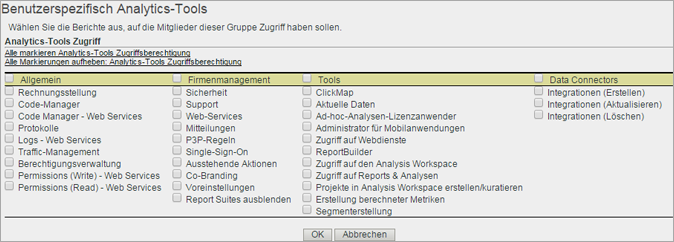

# Berechtigungen für Analytics-Tools anpassen

>[!IMPORTANT]
>
>Die Benutzer- und Produktverwaltung wurde in die [Admin-Konsole](https://helpx.adobe.com/enterprise/using/admin-console.html)verschoben. Sie werden von Adobe erfahren, wann Sie Benutzer migrieren müssen. After all customers have migrated, help content for **[!UICONTROL Analytics]** &gt; **[!UICONTROL Admin]** &gt; **[!UICONTROL User Management]** will be retired.

Gewähren Sie Benutzern Zugriff auf allgemeine Elemente (Rechnungsstellung, Protokolle usw.), Unternehmensverwaltung, Werkzeuge, Web-Services, den Report Builder und die Data Connectors-Integration.

**[!UICONTROL Benutzerverwaltung]** &gt; **[!UICONTROL Gruppen]** &gt; Zugriff auf **[!UICONTROL alle Berichte]** &gt; **[!UICONTROL Analytics-Tools]** &gt; **[!UICONTROL Anpassen]**

>[!NOTE]
>
>Die Version Herbst 2016 (20. Oktober) brachte Änderungen an der Gruppenverwaltung. See [Administrative Changes - Fall 2016](../../../admin/user-management2/c-user-management/permissions-changes.md#concept_86581595B86B47D5B8F90282FC3E31EF) for a summary of changes.

## Berichtszugriff – Analytics-Tools

Klicken Sie auf **[!UICONTROL Anpassen], um Elemente auszuwählen, auf die die Gruppe Zugriff erhalten soll.**

## Feldbeschreibungen

Die Einstellungen auf dieser Seite beziehen sich auf die Report Suites, die auf der Seite „[!UICONTROL Benutzergruppe definieren]“ ausgewählt wurden.

| Element | Beschreibung |
|--- |--- |
| **Allgemein** |  |
| [Code-Manager](../../../admin/admin/code-manager-admin.md) | Ermöglicht das Herunterladen von Datensammlungs-Code für Web- und mobile Plattformen. |
| Code-Manager – Web-Services | Ermöglicht es Nichtadministratoren, über Web-Services auf den Code-Manager zuzugreifen. |
| [Protokolle](../../../admin/admin/logs.md) | Ermöglicht Zugriff auf Protokolldateien, die anzeigen, wann sich Benutzer angemeldet haben, was genutzt und worauf zugegriffen wurde, sowie Report Suites und Admin-Änderungen. |
| Protokolle – Web-Services | Ermöglicht es Nichtadministratoren, über Web-Services auf Admin Tools-Protokolle zuzugreifen. |
| [Traffic-Management](../../../admin/c-traffic-management/traffic-management.md) | Auf der Seite „Traffic-Management“ können Sie Informationen zu erwarteten Änderungen des Trafficvolumens angeben. |
| Berechtigungsverwaltung | Ermöglicht Nichtadministratoren Zugriff auf Benutzerverwaltungsseiten in den Admin Tools. Diese Benutzer können die Einstellungen zwar lesen, aber nicht bearbeiten. |
| Berechtigungen (schreiben) – Web-Services | Erteilt Benutzern ohne Administratorrechte Lese- und Schreibberechtigungen für das Benutzermanagement der Web-Services. Diese Einstellung bezieht sich insbesondere auf die angegebenen Berechtigungsaktionen in der Admin-API. |
| Berechtigungen (lesen) – Web-Services | Ermöglicht es Nichtadministratoren, Berechtigungseinstellungen in der Benutzerverwaltung über Web-Services einzusehen. Diese Einstellung bezieht sich insbesondere auf die angegebenen Berechtigungsaktionen in der Admin-API. |
| **Firmenmanagement** |  |
| [Sicherheit](../../../admin/company/security-manager.md) | Gewährt Zugriff auf die Seite Sicherheits-Manager, über die der Zugriff auf Berichtsdaten gesteuert wird. Zu den Optionen gehören sichere Kennwörter, Kennwortablauf, IP-Anmeldebeschränkungen und E-Mail-Domänenbeschränkungen. |
| Support-Info | Gewährt Zugriff auf Supportinfo in den Unternehmenseinstellungen. |
| [Web-Services](../../../admin/company/web-services-admin.md) | Gewährt Zugriff auf die Web-Services-Seite in der Benutzeroberfläche der Admin Tools ([!UICONTROL Unternehmenseinstellungen] &gt; [!UICONTROL Web-Services]). Mit der Web-Services-API erhalten Sie programmatischen Zugriff auf Adobe Analytics-Dienste, mit denen Sie verfügbare Funktionen über die Benutzeroberfläche duplizieren und verstärken können. |
| Single Sign-on (veraltet) | Gewährt Zugriff auf die Single Sign-on-Seite in den Admin Tools. **Hinweis:** Single Sign-on wird in der Adobe Experience Cloud mithilfe der [Kontoverknüpfung](https://marketing.adobe.com/resources/help/en_US/mcloud/organizations.html) zwischen der Experience Cloud und anderen Lösungen ermöglicht. |
| [Ausstehende Aktionen](../../../admin/company/pending-actions-admin.md) | Ermöglicht die Bearbeitung ausstehender Aktionen in den [!UICONTROL Unternehmenseinstellungen]. |
| [Co-Branding](../../../admin/company/co-branding-admin.md) | Ermöglicht das Co-Branding von Analytics. |
| [Voreinstellungen](../../../admin/admin/preferences-manager.md) | Ermöglicht Zugriff auf den [!UICONTROL Manager für Voreinstellungen]. |
| [Report Suites ausblenden](../../../admin/company/c-hide-report-suites.md) | Verleiht das Recht zum Ausblenden von Report Suites in der Benutzeroberfläche von Adobe Analytics. |
| **Tools** | Mit diesen Einstellungen kann Zugriff auf Analytics-Tools (Oberflächen und Anwendungen) und erweiterte Funktionen wie Segmentierung und berechnete Metriken gewährt werden. |
| [Aktuelle Daten](https://marketing.adobe.com/resources/help/en_US/reference/data_latency.html) | Ermöglicht die Verwendung der Funktion „Aktuelle Daten“ für Berichte. |
| [Ad Hoc Analysis](https://marketing.adobe.com/resources/help/en_US/dsc/)-Lizenzanwender | Gewährt Zugriff auf [!UICONTROL Ad Hoc Analysis]. |
| Webdienstzugriff | Ermöglicht Nichtadministratoren Zugriff auf Web-Services. Erstellt Anmeldedaten für Web-Services. |
| [Report Builder](https://marketing.adobe.com/resources/help/en_US/arb/setup.html) | Ermöglicht Mitgliedern der Gruppe Zugriff auf [!UICONTROL Report Builder]-Lizenzen. |
| Zugriff auf [Analysis Workspace](https://marketing.adobe.com/resources/help/en_US/analytics/analysis-workspace/) | Gewährt Benutzern Zugriff auf Analysis Workspace, die für [!DNL Adobe Analytics] empfohlene Berichtsschnittstelle. |
| [Reports and Analytics](https://marketing.adobe.com/resources/help/en_US/sc/user/) | Gewährt Benutzern Zugriff auf Reports &amp; Analytics. |
| [Erstellung berechneter Metriken](https://marketing.adobe.com/resources/help/en_US/analytics/calcmetrics/) | Ermöglicht es Benutzern, berechnete Metriken zu erstellen. |
| [Erstellung von Segmenten](https://marketing.adobe.com/resources/help/en_US/analytics/segment/) | Ermöglicht es Benutzern, Segmente zu erstellen. |
| **Data Connectors** |  |
| Integrationen (erstellen, aktualisieren oder löschen) | Ermöglicht das Erstellen, Aktualisieren und Löschen von Data Connector-Integrationen. |
