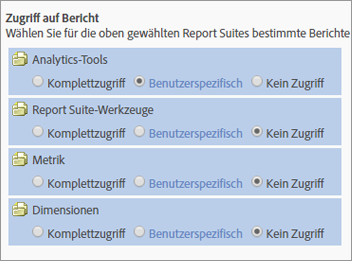

# Anpassen des Berichtszugriffs – Übersicht

>[!IMPORTANT]
>
>Die Verwaltung von Benutzern und Produkten erfolgt künftig von der [Admin Console](https://helpx.adobe.com/de/enterprise/using/admin-console.html) aus. Sie werden von Adobe erfahren, wann Sie Benutzer migrieren müssen. Nachdem alle Benutzer migriert wurden, wird die Herausgabe neuer Hilfeinhalte für **[!UICONTROL Analytics]** > **[!UICONTROL Admin Tools]** > **[!UICONTROL Benutzerverwaltung]** eingestellt.

Passen Sie Gruppenberechtigungen für den Zugriff auf Analytics-Tools, Report Suite-Tools, Metriken und Dimensionen an.

**[!UICONTROL Neue Gruppe hinzufügen]** > **[!UICONTROL Zugriff auf Berichte]**

Im Abschnitt [!UICONTROL Zugriff auf Berichte] auf der Seite [!UICONTROL Benutzergruppe definieren] werden verschiedene Zugriffskategorien aufgeführt, mit denen Sie Berechtigungen auf granularer Ebene anpassen können.

Sie können beispielsweise eine Gruppe mit Zugriff auf mehrere Analytics-Tools ([!UICONTROL Analysis Workspace], [!UICONTROL Reports &amp; Analytics] und [!UICONTROL Report Builder]) erstellen, die Zugriff auf bestimmte Metriken und Dimensionen (einschließlich eVars) erhält und beispielsweise Segmente oder berechnete Metriken erstellen kann.

## Wissenswertes über Berechtigungen {#section_3D25D4A5BD044008870C5B98F696244E}

<table id="table_DB7806E05E2040EC9A4CB7C3596879EC"> 
 <thead> 
  <tr> 
   <th colname="col1" class="entry"> Element </th> 
   <th colname="col2" class="entry"> Beschreibung </th> 
  </tr> 
 </thead>
 <tbody> 
  <tr> 
   <td colname="col1"> 
Administratorzugriff/vordefinierte Gruppen 
 </td> 
   <td colname="col2"> 
 Vordefinierte Gruppen sind für Administratoren nicht länger notwendig. Administratoren haben jetzt Zugriff auf alle Elemente (Tools, Dimensionen und Metriken) sowie auf Web Service, Report Builder, Activity Map und Ad Hoc Analysis. 
 
Sinn und Zweck von Gruppen ist es, den Zugriff von Nichtadministratoren zu ermöglichen oder einzuschränken. 
 </td> 
  </tr> 
  <tr> 
   <td colname="col1"> 
Benutzerspezifische Gruppen 
 </td> 
   <td colname="col2"> 
 Vordefinierte Gruppen wurden durch benutzerspezifische Gruppen ersetzt. Bestehende vordefinierte Gruppen werden in benutzerspezifische Gruppen migriert und mit dem gleichen Gruppennamen gekennzeichnet. Von Ihnen erstellte benutzerspezifische Gruppen und deren Einstellungen bleiben dabei erhalten. Sie werden jedoch möglicherweise bemerken, dass die Einstellungen sich an einem anderen Ort befinden. Die Unternehmenseinstellungen beispielsweise (früher in der Anpassung der Admin Console) befinden sich nun in der  <a href="/help/admin/user-management2/c-customize-report-access/groups-analytics-tools.md">Anpassen der Analytics-Tools</a>. 
 
 Benutzer mit Zugriff auf Berichte wurden zu einer benutzerdefinierten Gruppe migriert, die Zugriff auf Folgendes hat: 
 
    <ul id="ul_7E1B443DEEF7452E85FEB30CA0BBC8BE"> 
     <li id="li_A510C2A4129340E0AB08EEBDBE4AEAD9">Alle Dimensionen </li> 
     <li id="li_8BA1D7A2527C4F10AC93108B9E87F418">Alle Metriken </li> 
     <li id="li_265830A2C6B94AF28720DA99980EAA51">Alle Report Suites </li> 
     <li id="li_685B99DEAB814D7B9C11B14AA4CB8CD4">Kanalbericht </li> 
     <li id="li_B35420302AAB42509BD6AF0FA6349BF8">Anomalieerkennung </li> 
     <li id="li_3787E4696C454D3ABD1D75F6C282A9A2">Echtzeitbericht </li> 
     <li id="li_3797DF9C40D1426588819116362962F5">Zugriff auf Analysis Workspace </li> 
    </ul> 
Administratoren können benutzerdefinierte Gruppen löschen und eigene Gruppen erstellen, da sämtliche zuvor in vordefinierten Gruppen zur Verfügung stehenden Einstellungen auch für die Anpassung mit Einstellungen für den Zugriff auf Berichte unter Benutzergruppen definieren</a> verfügbar sind. 
 </td> 
  </tr> 
  <tr> 
   <td colname="col1"> 
Berechtigungen auf Dimensionsebene 
 </td> 
   <td colname="col2"> 
Sie können Berechtigungen so anpassen, dass der Zugriff auf bestimmte Dimensionen (zusätzlich zu den Metriken) eingeschränkt oder ausgeweitet werden kann. 
 
    <ul id="ul_DA5A54223673474E9151AF979DA50659"> 
     <li id="li_C3E82F7BC07A4F2F83A85D3D511292CC"> 
Alle aktuellen Dimensionen und Metriken in benutzerdefinierten Gruppen wurden automatisch in die neuen Kategorien migriert. Wenn in einer bestehenden Gruppe Metriken aktiv sind, werden für diese Gruppe sämtliche Dimensionen, für die neue Berechtigungen erteilt werden (eVars und inhaltsbasiert), und Metriken als Standardeinstellungen festgelegt. 
 </li> 
     <li id="li_CC56F9181CC14AB59318628E72F2E8C9"> Classifications Importer-Berechtigungen (bisher SAINT): Der Zugriff auf Klassifizierungen wird durch den Zugriff auf die <a href="https://docs.adobe.com/content/help/de-DE/analytics/components/classifications/c-classifications.html">Variable</a> bestimmt, auf die sich die Klassifizierung stützt. </li> 
    </ul> 
Siehe <a href="/help/admin/user-management2/c-customize-report-access/groups-dimensions.md">Anpassen von Dimensionsberechtigungen</a>. 
 </td> 
  </tr> 
  <tr> 
   <td colname="col1"> 
<a href="https://helpx.adobe.com/enterprise/using/admin-console.html"> Adobe Admin Console</a> 
 </td> 
   <td colname="col2"> 
Wird nur neuen Kunden empfohlen sowie Kunden mit Unternehmen, die in <a href="https://docs.adobe.com/content/help/de-DE/core-services/interface/about-core-services/core-services.html">Experience Cloud bereitgestellt wurden</a>. Für bestehende Analytics-Kunden ist eine Migration in das Identity Management-System von Experience Cloud geplant. 
 
Weitere Informationen finden Sie unter <a href="https://docs.adobe.com/content/help/de-DE/analytics/admin/user-product-management/user-management/migrate-users/c-migration-tool.html">Analytics-Benutzermigration zur Admin Console</a>. 
 </td> 
  </tr> 
  <tr> 
   <td colname="col1"> 
Content-Unterstützung 
 </td> 
   <td colname="col2"> 
Die Content-Unterstützung enthält Variablen, mit deren Hilfe Sie Berechtigungen für Metriken der Experience Cloud-Lösungsintegrationen verwalten können. Sie können Berechtigungen für Social oder Mobile verwalten sowie beliebige andere Daten, die über eine Experience Cloud-Integration bereitgestellt wurden. Diese Funktionen sind standardmäßig aktiviert. 
 </td> 
  </tr> 
  <tr> 
   <td colname="col1"> 
Erloschene Berechtigungen/Berichte 
 </td> 
   <td colname="col2"> 
Die folgenden erloschenen Berichte werden entfernt: 
 
    <ul id="ul_C0415CFF0562472297272EC58ECC0774"> 
     <li id="li_62B1CE33B1454987B878B321EB40D62E">Monatliche Zusammenfassung </li> 
     <li id="li_71CD776D212540A18F9B083D2E11A296">Homepage des Besuchers </li> 
     <li id="li_406200AD68C74D11B5F53988A4E76A68">Netscape-Plug-ins </li> 
     <li id="li_A124637D69C94C78921C8B028D890541">Wichtige Besucher </li> 
     <li id="li_5C26FF95371B4F3080FF75C7F8DE0F72">Von wichtigen Besuchern angezeigte Seiten </li> 
     <li id="li_E7E262BD0CF64E16B838F995F6A13B8A">Besucherüberblick </li> 
     <li id="li_0EDC74625C0D4B1A992FCA49B648E4C0">DRM </li> 
     <li id="li_ACC92E6EA188409486E7C943F26B9DAC">Netzprotokolle </li> 
     <li id="li_6E18C4D12377416A8124BBD13164B03A">Java-Version </li> 
     <li id="li_1599265E59EF4F34BB406356410C9E68">Länge der Lesezeichen-URL </li> 
     <li id="li_3035442010984C409089B21E03DB7BCC">Gerätenummerübertragung </li> 
     <li id="li_6B2163ED8FC84EBF933D97A504B4D527">PTT </li> 
     <li id="li_0EB8A4A7619B45DF87109B183A7C69C8">Design-Mail-Unterstützung </li> 
     <li id="li_989FAC662F7344E6BDDC517B79D4581E">Information </li> 
     <li id="li_F1FB7F8E415443F3B63F6D11D59A04AB">Informationsdienst </li> 
    </ul> 
Diese Berichte: 
 
    <ul id="ul_F71505C59F734EA9B541BF8AB9F9388F"> 
     <li id="li_7D461907B895447280E69CF1520DF47C">Können noch immer über Lesezeichen aufgerufen werden. </li> 
     <li id="li_27BA2DD6BA4C446FBAA06B6C76CD171F">Sind nicht Teil der neuen Kategorie für Dimensionsberechtigungen. </li> 
     <li id="li_504E9D8421714406A0F37DEF1E10E34B">Können in ihrer Berechtigung nicht mehr verändert werden. </li> 
     <li id="li_0022E8DCA07344C793847E8282EFBEEF">Bieten weiterhin benutzerdefinierten Gruppen Zugriff, die aktuell Zugriff haben. </li> 
    </ul> </td> 
  </tr> 
 </tbody> 
</table>

