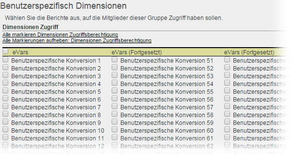

# Dimensionsberechtigungen anpassen

>[!IMPORTANT]
>
>User and product management is moving to the [Admin Console](https://helpx.adobe.com/enterprise/using/admin-console.html). Sie werden von Adobe erfahren, wann Sie Benutzer migrieren müssen. After all customers have migrated, help content for **[!UICONTROL Analytics]** &gt; **[!UICONTROL Admin Tools]** &gt; **[!UICONTROL User Management]** will be retired.

Legen Sie Benutzerrechte granular fest, einschließlich eVars, Traffic-Berichten, Lösungsberichten und Pfadsetzungsberichten.

**[!UICONTROL Benutzerverwaltung]** &gt; **[!UICONTROL Gruppen]** &gt; **[!UICONTROL Zugriff auf Bericht]** &gt; **[!UICONTROL Dimensionen]** &gt; **[!UICONTROL Anpassen]**

>[!IMPORTANT]
>
>Einige Dimensionen sind derzeit nicht möglich. Es handelt sich um die folgenden Dimensionen: Mobile Lesezeichenlänge; Mobilgerätenummer; Mobil-DRM; Mobile Informationsdienste; Mobile Java-VM; Mobiles Mail-Design; Mobile Netzprotokolle; Mobilbetriebssystem; Mobiles PTT.
>
>Diese Dimensionen sind für alle Benutzer verfügbar, unabhängig von anderen Berechtigungen.

Die Einstellungen auf dieser Seite beziehen sich auf die Report Suites, die auf der Seite „[!UICONTROL Benutzergruppe definieren]“ ausgewählt wurden.

Lesen Sie sich folgende Informationen zur Dimensionskategorie in den Berechtigungen aufmerksam durch.

* Individuelle Berechtigung für eVars 1–250.
* Sämtliche Traffic-Berichte sind Dimensionen.
* Video- und Mobilberichte sind Dimensionen sowie andere Analytics-Lösungsberichte (Experience Manager, Advertising Cloud, Social und durchführen).
* Pfadsetzungsberichte sind für Benutzer mit Zugang zu den übergeordneten Dimensionen verfügbar.
* Alle aktuellen Dimensionen und Metriken in benutzerdefinierten Gruppen wurden automatisch in die neuen Kategorien migriert. Wenn in einer bestehenden Gruppe Metriken aktiv sind, werden für diese Gruppe sämtliche Dimensionen, für die neue Berechtigungen erteilt werden (eVars und inhaltsbasiert), und Metriken als Standardeinstellungen festgelegt.
* Classifications Importer (bisher SAINT) berechtigt für: Zugriff auf Classifications wird durch Zugriff auf die [Variable](https://marketing.adobe.com/resources/help/en_US/reference/c_classifications.html) bestimmt, auf der Classification basiert.

Weitere Informationen finden Sie unter [Häufig gestellte Fragen zu geänderten Berechtigungen](https://marketing.adobe.com/resources/help/en_US/reference/permissions_faq.html).

**Dimensionen anpassen**

Bei den folgenden Elementen handelt es sich um Dimensionen, für die Sie Zugriffsrechte zuweisen können.

<table id="table_F37D74A1619A4560A5F5651E855DAF1C"> 
 <thead> 
  <tr> 
   <th colname="col1" class="entry"> Element </th> 
   <th colname="col2" class="entry"> Beschreibungen </th> 
  </tr> 
 </thead>
 <tbody> 
  <tr> 
   <td colname="col1"> 
 <a href="../../../admin/admin/conversion-var-admin/conversion-var-admin.md#concept_C02F7AA01DE242F1AA1A4E74022BE9DE" format="dita" scope="local"> eVars </a> 
 </td> 
   <td colname="col2"> 
Individuelle Berechtigung für eVars 1–250. Bei eVars handelt es sich um benutzerdefinierte Konversionsvariablen, die zur Segmentkonversion von Erfolgsmetriken in benutzerspezifischen Berichten verwendet werden. 
 </td> 
  </tr> 
  <tr> 
   <td colname="col1"> 
 <a href="https://marketing.adobe.com/resources/help/en_US/sc/implement/props_eVars.html" format="html" scope="external"> Props </a> 
 </td> 
   <td colname="col2"> 
Props sind benutzerdefinierte Traffic-Variablen. 
 
Weitere Informationen finden Sie unter <a href="https://marketing.adobe.com/resources/help/en_US/sc/implement/props_eVars.html" format="html" scope="external">Traffic-Props und Konversions-eVars</a> in der Implementierung von Analytics. 
 </td> 
  </tr> 
  <tr> 
   <td colname="col1"> 
 <a href="https://marketing.adobe.com/resources/help/en_US/sc/implement/hierN.html" format="html" scope="external"> Hierarchie </a> 
 </td> 
   <td colname="col2"> 
 Die Hierarchievariable bestimmt die Positionierung einer Seite in der Hierarchie der Site oder Seitenstruktur. 
 </td> 
  </tr> 
  <tr> 
   <td colname="col1"> 
 <a href="https://marketing.adobe.com/resources/help/en_US/sc/implement/listN.html" format="html" scope="external"> Listvar </a> 
 </td> 
   <td colname="col2"> 
 Ähnlich wie bei Listen-Props sind bei Listenvariablen mehrere Werte in derselben Bildanforderung möglich. 
 </td> 
  </tr> 
  <tr> 
   <td colname="col1"> 
Standard 
 </td> 
   <td colname="col2"> 
Bezieht sich auf Standard- (vordefinierte) Dimensionen in Analytics. 
 </td> 
  </tr> 
  <tr> 
   <td colname="col1"> 
 <a href="https://marketing.adobe.com/resources/help/en_US/em/" format="https" scope="external"> AEM </a> 
 </td> 
   <td colname="col2"> 
Adobe Experience Manager     
 </td> 
  </tr> 
  <tr> 
   <td colname="col1"> 
 <a href="https://marketing.adobe.com/resources/help/en_US/media-optimizer/" format="https" scope="external"> AMO </a> 
 </td> 
   <td colname="col2"> 
Adobe Advertising Cloud 
 </td> 
  </tr> 
  <tr> 
   <td colname="col1"> 
 <a href="https://marketing.adobe.com/resources/help/en_US/analytics/activitymap/" format="https" scope="external"> Activity Map </a> 
 </td> 
   <td colname="col2"> 
 Activity Map-Berichtsdimensionen: Activity Map – Seite; Activity Map – Link; Activity Map – Region; Activity Map – Link nach Region; Activity Map XY 
 </td> 
  </tr> 
  <tr> 
   <td colname="col1"> 
 <a href="https://marketing.adobe.com/resources/help/en_US/mobile/" format="https" scope="external"> Mobile </a> 
 </td> 
   <td colname="col2"> 
Adobe Mobile Services 
 </td> 
  </tr> 
  <tr> 
   <td colname="col1"> 
 Comscore 
 </td> 
   <td colname="col2"> 
Diese Partnerintegration ist nicht mehr aktiv. 
 </td> 
  </tr> 
  <tr> 
   <td colname="col1"> 
 <a href="https://marketing.adobe.com/resources/help/en_US/sc/appmeasurement/hbvideo/nielsen-partnership.html" format="html" scope="external"> Nielsen </a> 
 </td> 
   <td colname="col2"> 
Partnerintegrationen. 
 </td> 
  </tr> 
  <tr> 
   <td colname="col1"> 
 Social 
 </td> 
   <td colname="col2"> 
Nicht verwendet. 
 </td> 
  </tr> 
 </tbody> 
</table>

