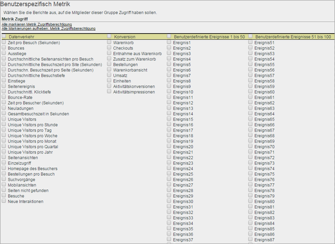

# Anpassen von Berechtigungen für Metriken

>[!IMPORTANT]
>
>Die Verwaltung von Benutzern und Produkten erfolgt künftig von der [Admin Console](https://helpx.adobe.com/de/enterprise/using/admin-console.html) aus. Sie werden von Adobe erfahren, wann Sie Benutzer migrieren müssen. Nachdem alle Benutzer migriert wurden, wird die Herausgabe neuer Hilfeinhalte für **[!UICONTROL Analytics]** > **[!UICONTROL Admin Tools]** > **[!UICONTROL Benutzerverwaltung]** eingestellt.

Gewähren Sie Zugriff auf Traffic-Metriken, Konversionsmetriken, benutzerspezifische Ereignisse, Lösungsereignisse und „Inhalt bewahren“.

**[!UICONTROL User Management]** > **[!UICONTROL Gruppen]** > **[!UICONTROL Zugriff auf Bericht]** > **[!UICONTROL Metriken]** > **[!UICONTROL Anpassen]**

Die Einstellungen auf der Seite für die Metrikanpassung beziehen sich auf die Report Suites, die auf der Seite [!UICONTROL Benutzergruppe definieren] ausgewählt wurden.

## Lösungsereignisse

Zusätzlich zu [benutzerspezifischen Ereignissen](https://docs.adobe.com/content/help/de-DE/analytics/implementation/vars/page-vars/events/event-serialization.html) enthält diese Kategorie Analytics-Lösungsereignisse, darunter Experience Manager (AEM), Advertising Cloud (AMO), Mobile, Video und Social. Jeder benutzerspezifischen Gruppe mit Metriken werden Lösungsereignisse als neue Metrik hinzugefügt.

Sie können für benutzerdefinierte Ereignisse und Analytics-Lösungsereignisse (AEM, AMO, Mobile Video und Social) Zugriffsberechtigungen festlegen.

Jeder benutzerspezifischen Gruppe mit Metriken werden Lösungsereignisse als neue Metrik hinzugefügt.

Informationen zu den in Analytics verwendeten Metriken finden Sie unter [Übersicht über Metriken](/help/components/metrics/overview.md).

## Content-Unterstützung

Die Content-Unterstützung enthält Variablen, mit deren Hilfe Sie Berechtigungen für Metriken der Experience Cloud-Lösungsintegrationen verwalten können. Sie können Berechtigungen für [!DNL Social] und [!DNL Mobile] verwalten sowie beliebige andere Daten, die über eine [!DNL Experience Cloud]-Integration bereitgestellt wurden. Diese Funktionen sind standardmäßig aktiviert.
