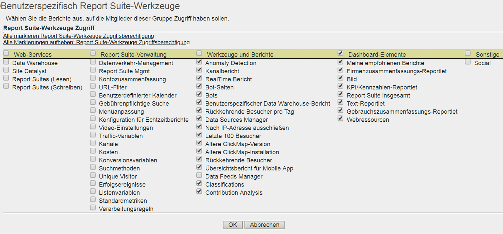

# Anpassen von Berechtigungen für Report Suite-Tools

>[!IMPORTANT]
>
>Die Verwaltung von Benutzern und Produkten erfolgt künftig von der [Admin Console](https://helpx.adobe.com/de/enterprise/using/admin-console.html) aus. Sie werden von Adobe erfahren, wann Sie Benutzer migrieren müssen. Nachdem alle Kunden migriert haben, werden Hilfeinhalte für **[!UICONTROL Analytics]** > **[!UICONTROL Admin]** > **[!UICONTROL Alle Admin]** > **[!UICONTROL Benutzerverwaltung]** eingestellt.

Gewähren Sie Benutzern Zugriff auf APIs, Report Suite-Verwaltung, Tools und Berichte sowie Dashboard-Elemente.

**[!UICONTROL User Management]** > **[!UICONTROL Gruppen]** > **[!UICONTROL Zugriff auf Bericht]** > **[!UICONTROL Report Suite-Tools]** > **[!UICONTROL Anpassen]**

Über die Seite für das [!UICONTROL Anpassen der Report Suite-Tools] erhalten Gruppenmitglieder Zugriff auf folgende Elemente.

## Feldbeschreibungen

Die Einstellungen auf dieser Seite beziehen sich auf die Report Suites, die auf der Seite „[!UICONTROL Benutzergruppe definieren]“ ausgewählt wurden.

| Element | Beschreibung |
|--- |--- |
| **Web-Services** |  |
| Mit diesen Einstellungen können Benutzer das Data Warehouse aufrufen und Report Suite-Einstellungen abrufen. |  |
| Data Warehouse | Ermöglicht es einem Benutzer ohne Administratorstatus, mithilfe von Data Warehouse über die Web Services API Aufrufe zu tätigen. Siehe [Data Warehouse – Dokumentation für Entwickler](/help/export/data-warehouse/data-warehouse.md) |
| Report Suites (Lesen) | Ermöglicht Nichtadministratoren die Verwendung von Report Suite-Methoden in der API. |
| Report Suites (Schreiben) | Ermöglicht Nichtadministratoren die Verwendung von Report Suite-Methoden in der API. |
| **Report Suite-Verwaltung** |  |
| Mit diesen Einstellungen wird Zugriff auf die Menüpunkte unter „Admin > Report Suites > Einstellungen bearbeiten ([Report Suite Manager](/help/admin/c-manage-report-suites/report-suites-admin.md))“ gewährt. |  |
| [Traffic-Management](/help/admin/c-traffic-management/traffic-management.md) | Ermöglicht Zugriff auf Traffic-Management. |
| [Report Suite-Verwaltung](/help/admin/c-manage-report-suites/report-suites-admin.md) | Ermöglicht Zugriff auf die Verwaltung von Report Suites. |
| [Kontozusammenfassung](/help/admin/admin/general-acct-settings-admin.md) | Ermöglicht Zugriff auf die Bearbeitung der Kontoeinstellungen für eine Report Suite. |
| [URL-Filter](/help/admin/admin/internal-url-filter-admin.md) | Ermöglicht Zugriff auf interne URL-Filter in Report Suites. Mithilfe interner URL-Filter wird festgelegt, welche Verweise oder verweisenden Seiten Ihrer Site intern angehören. |
| [Benutzerdefinierter Kalender](/help/admin/admin/custom-calendar.md) | Ermöglicht das Bearbeiten des benutzerdefinierten Kalenders. |
| [Paid Search](https://docs.adobe.com/content/help/de-DE/analytics/admin/admin-tools/paid-search-detection/paid-search-detection.html) | Die Erkennung von Paid Search unterscheidet gebührenpflichtige von kostenlosen Suchvorgängen in Suchmaschinen- und Suchbegriffberichten. |
| [Menüanpassung](/help/admin/admin/customize-menus.md) | Bearbeiten Sie die Berichtsmenüs, die Benutzern in Reports &amp; Analytics angezeigt werden. |
| [Konfiguration von Echtzeitberichten](/help/admin/admin/realtime/t-realtime-admin.md) | Möglichkeit zur Einrichtung von Echtzeitberichten in Analytics. |
| [Video-Einstellungen](/help/admin/admin/video-management.md) | Möglichkeit zur Reservierung einer Reihe von benutzerspezifischen Konversionsvariablen (eVars) und benutzerspezifischen Ereignissen für die Videoverfolgung und Videoberichte. |
| [Video-Classifications](https://docs.adobe.com/content/help/de-DE/media-analytics/using/media-overview.html) | Möglichkeiten zur Reservierung einer Reihe von benutzerspezifischen Konversionsvariablen (eVars) und benutzerspezifischen Ereignissen für die Videoverfolgung und Videoberichte. |
| [Traffic-Variablen](/help/admin/admin/c-traffic-variables/traffic-var.md) | Ermöglicht das Verknüpfen benutzerdefinierter Daten mit spezifischen, Traffic-bezogenen Ereignissen. |
| [Traffic-Klassifizierungen](/help/admin/admin/c-traffic-variables/traffic-classifications.md) | Konsolidiert in Classifications (unter „Werkzeuge und Berichte“). |
| [Kanäle](/help/components/c-marketing-channels/analyze-mc.md) | Ermöglicht Zugriff auf Marketing-Kanal-Einstellungen unter „Report Suite Manager > Einstellungen bearbeiten > Marketing-Kanäle“. |
| [Kosten](https://docs.adobe.com/content/help/de-DE/analytics/components/marketing-channels/analyze-mc.html) | Ermöglicht Zugriff auf „Marketing-Kanäle > Marketing-Kanal-Kosten“ im Report Suite Manager. |
| [Konversionsvariablen](/help/admin/admin/conversion-var-admin/conversion-var-admin.md) | Die benutzerspezifische Insight-Konversionsvariable (oder eVar) wird auf ausgewählten Webseiten Ihrer Site in den Adobe-Code aufgenommen. Ihr Hauptzweck besteht darin, Konversionserfolgsmetriken in benutzerspezifischen Marketing-Berichten zu segmentieren. |
| [Suchmethoden](/help/admin/admin/finding-methods.md) | Ermöglicht es Ihnen, herauszufinden, wie verschiedene Berichte zu Suchmethoden Gutschriften für Konversionserfolgsergebnisse auf Ihrer Site erhalten. |
| [Konversionsklassifizierungen](/help/admin/admin/conversion-var-admin/conversion-classifications.md) | Konsolidiert in Classifications (unter „Werkzeuge und Berichte“). |
| [Unique Visitor](https://docs.adobe.com/content/help/en/analytics/admin/admin-tools/unique-visitor-variable/t-unique-visitor-variable.html) | Ermöglicht das Festlegen der Unique-Visitor-Variablen. |
| [Erfolgsereignisse](https://docs.adobe.com/content/help/en/analytics/admin/admin-tools/success-events/success-event.html) | Aktionen, die verfolgt werden können, beispielsweise Produktansicht, Checkout und Kauf. |
| [Klassifizierungshierarchien](/help/admin/admin/conversion-var-admin/classification-hierarchies.md) | Konsolidiert in Classifications (unter „Werkzeuge und Berichte“). |
| [Listenvariablen](https://docs.adobe.com/content/help/de-DE/analytics/implementation/vars/page-vars/page-variables.html) | Wird auch als „List Var“ bezeichnet. Ähnlich wie bei Listen-Props sind bei Listenvariablen mehrere Werte in derselben Bildanforderung möglich. |
| [Standardmetriken](/help/admin/admin/default-metrics.md) | In Reports &amp; Analytics wird ein Standardsatz an Metriken in allen Konversionsberichten angezeigt, es sei denn, ein Benutzer wählt einen benutzerspezifischen Metriksatz aus. Die ausgewählten Metriken werden bei allen Benutzern der zugehörigen Report Suite angezeigt. |
| [Verarbeitungsregeln](https://docs.adobe.com/content/help/en/analytics/admin/admin-tools/processing-rules/processing-rules.html) | Erteilt Zugriff auf Verarbeitungsregeln, durch die die Datenerfassung und Inhaltsverwaltung beim Senden an Berichte vereinfacht wird. |
| **Werkzeuge und Berichte** |  |
| [Anomalieerkennung](https://docs.adobe.com/content/help/de-DE/analytics/analyze/analysis-workspace/virtual-analyst/anomaly-detection/anomaly-detection.html) | Ermöglicht Zugriff auf Anomalieerkennung, die eine statistische Methode bietet, mit der festgestellt wird, wie sich eine bestimmte Metrik in Bezug auf frühere Daten verändert hat. |
| [Kanalbericht](/help/components/c-marketing-channels/analyze-mc.md) | Ermöglicht Zugriff auf Marketing-Kanal-Berichte, zu finden unter „Berichte > Marketing-Kanalberichte“. |
| [Echtzeitbericht](/help/admin/admin/realtime/t-realtime-admin.md) | Ermöglicht Zugriff auf den Echtzeitbericht. |
| [Bot-Seiten](/help/admin/admin/bot-removal/bot-rules.md) | **Hinweis: Bot-Seiten sind für bestimmte Reports &amp; Analysen-Berichte bestimmt, nicht für die Verwaltung von Bot-Regeln. Derzeit ist es nicht zulässig, die Bearbeitung von Bot-Regeln zuzulassen.** Mit „Bot-Regeln“ können Sie Traffic aus Ihrer Report Suite entfernen, der von bekannten Spiders und Bots verursacht wird. Mit der Entfernung von Bot-Traffic erhalten Sie eine präzisere Messung der Benutzeraktivität auf Ihrer Website. |
| [Bots](/help/admin/admin/bot-removal/bot-rules.md) | **Hinweis: Bots sind für bestimmte Reports &amp; Analysen-Berichte gedacht, nicht für die Verwaltung von Bot-Regeln. Derzeit ist es nicht zulässig, die Bearbeitung von Bot-Regeln zuzulassen.** Mit Bots können Sie Traffic entfernen, der von bekannten Spiders und Bots aus Ihrer Report Suite generiert wird. Mit der Entfernung von Bot-Traffic erhalten Sie eine präzisere Messung der Benutzeraktivität auf Ihrer Website. |
| [Benutzerdefinierter Data Warehouse-Bericht](/help/export/data-warehouse/data-warehouse.md) | Data Warehouse bezieht sich auf die Kopie der unverarbeiteten Rohdaten für Speicherberichte und benutzerspezifische Berichte, die Sie durch Filtern der Daten ausführen. Sie können Berichte anfordern, die auf Ihre individuellen Fragen erweiterte Datenbeziehungen aus Rohdaten anzeigen. |
| Rückkehrende Besucher pro Tag | (Veraltet) In diesem Bericht wird angegeben, wie viele Besucher Ihre Website an einem bestimmten Tag mehrmals besuchen. Ein Tag wird als die letzten 24 Stunden definiert. |
| [Data Sources Manager](/help/admin/admin/data-sources.md) | Mit der Funktion „Data Sources“ können Sie Daten aus Offline-Quellen in Analytics importieren. |
| [Nach IP-Adresse ausschließen](/help/admin/admin/exclude-ip.md) | Daten von bestimmten IP-Adressen, z. B. von internen Websiteaktivitäten, Websitetests und der Verwendung durch Mitarbeiter, können aus Berichten ausgeschlossen werden. |
| Veraltete ClickMap | Ermöglicht Zugriff auf das Menü des veralteten ClickMap-Overlay-Tools. |
| Ältere ClickMap-Installation | Gewährt Installationsrechte für das alte ClickMap-Tool. |
| Rückkehrende Besucher | Ein Bericht, der die Anzahl der Besuche anzeigt, wobei die Besuchnummer größer als 1 ist. Der Bericht über rückkehrende Besucher schließt Besucher ohne Cookie ein. |
| [Classifications Importer](https://docs.adobe.com/content/help/de-DE/analytics/components/classifications/classifications-importer/c-working-with-saint.html)/Exporter und [Rule Builder](https://docs.adobe.com/content/help/de-DE/analytics/components/classifications/classifications-rulebuilder/classification-rule-builder.html) | Konsolidiert in Classifications (siehe unten). |
| Data Feeds Manager | Erteilt Rechte an Analytics-Daten-Feed. |
| Klassifizierungen | Kombiniert die folgenden Berechtigungen: „Traffic-Klassifizierungen“, „Video-Klassifizierungen“, „Konversionsklassifizierungen“, „Klassifizierungshierarchien“, „Klassifizierungsmanager“ und „Classifications Importer/Exporter &amp; Rule Builder“.  Hinweis: Mit dieser Berechtigung bearbeiten Anwender Klassifizierungen für alle Report Suites und nicht nur für die ausgewählte(n) Report Suite(s). |
| [Beitragsanalyse](https://docs.adobe.com/content/help/de-DE/analytics/analyze/analysis-workspace/virtual-analyst/contribution-analysis/ca-tokens.html) | Gewährt Rechte für die Verwendung von Beitragsanalysen in Analysis Workspace. |
| **Dashboard-Elemente** |  |
| Die Einstellungen in „Dashboard-Elemente“ ermöglichen den Zugriff auf [Reportlets](https://docs.adobe.com/content/help/de-DE/analytics/admin/server-call-usage/server-call-usage-dashboard.html) in Reports &amp; Analytics: Meine empfohlenen Berichte, Firmenzusammenfassungs-Reportlet, Grafik, KPI-/Kennzahlen-Reportlet, Report Suite insgesamt, Text, Reportlet, Gebrauchszusammenfassungs-Reportlet und Web-Ressourcen |  |
| **Sonstige** |  |
| Social | Steuern Sie den Zugriff auf das Social-Media-Verwaltungsmenü im Report Suite Manager. |
