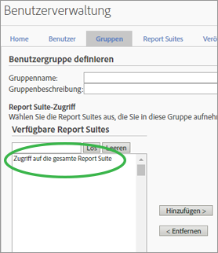

# Änderungen an Berechtigungen für Benutzer und Gruppen

>[!IMPORTANT]
>
>Benutzer- und Produktverwaltung wurden in die Admin Console [verschoben. ](https://helpx.adobe.com/de/enterprise/using/admin-console.html) Sie werden von Adobe erfahren, wann Sie Benutzer migrieren müssen. Nachdem alle Benutzer migriert wurden, wird die Herausgabe neuer Hilfeinhalte für **[!UICONTROL Analytics]** > **[!UICONTROL Admin Tools]** > **[!UICONTROL Benutzerverwaltung]** eingestellt.

## Was hat sich geändert? {#section_2C205DE94155441B9E9D3E4C46CCF2EE}

**[!UICONTROL Admin]** > **[!UICONTROL User Management]** > **[!UICONTROL Gruppen]**

>[!NOTE]
>
>Aufgrund der großen Anzahl möglicher Berechtigungskombinationen können wir keine Dokumentation bereitstellen, die alle API-Methoden beschreibt, die in jeder beliebigen Berechtigungskombination verwendet werden können. Im Allgemeinen gilt Folgendes: Benutzer ohne Administratorstatus, die Web-Services-Zugriff erhalten, haben nur Lesezugriff auf API-Methoden. Sie verfügen im Hinblick auf Methoden nicht über Schreibzugriff.

Weil API und Oberfläche dasselbe Berechtigungssystem verwenden, wird es sich bei allen Berechtigungen, die ein bestimmter Benutzer ohne Administratorstatus von einem Administrator in der Oberfläche (Adobe Admin Console) erhalten hat, um dieselben Berechtigungen handeln, die der Benutzer in der API hat.

<table id="table_D1DB0DE37752450BBCCA44DB760BB505"> 
 <thead> 
  <tr> 
   <th colname="col1" class="entry"> Verbesserung </th> 
   <th colname="col2" class="entry"> Beschreibung </th> 
  </tr> 
 </thead>
 <tbody> 
  <tr> 
   <td colname="col1"> 
Änderung an Zugriff auf Berichte (Anpassen von Gruppen) 
 </td> 
   <td colname="col2"> 
  Neue Gruppe hinzufügen &gt; Zugriff auf Berichte 
 
Der Abschnitt Zugriff auf Berichte auf der Seite Benutzergruppen definieren wurde auf vier Kategorien aufgeteilt, die es Ihnen erlauben, Berechtigungen detailliert anzupassen. 
 
 </img> 
 
Elemente, ehemals verfügbar in 
 
    <ul id="ul_16D5EF18D57D4608AEEDEC40D90D8828"> 
     <li id="li_F29E84C6228A464C8807F09205AEAAC6"> 
 <a href="/help/admin/user-management2/c-customize-report-access/groups-analytics-tools.md"> Analytics-Tools</a>: Gewähren Sie Benutzern Zugriff auf allgemeine Elemente (Abrechnung, Protokolle usw.), Unternehmensverwaltung, Tools, Web-Services, Report Builder und die Data Connectors-Integration. 
 
 <b>Hinweis:</b> Die Unternehmenseinstellungen aus der Kategorie „Anpassung der Admin Console“ sind nun in den Analytics-Tools zu finden. 
 </li> 
     <li id="li_A6EB788162A2455E94CE54B9279A854D"> 
 <a href="/help/admin/user-management2/c-customize-report-access/groups-report-suite-tools.md"> Report Suite-Tools</a>: Gewähren Sie Benutzern Zugriff auf Web-Services, Report Suite-Verwaltung, Tools und Berichte sowie Dashboard-Elemente. 
 </li> 
     <li id="li_EDB0255E009B4F1CAFAF53966B41363C"> 
 <a href="/help/admin/user-management2/c-customize-report-access/groups-metrics.md"> Metriken</a>: Gewähren Sie Zugriff auf Traffic, Konversion, benutzerspezifische Ereignisse, Lösungsereignisse, Content-Unterstützung und mehr. 
 </li> 
     <li id="li_8DAE87D1DEF54803A9C6FE31C01F0FB0"> 
 <a href="/help/admin/user-management2/c-customize-report-access/groups-dimensions.md"> Dimensionen</a>: Legen Sie Benutzerrechte auf einer granularen Ebene fest, einschließlich eVars, Traffic-Berichten, Lösungsberichten und Pfadsetzungsberichten. 
 </li> 
    </ul> 
Sie können beispielsweise eine Gruppe mit Zugriff auf mehrere Analytics-Tools (Analysis Workspace, Reports &amp; Analytics und Report Builder) erstellen, die Zugriff auf bestimmte Metriken und Dimensionen (einschließlich eVars) erhält und beispielsweise Segmente oder berechnete Metriken erstellen kann. 
 </td> 
  </tr> 
  <tr> 
   <td colname="col1"> 
Änderungen an vordefinierten Gruppen 
 </td> 
   <td colname="col2"> 
 <b>Administratorzugriff:</b> Vordefinierte Gruppen sind für Administratoren nicht länger notwendig. Administratoren haben jetzt Zugriff auf alle Elemente (Tools, Dimensionen und Metriken) sowie auf Web Service, Report Builder, Activity Map und Ad Hoc Analysis. 
 
Sinn und Zweck von Gruppen ist es künftig, den Zugriff von Nichtadministratoren zu ermöglichen oder einzuschränken. 
 
 <b>Benutzerspezifische Gruppen:</b> Vordefinierte Gruppen wurden durch benutzerspezifische Gruppen ersetzt. Bestehende vordefinierte Gruppen werden in benutzerspezifische Gruppen migriert und mit dem gleichen Gruppennamen gekennzeichnet. Von Ihnen erstellte benutzerspezifische Gruppen und deren Einstellungen bleiben dabei erhalten. Sie werden jedoch möglicherweise bemerken, dass die Einstellungen sich an einem anderen Ort befinden. Die Unternehmenseinstellungen beispielsweise (früher in der Anpassung der Admin Console) befinden sich nun in der  <a href="/help/admin/user-management2/c-customize-report-access/groups-analytics-tools.md">Anpassen der Analytics-Tools</a>. 
 
 Benutzer mit Zugriff auf Berichte wurden zu einer benutzerdefinierten Gruppe migriert, die Zugriff auf Folgendes hat: 
 
    <ul id="ul_696A9243F5FD4AF187352C2F4B1CFDC2"> 
     <li id="li_683A0A3BB7214CFFBC61D5A4CD237F48">Alle Dimensionen </li> 
     <li id="li_D8FDBF6A32224731AB706315DEA0A03E">Alle Metriken </li> 
     <li id="li_65ABE5C95D43444D88E63EE95C9AED05">Alle Report Suites </li> 
     <li id="li_7ED1505590144B38B3B9851BAA6BBB49">Kanalbericht  Berechtigung </li> 
     <li id="li_F718FE1FCF9A4B05AB933CA3F105F3EC">Berechtigung für Anomalieerkennungsbericht </li> 
     <li id="li_527BD52007E846FE8B5F71AB3C12F695">Berechtigung für Echtzeitbericht </li> 
     <li id="li_AFFB58C7FB644AC8A85E2D76BA7D51F5">Berechtigung für Zugriff auf Analysis Workspace </li> 
    </ul> 
Administratoren können benutzerdefinierte Gruppen löschen und eigene Gruppen erstellen, da sämtliche zuvor in vordefinierten Gruppen zur Verfügung stehenden Einstellungen auch für die Anpassung mit Einstellungen für den Zugriff auf Berichte unter <a href="/help/admin/user-management2/c-user-groups/groups.md">Benutzergruppen definieren</a> verfügbar sind. 
 </td> 
  </tr> 
  <tr> 
   <td colname="col1"> 
Berechtigungen auf Dimensionsebene 
 </td> 
   <td colname="col2"> 
Sie können Berechtigungen so anpassen, dass der Zugriff auf bestimmte Dimensionen (zusätzlich zu den Metriken) eingeschränkt oder ausgeweitet werden kann. 
 
    <ul id="ul_DA5A54223673474E9151AF979DA50659"> 
     <li id="li_C3E82F7BC07A4F2F83A85D3D511292CC"> 
Alle aktuellen Dimensionen und Metriken in benutzerdefinierten Gruppen wurden automatisch in die neuen Kategorien migriert. Wenn in einer bestehenden Gruppe Metriken aktiv sind, werden für diese Gruppe sämtliche Dimensionen, für die neue Berechtigungen erteilt werden (eVars und inhaltsbasiert), und Metriken als Standardeinstellungen festgelegt. 
 </li> 
     <li id="li_CC56F9181CC14AB59318628E72F2E8C9"> Classifications Importer-Berechtigungen (bisher SAINT): Der Zugriff auf Klassifizierungen wird durch den Zugriff auf die <a href="https://docs.adobe.com/content/help/de-DE/analytics/components/classifications/c-classifications.html">Variable</a> bestimmt, auf die sich die Klassifizierung stützt. </li> 
    </ul> 
Siehe <a href="/help/admin/user-management2/c-customize-report-access/groups-dimensions.md">Anpassen von Dimensionsberechtigungen</a>. 
 </td> 
  </tr> 
  <tr> 
   <td colname="col1"> 
Admin Console 
 </td> 
   <td colname="col2"> 
Wird nur neuen Kunden empfohlen sowie Kunden mit Unternehmen, die in <a href="https://docs.adobe.com/content/help/de-DE/core-services/interface/about-core-services/core-services.html">Experience Cloud bereitgestellt wurden</a>. Für bestehende Analytics-Kunden ist eine Migration in das Identity Management-System von Experience Cloud geplant. 
 
Weitere Informationen finden unter <a href="https://helpx.adobe.com/de/enterprise/using/manage-permissions-and-roles.html">Verwalten von Produktberechtigungen in der Admin Console</a>. 
 </td> 
  </tr> 
 </tbody> 
</table>

## Häufig gestellte Fragen zu Berechtigungsänderungen in Analytics {#section_02809EFC95054B40A089E6C6E4FACA13}

Hier finden Sie wichtige neue Informationen zu neuen und geplanten Aktualisierungen sowie zu den Auswirkungen, die sie auf Ihre Administrationsumgebung haben.

<table id="table_1E93F45C66E841E6882FB602509F30A3"> 
 <thead> 
  <tr> 
   <th colname="col1" class="entry"> Frage </th> 
   <th colname="col2" class="entry"> Antwort </th> 
  </tr> 
 </thead>
 <tbody> 
  <tr> 
   <td colname="col1">Welche Berechtigungen wurden in der Version vom <b>Juli 2016</b> eingeführt? </td> 
   <td colname="col2"> 
 <b>Zugriff auf alle Report Suites</b> 
 
Wird eine Report Suite einer Gruppe hinzugefügt, können Sie die Option Zugriff auf alle Report Suites auswählen. Mit dieser Einstellung kann die Gruppe auf alle bestehenden und künftig erstellten Report Suites zugreifen. 
 
Navigieren Sie zur Aktivierung dieser Funktion zu Benutzerverwaltung &gt; Gruppen &gt; Neue Benutzergruppe hinzufügen und wählen Sie Zugriff auf alle Report Suites aus. 
 
 
 </td> 
  </tr> 
  <tr> 
   <td colname="col1"> 
Sollte ich Benutzer über die Admin Console verwalten oder über die bestehende Benutzerverwaltung in Analytics? 
 </td> 
   <td colname="col2"> 
Änderungen, die unter „Analytics &gt; Admin &gt; Benutzerverwaltung“ vorgenommen werden, werden nicht in die Admin Console übertragen. Es sollten somit nur Neukunden, die die Admin Console bereits für die Benutzer- und Gruppenverwaltung einsetzen, dies auch weiterhin tun. Die Migration bestehender Analytics-Gruppenverwaltungen in die Admin Console ist derzeit in Planung. 
 </td> 
  </tr> 
  <tr> 
   <td colname="col1"> 
Welche Berechtigungen haben sich in der Version vom <b>Oktober 2016</b> geändert? 
 </td> 
   <td colname="col2"> 
Es wurden folgende Verbesserungen an der aktuellen Oberfläche der Admin Tools vorgenommen: 
 
 
     <ul id="ul_2A31E8DC17A94B7FABDBA9C87C3947EF"> 
      <li id="li_AE2ECCA01CC64D30B109BE74379EE474">Berechtigungsänderungen, wie unter <a href="/help/admin/user-management2/c-user-management/permissions-changes.md">Administrative Änderungen – Herbst 2016</a> beschrieben. </li> 
      <li id="li_33CB2B6A2E5F45BE97CC5E0983AF280E">Entfernung erloschener Traffic-Berichte, die nicht mehr im Menü aufgeführt wurden. </li> 
      <li id="li_57234CF27E1D405987DE89312CD62C52">Berechtigungen für Klassifizierungen: Zugriff auf Klassifizierungen wird über den Zugriff auf die Variable gesteuert, für die die Klassifizierung gilt. </li> 
     </ul> 
 </td> 
  </tr> 
  <tr> 
   <td colname="col1"> 
Muss ich bestimmte Voraussetzungen erfüllen, um Benutzer migrieren zu können? 
 </td> 
   <td colname="col2"> 
Nein, sämtliche Berechtigungen werden transparent migriert. 
 
 
     <ul id="ul_654F85286EC04416B3E0BA725EBE10AD"> 
      <li id="li_8050B8941F794103B82A0ADF0930D216">Alle aktuellen Traffic-Berichte in benutzerspezifischen Gruppen werden automatisch in die neue Dimensionskategorie migriert. </li> 
      <li id="li_B97079DB29A346B98D066F11AB7F94AF">Sollten für eine benutzerspezifische Gruppe bereits Metriken aktiviert worden sein, erhalten ihre Mitglieder automatisch Zugriff auf entsprechende neue Dimensionen (eVars und Lösungsvariablen). </li> 
      <li id="li_F1219EF490DA473BA15F2B215F2995AE"> Eine benutzerspezifische Gruppe mit mindestens einer Metrik erhält automatisch Zugriff auf alle eVars und andere inhaltsbezogene Dimensionen <b>mit Ausnahme</b> der neuen Traffic-Dimensionen (ehemals Traffic-Berichte). </li> 
      <li id="li_F494CE6144A04A6199CFBBA1D7BEA32B">Jede vordefinierte Gruppe wird in eine Berechtigung umgewandelt. Diese neuen Berechtigungen werden einer neuen Kategorie der Analytics-Tools hinzugefügt. </li> 
      <li id="li_2FCD9254FC3C4FD7871EEF9453E5CE1E">Jeder benutzerspezifischen Gruppe mit Metriken werden Lösungsereignisse als neue Metrik hinzugefügt. </li> 
      <li id="li_34C4560769B64F28A4E83BAE71065DCC">Jeder Benutzer, der Teil von „Zugriff auf alle Berichte“ war, wird der neuen benutzerdefinierten Gruppe hinzugefügt. Die Option „Zugriff auf alle Berichte“ gibt es nicht mehr. </li> 
     </ul> 
 </td> 
  </tr> 
  <tr> 
   <td colname="col1"> 
Was ändert sich nicht? 
 </td> 
   <td colname="col2"> 
Besucherattribute verfügen weiterhin nicht über Berechtigungen. 
 </td> 
  </tr> 
 </tbody> 
</table>

## Schnellverweis zu Berechtigungen   {#section_A3FDD8259F524B21A5489833533D1B28}

In der folgenden Tabelle finden Sie Aufgaben und deren Durchführungszeitpunkt (abhängig vom Status des Unternehmens).

>[!NOTE]
>
>*`migrated user`* und *`Experience Cloud user`* sind Benutzer, die eine Einladungs-E-Mail für Experience Cloud angenommen haben. Wird diese Einladung nicht angenommen, sind die Benutzer weiterhin Benutzer von Analytics und können nicht über die Admin Console verwaltet werden. (Die Ausnahme ist, wenn für die Migration [Enterprise oder Federated IDs](https://helpx.adobe.com/de/enterprise/using/set-up-identity.html) verwendet werden. In diesem Fall wird der Benutzer migriert, wenn der Administrator Benutzer einzeln migriert.)

<table id="table_B68FD00FC5D24823A86BB69558C0327C"> 
 <thead> 
  <tr> 
   <th colname="col1" class="entry"> Aufgabe </th> 
   <th colname="col2" class="entry"> Nicht migrierendes Anmeldeunternehmen </th> 
   <th colname="col3" class="entry"> Aktuell migrierendes Unternehmen </th> 
   <th colname="col4" class="entry"> Anmeldeunternehmen mit abgeschlossener Migration </th> 
  </tr> 
 </thead>
 <tbody> 
  <tr> 
   <td colname="col1"> Einen Benutzer erstellen </td> 
   <td colname="col2"> 
Admin Console (Erstellen von Benutzern und deren Hinzufügen zu einer Analytics-<a href="https://docs.adobe.com/content/help/de-DE/core-services/interface/manage-users-and-products/admin-getting-started.html">Produktkonfiguration</a> führen auch zur Erstellung eines Benutzerkontos in Analytics). 
 
 <a href="/help/admin/user-management2/c-user-management/t-add-user-account.md"> Admin Tools</a> 
 </td> 
   <td colname="col3"> 
 <a href="https://adminconsole.adobe.com/enterprise/"> Admin Console</a> 
 </td> 
   <td colname="col4"> 
 <a href="https://adminconsole.adobe.com/enterprise/"> Admin Console</a> 
 </td> 
  </tr> 
  <tr> 
   <td colname="col1"> Einen Benutzer bearbeiten </td> 
   <td colname="col2"> 
 <a href="/help/admin/user-management2/c-user-management/t-add-user-account.md"> Admin Tools</a> 
 </td> 
   <td colname="col3"> 
 <a href="https://adminconsole.adobe.com/enterprise/"> Admin Console</a> 
 
 Admin Tools – Das Bearbeiten migrierter Benutzer über die Admin Tools ist auf die Verwaltung von API-Schlüsseln sowie das Löschen oder Übertragen von Assets beschränkt. 
 </td> 
   <td colname="col4"> 
 <a href="https://adminconsole.adobe.com/enterprise/"> Admin Console</a> 
 
 Admin Tools – Das Bearbeiten ist auf die Verwaltung von API-Schlüsseln und das Löschen oder Übertragen von Assets beschränkt. 
 </td> 
  </tr> 
  <tr> 
   <td colname="col1"> Einen Benutzer löschen </td> 
   <td colname="col2"> 
Admin Console – für Experience Cloud-Benutzer 
 
Admin Tools – für alle Benutzer außer den Benutzern von Experience Cloud wird nur der zugeordnete Analytics-Benutzer, nicht aber das Experience Cloud-Konto gelöscht. 
 </td> 
   <td colname="col3"> 
Admin Console – für migrierte Benutzer. 
 
Admin Tools – für Benutzer, die ausschließlich Analytics nutzen. 
 </td> 
   <td colname="col4"> 
Admin Console 
 
 Admin Tools – Nach dem Löschen eines Experience Cloud-Benutzers oder Aufheben der Verknüpfung in der Admin Console können Sie den Analytics-Benutzer aus den Admin Tools löschen. 
 </td> 
  </tr> 
  <tr> 
   <td colname="col1"> Bei Analytics anmelden </td> 
   <td colname="col2"> 
 <b>Experience Cloud: </b>  marketing.adobe.com. Ausschließlich für Benutzer von Experience Cloud verfügbar. 
 
 <b>Analytics (veraltet):</b> sc.omniture.com. Für Benutzer, die ausschließlich Analytics verwenden, sowie für Benutzer von Experience Cloud mit deren Analytics-Anmeldedaten 
 </td> 
   <td colname="col3"> 
 marketing.adobe.com – ausschließlich für Benutzer von Experience Cloud verfügbar 
 
 sc.omniture.com – für Benutzer, die ausschließlich Analytics verwenden, sowie für Benutzer von Experience Cloud mit deren Analytics-Anmeldedaten. 
 
Während der Migration können Administratoren die Anmeldung über omniture.com für bestimmte Benutzer deaktivieren. 
 </td> 
   <td colname="col4"> 
Admin Console 
 </td> 
  </tr> 
  <tr> 
   <td colname="col1"> Eine Gruppe erstellen </td> 
   <td colname="col2"> 
Admin Console – Wird in der Admin Console eine Gruppe erstellt, erscheint in den Admin Tools in Analytics eine zugeordnete Gruppe, deren Namen jedoch nicht in den Admin Tools geändert werden und die nicht in den Tools gelöscht werden kann. 
 
Admin Tools. 
 </td> 
   <td colname="col3"> 
Admin Console (<a href="https://docs.adobe.com/content/help/en/core-services/interface/manage-users-and-products/admin-getting-started.html">Produktkonfiguration erstellen</a>) 
 </td> 
   <td colname="col4"> 
Admin Console (<a href="https://docs.adobe.com/content/help/en/core-services/interface/manage-users-and-products/admin-getting-started.html">Produktkonfiguration erstellen</a>) 
 </td> 
  </tr> 
  <tr> 
   <td colname="col1"> Benutzer in einer Gruppe bearbeiten </td> 
   <td colname="col2"> 
Admin Console – Nur für Experience Cloud-Benutzer 
 
Admin Tools – sowohl für Benutzer, die ausschließlich Analytics verwenden, als auch für Benutzer von Experience Cloud, die Mitglieder von in den Admin Tools bearbeitbaren Gruppen sind. Ist jedoch ein Benutzer von Experience Cloud Mitglied einer Gruppe in Admin Console, kann er in den Admin Tools nicht aus der Gruppe entfernt werden. 
 </td> 
   <td colname="col3"> 
Admin Console – Nur Experience Cloud-Benutzer 
 
 Admin Tools – Benutzer, die ausschließlich Analytics verwenden, können nach wie vor Gruppen in Analytics hinzugefügt oder daraus entfernt werden. 
 </td> 
   <td colname="col4"> 
Admin Console 
 </td> 
  </tr> 
  <tr> 
   <td colname="col1"> Berechtigungen einer Gruppe bearbeiten </td> 
   <td colname="col2"> 
Admin Console – Sie können in Admin Console erstellte Gruppen bearbeiten. 
 
Admin Tools – Sie können die Berechtigungen beliebiger Gruppen bearbeiten. 
 </td> 
   <td colname="col3"> 
Admin Console 
 </td> 
   <td colname="col4"> 
Admin Console 
 </td> 
  </tr> 
  <tr> 
   <td colname="col1"> Gruppe löschen </td> 
   <td colname="col2"> 
Admin Console – Sie können ausschließlich in Admin Console erstellte Gruppen löschen. 
 
Admin Tools – Sie können ausschließlich mit den Admin Tools erstellte Gruppen löschen. 
 </td> 
   <td colname="col3"> 
Admin Console 
 </td> 
   <td colname="col4"> 
Admin Console 
 </td> 
  </tr> 
  <tr> 
   <td colname="col1"> Administratorstatus eines Benutzers ändern </td> 
   <td colname="col2"> 
Admin Console – Nur für Experience Cloud-Benutzer. 
 
Admin Tools 
 </td> 
   <td colname="col3"> 
Admin Console – Nur für Experience Cloud-Benutzer. 
 
Admin Tools – nur für Benutzer von Analytics. 
 </td> 
   <td colname="col4"> 
Admin Console 
 </td> 
  </tr> 
 </tbody> 
</table>
