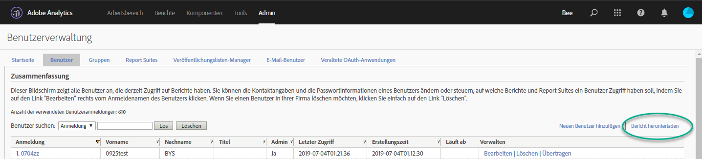

# Migrieren von Analytics-Benutzerkonten für Enterprise und Federated IDs{#migrate-analytics-user-accounts-for-enterprise-and-federated-ids}

So migrieren Sie Analytics-Benutzerkonten als Enterprise IDs oder Federated IDs in die Admin Console.

## Voraussetzungen {#concept-e60d8deb3fc54a1a81f1f47a26658de3}

Voraussetzungen für das User Management mit der Admin Console.

Bei neuen Domänen und Verzeichnissen folgen Sie den Schritten bis:

* Verzeichnis einrichten
* Domänen einrichten
* Domänen mit Verzeichnissen verknüpfen

Vgl. als Hilfe [Einrichten eines Identitätssystems](https://helpx.adobe.com/enterprise/using/set-up-identity.html).

Wenn ein Verzeichnis bereits in einer anderen Organisation von einer anderen Geschäftseinheit oder einem anderen Team erstellt wurde, führen Sie die Schritte unter [Vertrauenswürdiges Verzeichnis](https://helpx.adobe.com/enterprise/using/set-up-identity.html#Directorytrusting) durch, um das Verzeichnis in der Organisation zu erstellen, für die Sie Analytics verwenden.

## Migrieren von-Benutzerkonten für Enterprise IDs und Federated IDs {#task-0cfb3e4400fd4ab58e4d9704528b05fa}

Diese Vorgehensweise ermöglicht Ihnen Folgendes:

* Download a user login list from **[!UICONTROL Analytics]** &gt; **[!UICONTROL Analytics Users &amp; Assets]**.

* Download a current users list from the **[!UICONTROL Admin Console]** &gt; **[!UICONTROL Users]**.

* Vergleichen Sie die Listen und suchen Sie nach Duplikaten, um das Überschreiben von Kontodaten in der Admin Console zu vermeiden.
* Upload a finished [!DNL .csv] (from **[!UICONTROL Admin Console]** &gt; **[!UICONTROL Users]**) with Enterprise ID or Federated ID users to the Admin Console.

Wenn Sie bestehende Adobe ID-Benutzerkonten auf eine Enterprise ID oder Federated ID migrieren möchten, wenden Sie sich an die Adobe-Kundenunterstützung und fordern Sie einen [Massenwechsel von Benutzeridentitäten](https://helpx.adobe.com/enterprise/using/bulk-operations.html) an.

**Benutzerkonten migrieren**

1. Laden Sie die Datei mit Analytics-Benutzeranmeldungen ([!DNL User Logins List.tab]) aus dem Analytics User Management herunter, und zwar mit einer der folgenden Methoden (je nachdem, ob Sie bereits Benutzer migriert haben). 
   1. *Navigieren Sie vor der Migration* zu **[!UICONTROL Admin]** &gt; **[!UICONTROL Benutzerverwaltung (Legacy)]** &gt; Benutzer **[!UICONTROL bearbeiten]** und klicken Sie dann auf Bericht **[!UICONTROL herunterladen]**.

      

      Der Link „Bericht herunterladen“ wird nur für Kunden angezeigt, die nicht-migrierte Benutzer haben.

   1. *Wenn Sie bereits Benutzer migriert haben,* navigieren Sie zu **[!UICONTROL Analytics]** &gt; **[!UICONTROL Analytics-Benutzern und Assets]**.

      

   1. On the [!DNL Users] page, select users, then click **[!UICONTROL Export to CSV]**.

      

   1. Open the downloaded [!DNL User List.csv] file in Excel.

      Be prepared to copy the *`Email`*, *`First Name`*, and *`Last Name`* values to a [!DNL sample.csv] file (described in the next step).

      >[!IMPORTANT]
      >
      >Die Werte in der CSV-Datei müssen kommagetrennt sein.

      **Tipp**: In diesem Schritt empfiehlt Adobe, Ihre Benutzerliste abzugleichen, um sicherzustellen, dass nur Benutzer mit einer gültigen E-Mail-ID in die Migration von Enterprise- oder Federated IDs einbezogen werden.

1. Laden Sie in der Admin Console eine Liste der Benutzer der Admin Console herunter:

   1. Navigate to [Admin Console](http://adminconsole.adobe.html/#) &gt; **[!UICONTROL Users]**, then click [Export users list to CSV](https://helpx.adobe.com/enterprise/using/users.html).

      

   1. Compare the two files: the existing Admin Console users in the exported [!DNL .csv] file ( [!DNL sample.csv], in this example) with the users in the Analytics [!DNL User Logins List.csv] file.

      >[!IMPORTANT]
      >
      >If you find duplicates, delete them from the Analytics [!DNL User Logins List.csv] file. Dieser Schritt verhindert das Überschreiben vorhandener Experience Cloud-Benutzerberechtigungen in der Admin Console und erstellt Ihnen eine Liste der zu migrierenden Konten.

1. Laden Sie die CSV-Vorlage von der Admin Console herunter:
   1. On the Users tab, click **[!UICONTROL Add users by CSV]**, then **[!UICONTROL Download CSV Template]**.

      

   1. Choose **[!UICONTROL Standard Template]**.

      In diesem Schritt wird eine Vorlagendatei mit dem Namen [!DNL sample.csv] heruntergeladen.

      

1. Copy the *`Email`*, *`First Name`*, and *`Last Name`* column values from [!DNL User Logins List.tab] to the corresponding columns in the [!DNL sample.csv] template.

   **Beispiel für eine Vorlagendatei**

   

1. Ergänzen Sie in der Vorlage [!DNL sample.csv] die folgenden Pflichtfelder:

<table id="table_1B5EEFDB5BD8436EB760BE5FFAB1CF02"> 
 <thead> 
  <tr> 
   <th colname="col1" class="entry"> Feld </th> 
   <th colname="col2" class="entry"> Beschreibung </th> 
  </tr>
 </thead>
 <tbody> 
  <tr> 
   <td colname="col1"> 
E-Mail 
 </td> 
   <td colname="col2"> 
Kopiert aus User Logins List.tab. 
 </td> 
  </tr> 
  <tr> 
   <td colname="col1"> 
Vorname 
 </td> 
   <td colname="col2"> 
Kopiert aus User Logins List.tab. 
 </td> 
  </tr> 
  <tr> 
   <td colname="col1"> 
Nachname 
 </td> 
   <td colname="col2"> 
Kopiert aus User Logins List.tab. 
 </td> 
  </tr> 
  <tr> 
   <td colname="col1"> 
Identitätstyp 
 </td> 
   <td colname="col2"> 
 Federated ID oder  Enterprise ID. 
 </td> 
  </tr> 
  <tr> 
   <td colname="col1"> 
Domäne 
 </td> 
   <td colname="col2"> 
Achten Sie darauf, dass die Spalten  Domäne und  E-Mail -Spalte stimmen mit den in den <a href="../c-migration-tool/migrate-enterprise.md#concept-e60d8deb3fc54a1a81f1f47a26658de3" format="dita" scope="local"> Voraussetzungen festgelegten Domänen überein</a>. 
 </td> 
  </tr> 
  <tr> 
   <td colname="col1"> 
Ländercode 
 </td> 
   <td colname="col2"> </td> 
  </tr> 
 </tbody> 
</table>

For more information about the fields in the [!DNL .csv] file, see [CSV file format](https://helpx.adobe.com/enterprise/using/users.html).

>[!NOTE]
>
>Other columns, such as *`Product Configurations`* and *`Admin Roles`* can be blank.

1. On the Users tab in the Admin Console, upload the template file by clicking **[!UICONTROL Add users by CSV]** (as shown in [Step 3](../c-migration-tool/migrate-enterprise.md#step-190321c6025947e38b195daed122c063).).
1. In Analytics, run the migration tool (as described in [Migrate Analytics user accounts](../c-migration-tool/t-migrate-users.md#task-f3355f3b14a340feae58cfa04c0ba1c9)).
1. Click **[!UICONTROL Migrate]** &gt; **[!UICONTROL Migrate as Enterprise IDs]**.

   

   When you click **[!UICONTROL Migrate]**, user are linked to the Enterprise ID/Federated ID account in Admin Console. The permissions of the legacy user account in Analytics will match the permissions granted to the Enterprise/Federated ID login in **[!UICONTROL Admin Console]** &gt; **[!UICONTROL Analytics]** &gt; **[!UICONTROL Product Profiles]**. Die Benutzer-ID wird im Bereich Migration abgeschlossen angezeigt. Sie können die bisherigen [!DNL my.omniture.com]-Zugriffsdaten nun deaktivieren.

   After migrating users, the status under the Migration Status column changes from *`Not Initiated`* to *`Migrated`*.

   Auch Adobe ID-Benutzer, die im Migrationstool erscheinen, können in diesem Prozess migriert werden. Sie müssen sich weiterhin mit ihrer Adobe ID anmelden, bis ein Identitätswechsel durchgeführt ist. Wenden Sie sich an die Adobe-Kundenunterstützung, wenn Sie Hilfe beim Identitätswechsel benötigen.
