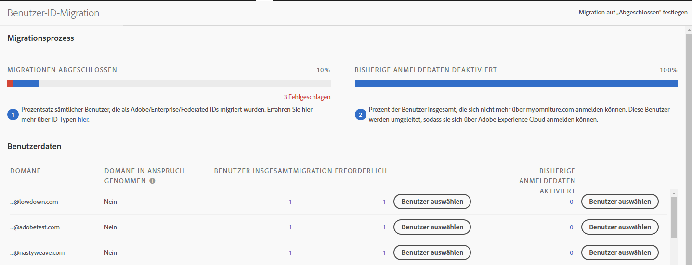

# Migrieren von Analytics-Benutzerkonten für Adobe IDs{#migrate-analytics-user-accounts-for-adobe-ids}

Migrieren Sie Benutzer aus dem vormaligen Analytics User Management-System in die Adobe Admin Console.

## Migrieren von Analytics-Benutzerkonten für Adobe IDs {#task-f3355f3b14a340feae58cfa04c0ba1c9}

Migrieren Sie Benutzer aus dem vormaligen Analytics User Management-System in die Adobe Admin Console.

>[!NOTE]
>
>Wenn ein nicht über die Experience Cloud angemeldeter Administrator versucht, auf das Migration-Tool für Benutzer-Ids zuzugreifen, werden sie zur Experience Cloud-Anmeldeseite weitergeleitet.

**Migration von Analytics-Benutzern**

1. Navigieren Sie zu **Analytics** &gt; **[!UICONTROL Admin]** &gt; **[!UICONTROL Benutzer-ID-Migration]**.

   

   Die Seite zur Migration von Benutzer-IDs besteht aus zwei Abschnitten: *Migrationsprozess* und *Benutzerdaten*.

   **Migrationsprozess**

<table id="table_F9F1CFF762C745E198CB075A02BA2DDA"> 
 <thead> 
  <tr> 
   <th colname="col1" class="entry"> Phase </th> 
   <th colname="col2" class="entry"> Beschreibung </th> 
  </tr>
 </thead>
 <tbody> 
  <tr> 
   <td colname="col1"> 
Migration abgeschlossen 
 </td> 
   <td colname="col2"> 
Die Benutzer haben die Einladung angenommen. 
 </td> 
  </tr> 
  <tr> 
   <td colname="col1"> 
Bisherige Anmeldedaten deaktiviert 
 </td> 
   <td colname="col2"> 
Die bisherigen Anmeldedaten mit Unternehmens-ID wurden deaktiviert. Benutzer greifen nun mit ihrer Adobe ID oder Enterprise ID auf die Experience Cloud zu. Wenn alle Ihre Benutzer diese Phase erreicht haben, ist die Migration abgeschlossen. 
 
Bei der Migration ist die alte Anmeldung deaktiviert. Users are redirected to  experiencecloud.adobe.com and must log in using the Adobe ID or Enterprise ID. 
 
See <a href="../c-migration-tool/t-disable-legacy-login.md#task-c9262e469814473c8a3ff3971c95570b" format="dita" scope="local"> Disable Legacy Logins</a> for more information. 
 </td> 
  </tr> 
 </tbody> 
</table>

**Benutzerdaten**

Die Benutzerdaten zeigen die Benutzer in Ihrer Organisation an, getrennt durch den Domänennamen.

<table id="table_3822E27AF81E4A188562FEB5131548A5"> 
 <thead> 
  <tr> 
   <th colname="col1" class="entry"> Element </th> 
   <th colname="col2" class="entry"> Beschreibung </th> 
  </tr>
 </thead>
 <tbody> 
  <tr> 
   <td colname="col1"> 
Domäne 
 </td> 
   <td colname="col2"> 
Domänen beziehen sich auf die E-Mail-IDs der aktuellen Analytics-Benutzerbasis. Eine Domäne kann nur von einem einzigen Unternehmen und nur durch Systemadministratoren in Anspruch genommen werden. Weitere Informationen finden Sie unter <a href="https://helpx.adobe.com/enterprise/help/request-access-to-claimed-domain.html" format="html" scope="external">Zugriff auf eine beanspruchte Domäne anfordern</a>. 
 </td> 
  </tr> 
  <tr> 
   <td colname="col1"> 
Domäne angefordert 
 </td> 
   <td colname="col2"> 
Wenn Sie Benutzer als Enterprise- oder Federated IDs migrieren möchten, müssen Sie Systemadministrator sein und eine verfügbare Domäne über die Admin Console anfordern, bevor Sie Benutzer migrieren können. <a href="https://helpx.adobe.com/enterprise/help/identity.html" format="html" scope="external">Weitere Informationen</a>. 
 
Wenn Sie keine Domänen für Enterprise- oder Federated IDs anfordern möchten, überspringen Sie diesen Schritt und migrieren Sie Benutzer als Adobe IDs. Erfahren Sie <a href="https://helpx.adobe.com/enterprise/help/identity.html" format="html" scope="external">hier</a> mehr über ID-Arten. 
 </td> 
  </tr> 
 </tbody> 
</table>

1. Locate the domain containing the user IDs you want to migrate, then, under **[!UICONTROL Requiring Migration]**, click **[!UICONTROL Select Users]**.
1. On the [!DNL Users] page, select the users you want to migrate, then click **[!UICONTROL Migrate]**.

   When you click **[!UICONTROL Migrate]**, users receive an invitation (Migration Initiated) and must accept it. Dadurch wird die Benutzer-ID in die Kategorie „Migration abgeschlossen“ verschoben. Sie können die bisherigen [!DNL my.omniture.com]-Anmeldedaten dann deaktivieren.

   

1. Geben Sie die Art der ID an, die Sie für die Migration der Benutzer verwenden möchten ([Adobe ID oder Enterprise ID](https://helpx.adobe.com/enterprise/help/identity.html)).

   After migrating users, the status under the column Migration Status changes from *`Not Initiated`* to *`Migrated`*.

   If *`Failed`* displays, hover over the icon for a description about why the migration failed.
