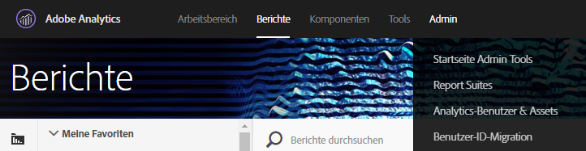
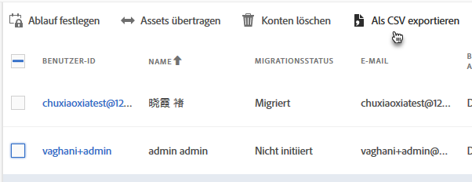
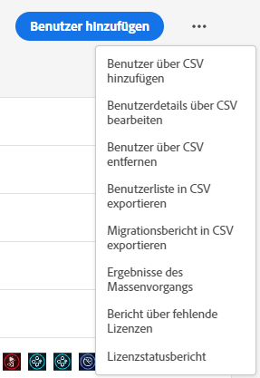
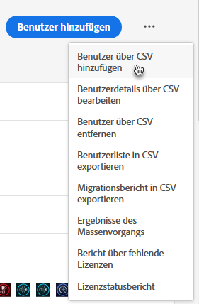
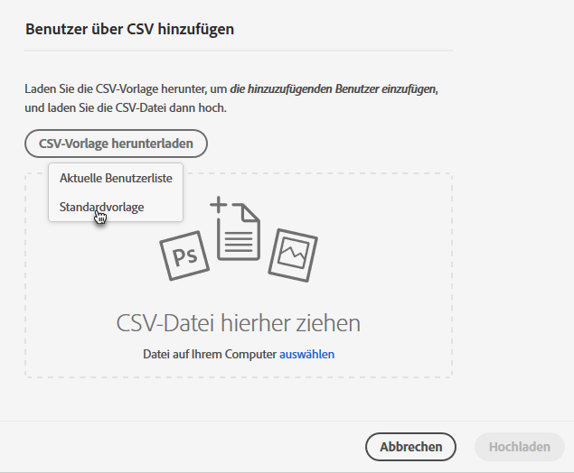
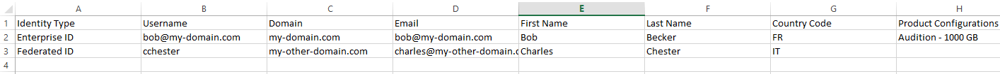
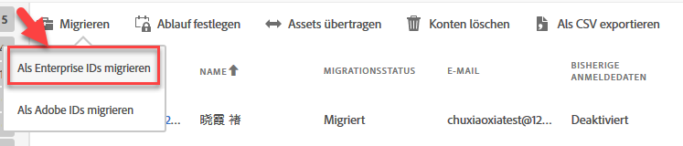

# Migrieren von Analytics-Benutzerkonten für Enterprise und Federated IDs {#migrate-analytics-user-accounts-for-enterprise-and-federated-ids}

Migrieren von Analytics-Benutzerkonten als Enterprise IDs oder Federated IDs in die Admin Console.

## Voraussetzungen {#prereqs}

Voraussetzungen für das User Management mit der Admin Console.

Bei neuen Domänen und Verzeichnissen folgen Sie den Schritten bis:

* Verzeichnis einrichten
* Domänen einrichten
* Domänen mit Verzeichnissen verknüpfen

Vgl. als Hilfe [Einrichten eines Identitätssystems](https://helpx.adobe.com/de/enterprise/using/set-up-identity.html).

Wenn ein Verzeichnis bereits in einer anderen Organisation von einer anderen Geschäftseinheit oder einem anderen Team erstellt wurde, führen Sie die Schritte unter [Vertrauenswürdiges Verzeichnis](https://helpx.adobe.com/de/enterprise/using/set-up-identity.html#Directorytrusting) durch, um das Verzeichnis in der Organisation zu erstellen, für die Sie Analytics verwenden.

## Migrieren von-Benutzerkonten für Enterprise IDs und Federated IDs  {#task-0cfb3e4400fd4ab58e4d9704528b05fa}

Diese Vorgehensweise ermöglicht Ihnen Folgendes:

* Laden Sie eine Benutzeranmeldeliste unter **[!UICONTROL Analytics]** > **[!UICONTROL Analytics-Benutzer und -Assets]**.

* Laden Sie eine aktuelle Benutzerliste von **[!UICONTROL Admin Console]** > **[!UICONTROL Benutzer]** herunter.

* Vergleichen Sie die Listen und suchen Sie nach Duplikaten, um das Überschreiben von Kontodaten in der Admin Console zu vermeiden.
* Laden Sie eine fertige [!DNL .csv]-Datei (von **[!UICONTROL Admin Console]** > **[!UICONTROL Benutzer]**) mit Enterprise ID- oder Federated ID-Benutzern in die Admin Console hoch.

Wenn Sie bestehende Adobe ID-Benutzerkonten auf eine Enterprise ID oder Federated ID migrieren möchten, wenden Sie sich an die Adobe-Kundenunterstützung und fordern Sie einen [Massenwechsel von Benutzeridentitäten](https://helpx.adobe.com/de/enterprise/using/bulk-operations.html) an.

**Benutzerkonten migrieren**

1. Laden Sie die Datei mit Analytics-Benutzeranmeldungen ([!DNL User Logins List.tab]) aus Analytics User Management herunter, und zwar mit einer der folgenden Methoden (je nachdem, ob Sie bereits Benutzer migriert haben).
   1. *Gehen Sie* vor der Migration zu **[!UICONTROL Admin]** > **[!UICONTROL User Management (bisherig)]** > **[!UICONTROL Benutzer bearbeiten]** und klicken dann auf **[!UICONTROL Bericht herunterladen]**.

      

      Der Link „Bericht herunterladen“ wird nur für Kunden angezeigt, die nicht-migrierte Benutzer haben.

   1. *Wenn Sie bereits Benutzer migriert haben,* gehen Sie zu **[!UICONTROL Analytics]** > **[!UICONTROL Analytics-Benutzer und -Assets]**.

      

   1. Wählen Sie auf der Seite „[!DNL Users]“ Benutzer aus und klicken Sie dann auf **[!UICONTROL Als CSV exportieren]**.

      

   1. Öffnen Sie die heruntergeladene Datei [!DNL User List.csv] mit Excel.

      Bereiten Sie sich darauf vor, die Werte *`Email`*, *`First Name`* und *`Last Name`* in eine [!DNL sample.csv]-Datei zu kopieren (siehe nächsten Schritt).

      >[!IMPORTANT]
      >
      >Die Werte in der CSV-Datei müssen durch Kommas getrennt sein.

      >[!TIP]
      >
      >In diesem Schritt empfiehlt Adobe, Ihre Benutzerliste abzugleichen, um sicherzustellen, dass nur Benutzer mit einer gültigen E-Mail-ID in die Migration von Enterprise oder Federated IDs einbezogen werden.

1. Laden Sie in der [!UICONTROL Admin Console] eine Liste der Benutzer der Admin Console herunter:

   1. Gehen Sie zu [!UICONTROL Admin Console] > **[!UICONTROL Benutzer]** und klicken Sie auf [Benutzerliste in CSV exportieren](https://helpx.adobe.com/de/enterprise/using/users.html).

      

   1. Vergleichen Sie die beiden Dateien: die vorhandenen Admin Console-Benutzer in der exportierten [!DNL .csv]-Datei (in diesem Beispiel [!DNL sample.csv]) mit den Benutzern in der Analytics-Datei [!DNL User Logins List.csv].

      >[!IMPORTANT]
      >
      > Wenn Sie Duplikate finden, löschen Sie diese aus der Analytics-Datei [!DNL User Logins List.csv]. Dieser Schritt verhindert das Überschreiben vorhandener Experience Cloud-Benutzerberechtigungen in der Admin Console und erstellt Ihnen eine Liste der zu migrierenden Konten.

1. Laden Sie die CSV-Vorlage von der Admin Console herunter:
   1. Klicken Sie auf der Registerkarte „Benutzer“ auf **[!UICONTROL Benutzer gemäß CSV zufügen]** und dann auf **[!UICONTROL CSV-Vorlage herunterladen]**.

      

   1. Wählen Sie **[!UICONTROL Standardvorlage]** aus.

      In diesem Schritt wird eine Vorlagendatei mit dem Namen [!DNL sample.csv] heruntergeladen.

      

1. Kopieren Sie die Spaltenwerte *`Email`*, *`First Name`* und *`Last Name`* aus [!DNL User Logins List.tab] in die entsprechenden Spalten in der [!DNL sample.csv]-Vorlage.

   **Beispiel für eine Vorlagendatei**

   

1. Ergänzen Sie in der Vorlage [!DNL sample.csv] die folgenden Pflichtfelder:

<table id="table_1B5EEFDB5BD8436EB760BE5FFAB1CF02"> 
 <thead> 
  <tr> 
   <th colname="col1" class="entry"> Feld </th> 
   <th colname="col2" class="entry"> Beschreibung </th> 
  </tr>
 </thead>
 <tbody> 
  <tr> 
   <td colname="col1"> 
E-Mail 
 </td> 
   <td colname="col2"> 
Kopiert aus User Logins List.tab. 
 </td> 
  </tr> 
  <tr> 
   <td colname="col1"> 
Vorname 
 </td> 
   <td colname="col2"> 
Kopiert aus User Logins List.tab. 
 </td> 
  </tr> 
  <tr> 
   <td colname="col1"> 
Nachname 
 </td> 
   <td colname="col2"> 
Kopiert aus User Logins List.tab. 
 </td> 
  </tr> 
  <tr> 
   <td colname="col1"> 
Identitätstyp 
 </td> 
   <td colname="col2"> 
 Federated ID oder  Enterprise ID. 
 </td> 
  </tr> 
  <tr> 
   <td colname="col1"> 
Domäne 
 </td> 
   <td colname="col2"> 
Achten Sie darauf, dass die Domänen in den Spalten Domäne und E-Mail mit den Domänen übereinstimmen, die in den Voraussetzungen</a> festgelegt wurden. 
 </td> 
  </tr> 
  <tr> 
   <td colname="col1"> 
Ländercode 
 </td> 
   <td colname="col2"> </td> 
  </tr> 
 </tbody> 
</table>

Weitere Informationen zu den Feldern in der [!DNL .csv]-Datei finden Sie unter [CSV-Dateiformat](https://helpx.adobe.com/enterprise/using/users.html).

>[!NOTE]
>
>Andere Spalten wie [!UICONTROL Produktkonfigurationen] und [!UICONTROL Administratorrollen] können leer sein.

1. Laden Sie die Vorlagendatei auf der Registerkarte „Benutzer“ in der Admin Console hoch, indem Sie auf **[!UICONTROL Benutzer gemäß CSV zufügen]** klicken (vgl. Schritt 3).
1. Führen Sie in Analytics das Migrationstool aus (wie unter [Migrieren von Analytics-Benutzerkonten](/help/admin/user-management2/user-migration/t-migrate-users.md) beschrieben).
1. Klicken Sie auf **[!UICONTROL Migrieren]** > **[!UICONTROL Als Enterprise IDs migrieren]**.

   

   Wenn Sie auf **[!UICONTROL Migrieren]** klicken, werden die Benutzer mit dem Enterprise ID/Federated ID-Konto in der Admin Console verknüpft. Die Berechtigungen des bisherigen Benutzerkontos in Analytics stimmen mit den Berechtigungen überein, die für die Anmeldung von Enterprise-/Federated IDs unter **[!UICONTROL Admin Console]** > **[!UICONTROL Analytics]** > **[!UICONTROL Produktprofile]** erteilt wurden. Die Benutzer-ID wird im Bereich „Migration abgeschlossen“ angezeigt. Sie können die bisherigen [!DNL my.omniture.com]-Zugriffsdaten nun deaktivieren.

   Nach der Migration von Benutzern ändert sich der Wert in der Spalte „Migrationsstatus“ von **[!UICONTROL Nicht initiiert]** auf **[!UICONTROL Migriert]**.

   Auch Adobe ID-Benutzer, die im Migrationstool erscheinen, können in diesem Prozess migriert werden. Sie müssen sich weiterhin mit ihrer Adobe ID anmelden, bis ein Identitätswechsel durchgeführt ist. Wenden Sie sich an die Adobe-Kundenunterstützung, wenn Sie Hilfe beim Identitätswechsel benötigen.
