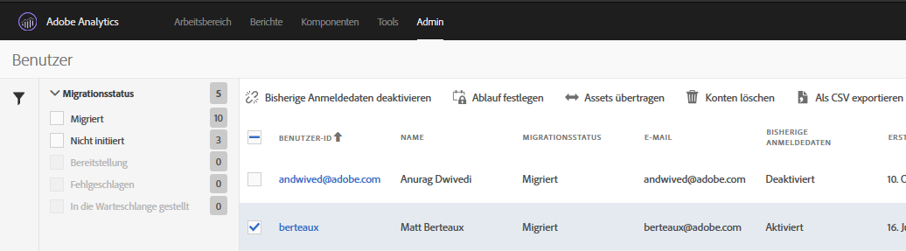

# Migrieren von Analytics-Benutzerkonten für Adobe IDs {#migrate-analytics-user-accounts-for-adobe-ids}

Migrieren Sie Benutzer aus dem vormaligen Analytics User Management-System in die Adobe Admin Console.

## Migrieren von Analytics-Benutzerkonten für Adobe IDs {#task-f3355f3b14a340feae58cfa04c0ba1c9}

Migrieren Sie Benutzer aus dem vormaligen Analytics User Management-System in die Adobe Admin Console.

>[!NOTE]
>
>Versuchen Admins, die nicht über die Experience Cloud angemeldet sind, auf das Benutzer-ID-Migrationstool zuzugreifen, werden sie zur Experience Cloud-Anmeldeseite weitergeleitet.

**Migrieren von Analytics-Benutzern**

1. Navigieren Sie zu **[!UICONTROL Analytics]** > **[!UICONTROL Admin]** > **[!UICONTROL Benutzer-ID-Migration]**.

   

   Die Seite zur Migration von Benutzer-IDs besteht aus zwei Abschnitten: *Migrationsprozess* und *Benutzerdaten*.

   **Migrationsprozess**

   <table id="table_F9F1CFF762C745E198CB075A02BA2DDA"> 
   <thead> 
   <tr> 
      <th colname="col1" class="entry"> Phase </th> 
      <th colname="col2" class="entry"> Beschreibung </th> 
   </tr>
   </thead>
   <tbody> 
   <tr> 
      <td colname="col1"> 
Migration abgeschlossen 
 </td> 
      <td colname="col2"> 
Die Benutzer haben die Einladung angenommen. 
 </td> 
   </tr> 
   <tr> 
      <td colname="col1"> 
Bisherige Anmeldedaten deaktiviert 
 </td> 
      <td colname="col2"> 
Die bisherigen Anmeldedaten mit Unternehmens-ID wurden deaktiviert. Benutzer greifen nun mit ihrer Adobe ID oder Enterprise ID auf die Experience Cloud zu. Wenn alle Ihre Benutzer diese Phase erreicht haben, ist die Migration abgeschlossen. 
 
Bei der Migration ist die bisherige Anmeldung deaktiviert. Benutzer werden zu experiencecloud.adobe.com umgeleitet und müssen sich mit der Adobe ID oder Enterprise ID anmelden. 
 </td> 
   </tr> 
   </tbody> 
   </table>

   **Benutzerdaten**

   Die Benutzerdaten zeigen die Benutzer in Ihrer Organisation an, getrennt durch den Domänennamen.

   <table id="table_3822E27AF81E4A188562FEB5131548A5"> 
   <thead> 
   <tr> 
      <th colname="col1" class="entry"> Element </th> 
      <th colname="col2" class="entry"> Beschreibung </th> 
   </tr>
   </thead>
   <tbody> 
   <tr> 
      <td colname="col1"> 
Domäne 
 </td> 
      <td colname="col2"> 
Domänen beziehen sich auf die E-Mail-IDs der aktuellen Analytics-Benutzerbasis. Eine Domäne kann nur von einem einzigen Unternehmen und nur durch Systemadministratoren in Anspruch genommen werden. Weitere Informationen finden Sie unter <a href="https://helpx.adobe.com/de/enterprise/help/request-access-to-claimed-domain.html">Anfordern des Zugriffs auf eine beanspruchte Domäne</a>. 
 </td> 
   </tr> 
   <tr> 
      <td colname="col1"> 
Domäne angefordert 
 </td> 
      <td colname="col2"> 
Wenn Sie Benutzer als Enterprise- oder Federated IDs migrieren möchten, müssen Sie Systemadministrator sein und eine verfügbare Domäne über die Admin Console anfordern, bevor Sie Benutzer migrieren können. <a href="https://helpx.adobe.com/de/enterprise/help/identity.html">Weitere Informationen</a>. 
 
Wenn Sie keine Domänen für Enterprise- oder Federated IDs anfordern möchten, überspringen Sie diesen Schritt und migrieren Sie Benutzer als Adobe IDs. Erfahren Sie <a href="https://helpx.adobe.com/enterprise/help/identity.html">hier</a> mehr über ID-Typen. 
 </td> 
   </tr> 
   </tbody> 
   </table>

1. Suchen Sie nach der Domäne, die die zu migrierenden Benutzer-IDs enthält, und klicken Sie dann unter **[!UICONTROL Migration erforderlich]** auf **[!UICONTROL Benutzer auswählen]**.
1. Wählen Sie auf der Seite „[!DNL Users]“ die Benutzer aus, die Sie migrieren möchten, und klicken Sie dann auf **[!UICONTROL Migrieren]**.

   Wenn Sie auf **[!UICONTROL Migrieren]** klicken, erhalten Benutzer eine Einladung (die Migration wird initiiert) und müssen diese annehmen. Dadurch wird die Benutzer-ID in die Kategorie „Migration abgeschlossen“ verschoben. Sie können dann die bisherigen `[!DNL my.omniture.com].`-Anmeldedaten deaktivieren

   

1. Geben Sie den Typ der ID an, die Sie für die Migration der Benutzer verwenden möchten (Adobe ID oder Enterprise ID)

   Nach der Migration von Benutzern ändert sich der Wert in der Spalte „Migrationsstatus“ von *`Not Initiated`* auf *`Migrated`*.

   Wenn *`Failed`* angezeigt wird, fahren Sie mit dem Maus über das Symbol, um den Grund für das Fehlschlagen der Migration anzuzeigen.
