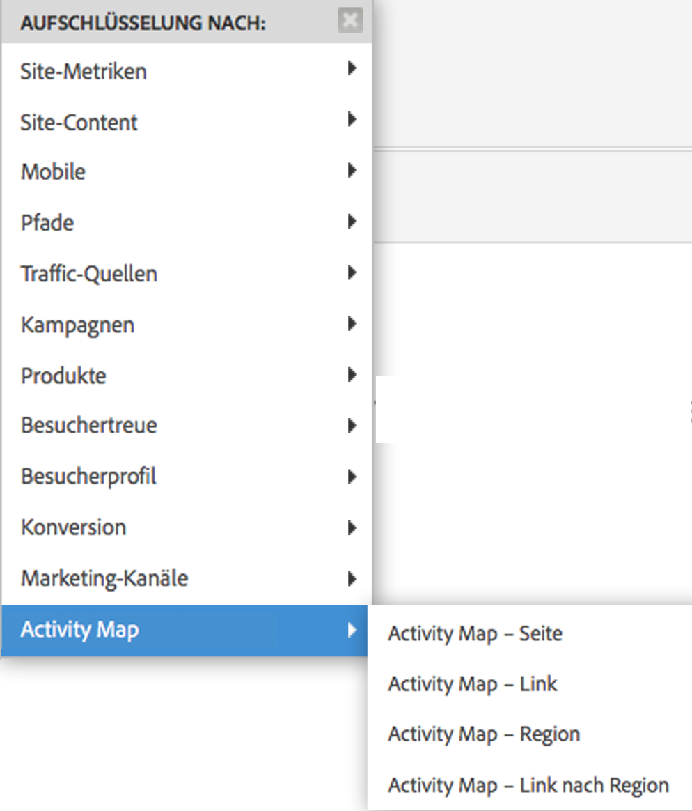

# Activity Map aktivieren {#enable-activity-map}

Erläutert die Schritte, die der Analytics-Administrator ausführen muss, um die Activity Map-Linkerfassung und den Download durch den Benutzer zu ermöglichen.

## Schritt 1. AppMeasurement-Code (Javascript) auf Version 1.6 (oder höher) aktualisieren {#section_5D1586289DF2489289B1B6C1C80C300D}

Das Activity Map-Modul ist Bestandteil der Datei AppMeasurement.js (befindet sich oben in der Datei). Die AppMeasurement-Bibliothek lädt das Activity Map-Modul nach der Instanziierung.

Activity Map-Daten können erst erfasst werden, nachdem AppMeasurement auf diese Version (oder höher) aktualisiert wurde.

1. Laden Sie über **[!UICONTROL Analyse]** > **[!UICONTROL Admin]** > **[!UICONTROL Code-Manager]** den aktuellen AppMeasurement-Code (AppMeasurement_Javascript-1.6.zip) herunter und [implementieren Sie ihn](https://docs.adobe.com/content/help/de-DE/analytics/implementation/js/overview.html).

   Der verfügbare [Beispiel-Implementierungscode](/help/analyze/activity-map/activitymap-getting-started/activitymap-getting-started-admins/activitymap-sample-implementation-code.md) veranschaulicht die Änderungen, die am Code durch Einbindung des Activity Map-Moduls vorgenommen wurden.

1. Validieren Sie die Implementierung:

   1. Wenn auf ein klickbares Element geklickt wird, werden Daten in einem Cookie namens s_sq gespeichert.
   1. Die Activity Map-Daten sind in der Abfragezeichenfolge des Tracking-Aufrufs sichtbar. Beispiel:

      ```
      …&c.&a.&Activity Map.&link=My%20Link&region=My%20Region&page=My%20Page&.Activity Map&.a&.c&...
      ```

1. Schlüsseln Sie diesen Bericht mit **[!UICONTROL Activity Map – Link nach Region]** auf, um den Link/die Region für diese Seite zu sehen: {width=&quot;400px&quot;}

## Schritt 2. Activity Map-Berichte aktivieren {#section_D14F15D2FC0346FCAD8B3B87E6DD33D4}

Zunächst müssen Sie Activity Map-Berichte auf einer Report Suite-Ebene aktivieren.

1. Melden Sie sich bei Adobe Analytics an und navigieren Sie zu **[!UICONTROL Analytics]** > **[!UICONTROL Admin]** > **[!UICONTROL Report Suites]** > Report Suites auswählen > **[!UICONTROL Einstellungen bearbeiten]** > **[!UICONTROL Activity Map]** > **[!UICONTROL Activity Map – Berichterstattung]**.
1. Activity Map erfasst die Linkdaten in Activity Map-Berichten. Zur Aktivierung müssen Sie zunächst die Variablen aktivieren, indem Sie auf **[!UICONTROL Activity Map-Berichte aktivieren]** klicken.

   Dieser Schritt fügt alle Analytics-Dimensionen hinzu, die Sie zur Datenerfassung benötigen.

1. Nach etwa einer Stunde können Sie sich den [Activity Map-Seitenbericht](/help/analyze/activity-map/activitymap-reporting-analytics.md) ansehen, der alle Seiten enthält, auf denen Benutzer auf einen Link geklickt haben.

## Schritt 3. Benutzer zur Activity Map Access Group hinzufügen {#section_4C7A47BB7DEF4AFFBC276392467F9675}

1. Klicken Sie auf **[!UICONTROL Benutzer zur Gruppe hinzufügen]**.

   Dies bringt Sie zur Gruppenverwaltungsseite in der Admin Console.

1. [Fügen Sie Benutzer dieser Gruppe hinzu](https://docs.adobe.com/content/help/de-DE/analytics/admin/user-product-management/user-groups/groups.html) und klicken Sie auf **[!UICONTROL Gruppe speichern]**.

1. Dadurch können Ihre Admin-Benutzer Activity Map über **[!UICONTROL Adobe Analytics]** > **[!UICONTROL Werkzeuge]** > **[!UICONTROL Activity Map]** herunterladen.

>[!NOTE]
>
>Wenn Sie möchten, dass Benutzer, die keine Administratoren sind, Activity Map herunterladen können, erstellen Sie eine neue Benutzergruppe, die Berechtigungen für „Tools“ und „Legacy ClickMap Installation“ bereitstellt. Diese Berechtigungsstufe in Verbindung mit dem Activity Map-Zugriff bietet Berechtigungen zum Herunterladen und Verwenden des Tools.
