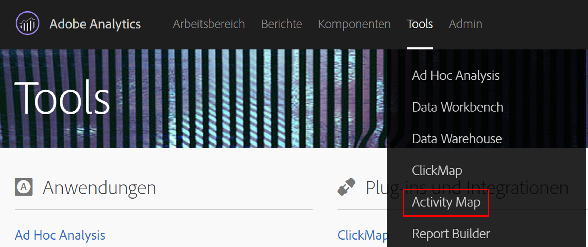

# Activity Map Browser-Plugins installieren {#install-activity-map-browser-plug-ins}

Der Installationsprozess variiert in Abhängigkeit von dem verwendeten Browser.

Activity Map Browser-Plugins:

* werden manuell als Analytics-Seiten-Tag eingefügt,
* werden durch eine Schaltfläche oder ein Menüelement in der Browsersymbolleiste gestartet,
* sind nur mit den neuesten Versionen dieser Desktopbrowser kompatibel: Internet Explorer, Firefox und Chrome,
* Unterstützen Sie die **[!UICONTROL Remember my login]** Funktion.
* **** können die Activity Map-Symbolleiste auf Webseiten ohne Analytics-Seiten-Code einfügen, zeigen eine Fehlermeldung an, wenn die Seite den Analytics-Seiten-Code nicht enthält,
* erfordern, dass Sie einen Installationsvorgang für Browser-Plugins ausführen.

## Activity Map-Plugin für Chrome installieren {#section_6907253D5D5E4422967E6439207A013F}

1. Öffnen von **[!UICONTROL Adobe Analytics]** > **[!UICONTROL Tools]** > **[!UICONTROL Activity Map]**.  
1. Klicken Sie auf **[!UICONTROL Download Activity Map]**.
1. Klicken Sie auf **[!UICONTROL Install the Activity Map Plug-in]**.
1. Answer **[!UICONTROL Yes]** when the security warning asks you whether you want to download the Activity Map Browser Plug-in.
1. Sobald der Download abgeschlossen ist, suchen Sie das Verzeichnis mit der .zip-Datei und entzippen Sie den Inhalt.
1. Kehren Sie zur Adressleiste von Chrome zurück und geben Sie `chrome://extensions` ein.
1. Aktivieren Sie das Kontrollkästchen für den Entwicklermodus.
1. Klicken Sie auf die Schaltfläche zum Herunterladen der extrahierten Erweiterungen und wählen Sie den extrahierten Ordner aus dem Popup aus.
1. Wenn das Adobe Analytics-Symbol {width=&quot;70px&quot;} in Ihrer Symbolleiste angezeigt wird, war der Download erfolgreich. Jetzt können Sie auf Ihrer Seite [Activity Map starten](/help/analyze/activity-map/activitymap-getting-started/activitymap-getting-started-users/activitymap-launch.md).

## Activity Map-Plugin für Firefox installieren {#section_1F69D3D22DB34D6992747B1A62C1D2DA}

1. Öffnen von **[!UICONTROL Analytics]** > **[!UICONTROL Activity Map]**.

1. Klicken Sie auf **[!UICONTROL Download Activity Map]**.
1. Klicken Sie auf **[!UICONTROL Install the Activity Map Plug-in]**.
1. Click **[!UICONTROL Allow]** when this message appears: 
1. Klicken Sie auf **[!UICONTROL Install Now]**.
1. Click the **[!UICONTROL Open Menu]** icon at the top right and select **[!UICONTROL Add-Ons]**. {width=&quot;250px&quot;}
1. Activity Map sollte als eines der Firefox-Add-ons aufgeführt werden.
1. Wenn das Adobe Analytics-Symbol  in Ihrer Symbolleiste angezeigt wird, war der Download erfolgreich. Jetzt können Sie auf Ihrer Seite [Activity Map starten](/help/analyze/activity-map/activitymap-getting-started/activitymap-getting-started-users/activitymap-launch.md).

## Activity Map-Plugin für Internet Explorer installieren {#section_1A33705D7F784C4A88C9026ADC860FB8}

1. Öffnen von **[!UICONTROL Analytics]** > **[!UICONTROL Activity Map]**.
1. Klicken Sie auf **[!UICONTROL Download Activity Map]**.
1. Klicken Sie auf **[!UICONTROL Install the Activity Map Plug-in]**.
1. Click **[!UICONTROL Run]** to initiate the Activity Map installation.
1. Click **[!UICONTROL Yes]** on the popup to allow the program to make changes to the computer.
1. Befolgen Sie die Anweisungen im Installationsassistenten.
1. Wenn Activity Map erfolgreich installiert wurde, wird in Internet Explorer eine Benachrichtigung angezeigt, die darauf hinweist, dass die Activity Map-Symbolleiste einsatzbereit ist. Aktivieren Sie sie, um die Anwendung zu verwenden. Jetzt können Sie auf Ihrer Seite [Activity Map starten](/help/analyze/activity-map/activitymap-getting-started/activitymap-getting-started-users/activitymap-launch.md).
