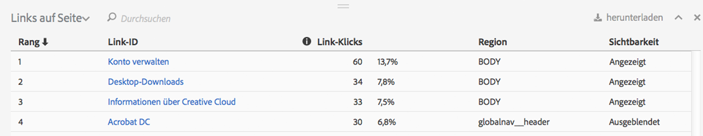
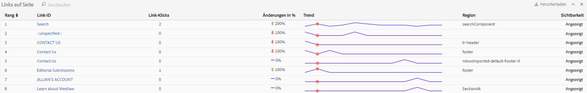

# Link-Bericht

Der Linkbericht enthält Daten zu den Links, die auf der aktuellen Seite gefunden wurden. Er enthält nicht die Daten für alle Links, die für diese Seite erfasst wurden.

Der Bericht „Links auf Seite“ bietet eine tabellarische Ansicht der Links. In einigen Fällen möchten Sie eventuell Link-Klicks (oder andere Metriken) nach Rang sortiert in einer einzigen Ansicht sehen. Dadurch können Sie die Links besser miteinander vergleichen. Erstellen Sie den Bericht „Links auf Seite“, der eine Liste enthält, auf der alle Links der Seite (mit ihrer Link-ID) nach Rang sortiert aufgeführt werden, einschließlich der Klickinformationen (Anzahl und %) und der Region der Seite. Klicken Sie auf die Schaltfläche für den Bericht „Links auf Seite“ in der Activity Map-Symbolleiste.

Der Bericht **[!UICONTROL Links auf Seite]** wird unter dem Browserframe im Activity Map-Dashboard geöffnet.

## Standardmodus {#section_C8D2A1C07A2A4E3A8F84AC9240603FA7}

Im Standardmodus zeigt der Bericht „Links auf Seite“ die Linkdaten für einen einzelnen Tag oder für einen vollständigen, mehrere Tage umfassenden Datumsbereich. Die folgenden Informationen werden für jeden Link angezeigt:

<table id="table_3DE41B2CFA644B70AF802A3123CE51D9"> 
 <thead> 
  <tr> 
   <th colname="col1" class="entry"> Spalte </th> 
   <th colname="col2" class="entry"> Beschreibung </th> 
  </tr> 
 </thead>
 <tbody> 
  <tr> 
   <td colname="col1"> Rang </td> 
   <td colname="col2"> Rang auf der Seite. Im Standardmodus bleibt der Rangwert immer gleich, unabhängig davon, auf welche Spalte Sie klicken. </td> 
  </tr> 
  <tr> 
   <td colname="col1"> Link-ID </td> 
   <td colname="col2">Die primäre ID des Links (weitere Informationen darüber, wie die primäre ID von der neuen Linktracking-Methode definiert wird, finden Sie <a href="/help/analyze/activity-map/activitymap-link-tracking/activitymap-link-tracking-methodology.md">hier</a>). </td> 
  </tr> 
  <tr> 
   <td colname="col1"> Klicks </td> 
   <td colname="col2"> Die Rohdaten für die Anzahl der Klicks auf einen bestimmten Link und der prozentuale Anteil im Vergleich zu den gesamten Klicks auf der Seite: Wenn der Benutzer eine andere Metrik in der Symbolleiste auswählt, enthält der Linkbericht stattdessen Daten zu dieser Metrik. </td> 
  </tr> 
  <tr> 
   <td colname="col1"> Region </td> 
   <td colname="col2"> Stellt die Region auf der Seite dar, in der sich der Link befindet. </td> 
  </tr> 
  <tr> 
   <td colname="col1"> Sichtbarkeit </td> 
   <td colname="col2">Bezieht sich auf den Sichtbarkeitsstatus des Links. Zwei Werte sind möglich: 
    <ul id="ul_BABCC0F64145407C9D439150A6898E6D">
     <li id="li_9AF0479BDCEB4A44A37292FAABFA83A5"><b>Verborgen</b>: Der Link befindet sich auf der Seite, ist jedoch für den Endbenutzer nicht sichtbar (wie ein Untermenü in einem Navigationsmenü, das erst sichtbar wird, wenn der Benutzer den Mauszeiger über das übergeordnete Menü bewegt). </li>
     <li id="li_C6FA4EC27EDD4341AB9821E2B4BC9E60"><b>Angezeigt</b>: Der Link wird aktuell auf der Seite angezeigt. Er kann sich jedoch weiter unten befinden, sodass der Benutzer einen Bildlauf auf der Seite durchführen muss, um ihn zu sehen. </li>
    </ul>
Hinweis: Wenn ein Link auf „Verborgen“ gesetzt ist, werden keine Überlagerungen dafür angezeigt. 
</td> 
  </tr> 
 </tbody> 
</table>

**Daten filtern**

Wenn Sie einen bestimmten Link näher betrachten möchten, können Sie nach einem entsprechenden Begriff im Feld **[!UICONTROL Daten filtern]** suchen. Nur für die Links, die dem Suchkriterium entsprechen, werden Überlagerungen angezeigt. Ohne Filter werden die in den [Einstellungen für Activity Map](/help/analyze/activity-map/activitymap-overlay-settings.md) angegebenen Überlagerungen angezeigt.

## Livemodus {#section_AC1967217B5A4532ACB01D33636F6770}

Im Livemodus zeigt der Bericht „Links auf Seite“ die Trenddaten über mehrere Minuten an.

<table id="table_61D1FB0F02894055A1AB394DE4FE4742"> 
 <thead> 
  <tr> 
   <th colname="col1" class="entry"> Spalte </th> 
   <th colname="col2" class="entry"> Beschreibung </th> 
  </tr> 
 </thead>
 <tbody> 
  <tr> 
   <td colname="col1"> Rang </td> 
   <td colname="col2"> Rang auf der Seite. Bei einer Verlaufs- oder Blasenüberlagerung bleibt der Rangwert gleich, unabhängig von der Spalte, auf die Sie klicken. Bei der Überlagerung „Gewinner und Verlierer“ ändert sich der Rangwert abhängig davon, für welche Links die Werte am meisten gestiegen bzw. gefallen sind. </td> 
  </tr> 
  <tr> 
   <td colname="col1"> Link-ID </td> 
   <td colname="col2">Die primäre ID des Links. Weitere Informationen darüber, wie die primäre ID von der neuen Linktracking-Methode definiert wird, finden Sie <a href="/help/analyze/activity-map/activitymap-link-tracking/activitymap-link-tracking-methodology.md">hier</a>. </td>
  </tr> 
  <tr> 
   <td colname="col1"> Link-Klicks </td> 
   <td colname="col2"> Klicks insgesamt für den ausgewählten Zeitraum. </td> 
  </tr> 
  <tr> 
   <td colname="col1"> Änderungen in % </td> 
   <td colname="col2"> Prozentuale Änderung zwischen den Linkmetriken im aktuellen und im vorherigen Zeitraum: Sind die prozentualen Änderungen negativ, werden sie in roter Farbe angezeigt, sind sie positiv, werden sie in grüner Farbe angezeigt. </td> 
  </tr> 
  <tr> 
   <td colname="col1"> Trend </td> 
   <td colname="col2"> Ein Liniendiagramm für alle erfassten Zeiträume: Der aktuell ausgewählte Zeitraum wird durch eine grüne Markierung angegeben. Der Zeitraum, über dem sich der Mauszeiger befindet, wird durch eine rote Markierung angegeben. </td> 
  </tr> 
  <tr> 
   <td colname="col1"> Region </td> 
   <td colname="col2"> Stellt die Region auf der Seite dar, in der sich der Link befindet. </td> 
  </tr> 
  <tr> 
   <td colname="col1"> Sichtbarkeit </td> 
   <td colname="col2">Bezieht sich auf den Sichtbarkeitsstatus des Links. Zwei Werte sind möglich: 
    <ul id="ul_B10C55ED4D3C4CF99506DC467E2E7CFB">
     <li id="li_EA646722A51041CC9E62C56DEF92C81F">Verborgen: Der Link befindet sich aktuell auf der Seite, ist jedoch nicht für Sie sichtbar (beispielsweise ein Link, der nach dem Laden der Seite angezeigt wird). </li>
     <li id="li_F9543614C2894003AC9984A7404E2785">Angezeigt: Der Link wird aktuell auf der Seite angezeigt. Er kann sich jedoch weiter unten befinden, sodass Sie einen Bildlauf auf der Seite durchführen müssen, um ihn zu sehen. </li>
    </ul></td> 
  </tr> 
 </tbody> 
</table>

## Sortieren und Filtern {#section_4B8E8233C21247CAA70DAEC2156548AD}

In einigen Fällen müssen Sie nur die Ergebnisse für eine bestimmte Region der Seite analysieren (z. B. im linken Bereich), um zu entscheiden, wie der Inhalt in dieser spezifischen Region auf der Webseite angeordnet werden soll.

Dafür steht eine Sortier- und Filterfunktion für Links im Bericht „Links auf Seite“ zur Verfügung. Filtern ist über das Filterfeld möglich und der Suchbegriff wird auf die Spalte mit der Link-ID und die Spalte mit der Linkregion angewendet. Sortieren ist durch Klicken auf die Beschriftungen (Rang, Link-ID, Klicks, Änderung über Zeit, Region, Sichtbarkeit) möglich. Es kann sowohl aufsteigend als auch absteigend sortiert werden. Überlagerungen werden von der Website entfernt, wenn Links aus dem Bericht „Links auf Seite“ gefiltert werden.
