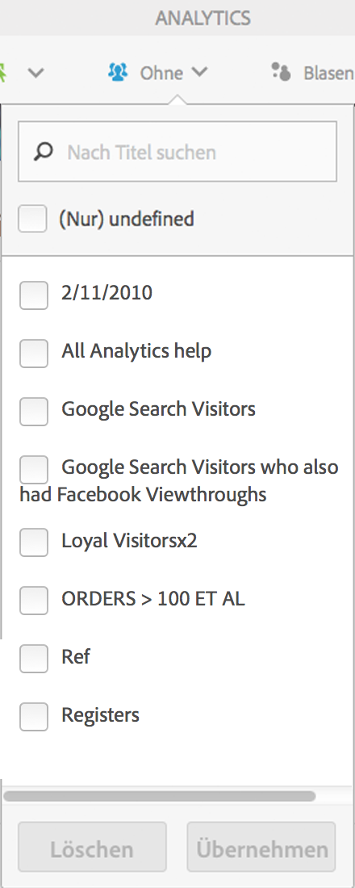
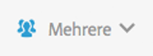

# Kundensegmentierung

Ermöglicht Ihnen, in Activity Map Filter anzuwenden, die mehrere Segmente umfassen.

>[!NOTE]
>
>Die Segmentkontrolle ist nur im Standardmodus verfügbar, da die Adobe Analytics-Plattform keine Segmentierung von Echtzeitdaten unterstützt.

You can select one or several of the segments from the **[!UICONTROL Segments]**drop-down menu shown below. Die aufgelisteten Segmente sind entweder Ihre eigenen oder solche, die über „Reports &amp; Analytics“ für die ausgewählte Report Suite für Sie freigegeben wurden.

Wenn sich die ausgewählten Segmente geändert haben und nachdem die Segmentauswahl geschlossen wurde, wird ein neuer Analytics-Datenabrufprozess für alle Metriken gestartet, die in der Anwendung angezeigt werden. Während Sie von Seite zu Seite navigieren, „merkt“ sich das Programm die ausgewählten Segmente.

Sind mehrere Segmente ausgewählt, so lautet die Beschriftung der Segmentauswahl (in minimiertem Zustand) „Mehrere“. Die vollständige Liste der ausgewählten Segmente wird angezeigt, wenn Sie auf das Steuerelement klicken.

Die ausgewählten Segmente werden auf alle in Activity Map dargestellten Analytics-Berichte angewendet, d. h. auf Überlagerungen sowie auf die Berichte **[!UICONTROL Links auf Seite]** und **Seitendetails[!UICONTROL .]**
