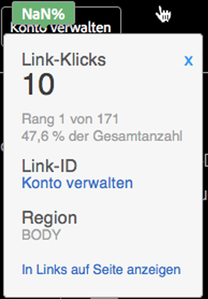

# Überlagerungsdetails

Überlagerungsdetails werden angezeigt, wenn Sie den Mauszeiger über eine Linküberlagerung bewegen.

Überlagerungsdetails zeigen die folgenden Werte an, die für diesen Link verfolgt werden:

* Metrik
* Rohdatenwert
* Rang
* Prozentwert
* Link-ID
* Region
* Bericht „In Links auf Seite anzeigen“

