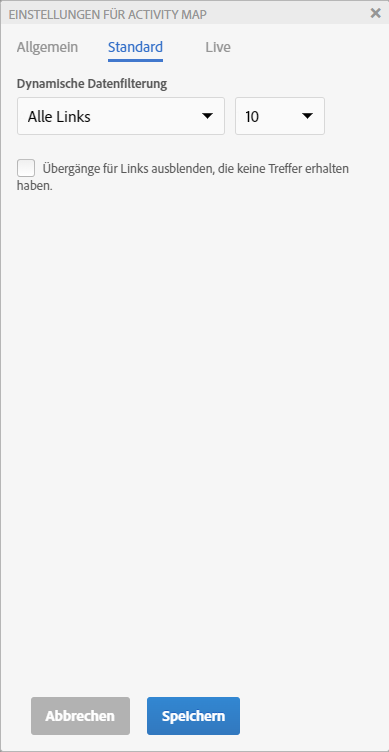
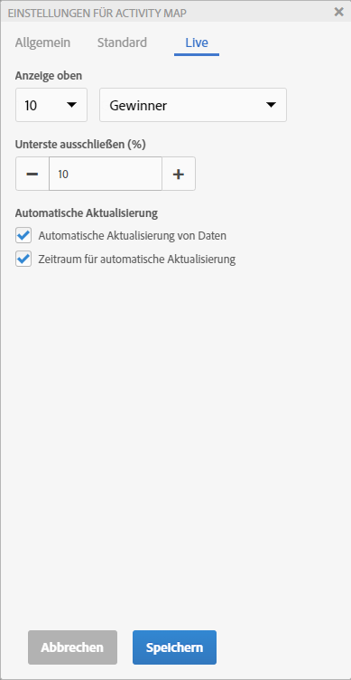
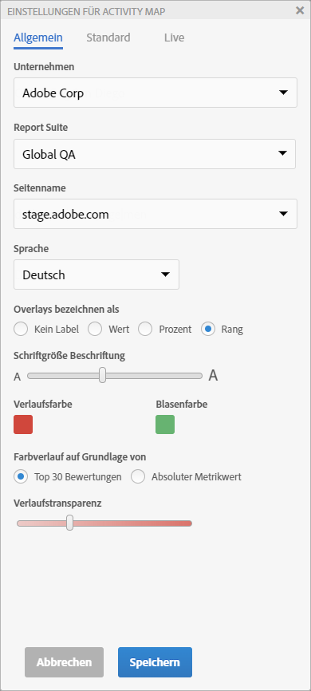

# Activity Map-Einstellungen konfigurieren

Das Activity Map-Einstellungsbedienfeld ermöglicht es Ihnen, die Einstellungen und Eigenschaften für alle Arten von Überlagerungsvisualisierungen zu ändern.

Rufen Sie das Activity Map-Einstellungsbedienfeld durch Klicken auf das Zahnradsymbol in der Activity Map-Symbolleiste auf.

Der Inhalt des Einstellungsbedienfelds variiert abhängig vom ausgewählten Anwendungsmodus. Die Registerkarte „Sonstige“ enthält allgemeine Einstellungen.

| Standard | **[!UICONTROL Verlaufs]**- oder **[!UICONTROL Blasen]**&#x200B;überlagerungen |
|---|---|
| Live | **[!UICONTROL Gewinner und Verlierer]**-, **[!UICONTROL Verlaufs]**-, **[!UICONTROL Blasen]** überlagerungen |
| Sonstige | Report Suite-Auswahl und Sprachauswahl |

## Einstellungen für die Überlagerung im Standardmodus {#section_24DB95376E1A448494ECF3F57743FC19}

<table id="table_0244107DE6D142F2A1DA4882E0ED9826"> 
 <thead> 
  <tr> 
   <th colname="col2" class="entry"> Einstellungen </th> 
   <th colname="col3" class="entry"> Beschreibung </th> 
  </tr> 
 </thead>
 <tbody> 
  <tr> 
   <td colname="col2">  Overlays bezeichnen als </td> 
   <td colname="col3"> 
    <ul id="ul_13AD02789F2D4904A35215A8FA230F3E"> 
     <li id="li_8DB71636D2074C69B0D94D3FB0CAFE28"> <b>Kein Label</b>: nur für Verlaufsüberlagerungen In diesem Fall gibt die Farbe einen Hinweis auf den Rang des Links. </li> 
     <li id="li_39C98D7EA9514C1D8731B9D21C0E73A6"> <b>Wert</b>: Der unverarbeitete Gesamtwert der Metrik für den Link </li> 
     <li id="li_A5F583E45BCD4F2399398F9DCC7FE382"> <b>Prozent</b>: Prozentsatz der Metrik für diesen Link im Vergleich zum Gesamtwert der Metrik für die Seite. </li> 
     <li id="li_E4BF7D3B863E4B6C8E737CF29ADA9D67"> <b>Rang</b>: Rang dieses Links im Vergleich zu allen Links auf der gerenderten Seite </li> 
    </ul> </td> 
  </tr> 
  <tr> 
   <td colname="col2">  Schriftgröße Beschriftung </td> 
   <td colname="col3"> Ermöglicht Ihnen, die Schriftgröße der Überlagerungsbeschriftung zur besseren Lesbarkeit mithilfe eines Reglers zu erhöhen oder zu verringern. </td> 
  </tr> 
  <tr> 
   <td colname="col2">  Anzeigen </td> 
   <td colname="col3">Wählen Sie Oben, Unten oder Alle Links zur Anzeige der Überlagerung. Wenn Sie „Oben“ oder „Unten“ auswählen, müssen Sie auch die Anzahl der anzuzeigenden Links festlegen. </td> 
  </tr> 
  <tr> 
   <td colname="col2"> Übergänge für Links ausblenden, die keine Treffer erhalten haben </td> 
   <td colname="col3"> Dieses Kontrollkästchen ermöglicht Ihnen, die Überlagerungen für Links auszublenden, die keine Treffer erhalten haben, damit die Oberfläche übersichtlicher bleibt. </td> 
  </tr> 
  <tr> 
   <td colname="col2">  Verlaufsfarbe/Blasenfarbe </td> 
   <td colname="col3">Wählen Sie aus einer Reihe von Farben aus, um den Rang eines Links in den Visualisierungen von Verlaufs- oder Blasen überlagerungen anzuzeigen. </td> 
  </tr> 
  <tr> 
   <td colname="col2">  Farbverlauf auf Grundlage von </td> 
   <td colname="col3"> 
    <ul id="ul_1B5C2A44A9EB465D8B8E9AD91AF79D69"> 
     <li id="li_C983CB68B90B492BB0774254292B5961">  Top-30-Bewertungen: Die Farbintensität wird für die 30 höchsten Werte vereinheitlicht. </li> 
     <li id="li_1E83431C8C734AB0BC82B5A66AED1189">  Absoluter Metrikwert: Die Farbintensität ist eine Funktion des absoluten Metrikwerts. </li> 
    </ul> </td> 
  </tr> 
  <tr> 
   <td colname="col2">  Verlaufstransparenz </td> 
   <td colname="col3">Wählen Sie die Transparenzstufe für Verlaufsüberlagerungen. 
Diese Einstellung wirkt sich nicht auf Blasenüberlagerungen aus. 
 </td> 
  </tr> 
 </tbody> 
</table>

## Einstellungen für Überlagerungen im Livemodus {#section_D30F6E62FB5D404090B588F396A460AF}

| Einstellungen | Beschreibung |
|---|---|
| **[!UICONTROL Anzeige oben]** | Wählen Sie „Anzahl der anzuzeigenden Links“ (oder „alle“) und **[!UICONTROL Gewinner]** oder **[!UICONTROL Verlierer]** (oder beides) zur Anzeige von Überlagerungen. |
| **[!UICONTROL Unterste ausschließen (%)]** | Wählen Sie diese Option, um Links für Gewinner oder Verlierer auszuschließen, für die wenig Daten vorhanden sind. Wenn Sie diesen Prozentsatz der Links ausschließen, werden nur noch die Links angezeigt, für die genug Daten vorhanden sind, um relevante Gewinne oder Verluste anzuzeigen. Der Prozentsatz wird anhand der Anzahl der Links auf der Seite berechnet. Beispielsweise werden durch Herausfiltern der untersten 10 % einer Liste mit 200 Links die letzten 20 Links nicht mehr angezeigt. |
| **[!UICONTROL Automatische Aktualisierung von Daten]** | Ermöglicht Ihnen, zu entscheiden, ob die auf der Oberfläche angezeigten Analytics-Daten automatisch aktualisiert werden sollen, wenn ein neuer Zeitraum berechnet wird. |
| **[!UICONTROL Zeitraum für automatische Aktualisierung]** | Wenn dieses Kontrollkästchen aktiviert wird, wird die Webseite jedes Mal aktualisiert, wenn neue Daten abgerufen werden. Dadurch können die Links auf der Seite genauer mit den erfassten Daten synchronisiert werden. |

## Sonstige Einstellungen {#section_697A12F099494D699A4BF498598178C5}

<table id="table_0F560236F8844FA0928CBB9C50D5ABEF"> 
 <tbody> 
  <tr> 
   <td colname="col1"> Report Suite </td> 
   <td colname="col2"> 
Die für Sie verfügbare Liste mit Report Suites ist nicht mehr beschränkt auf die im Web-Seiten-Tag definierten Report Suites. Sie können nun die ausgewählte Report Suite (die zu einem der Tags auf der Seite gehört) durch eine andere Report Suite ersetzen. Diese neue Report Suite muss nicht mit einem Tag auf der Seite verbunden sein. Wenn Sie die ausgewählte Report Suite in den Einstellungen für Activity Map ändern, werden die betroffenen Analytics-Berichte beim Speichern aktualisiert. 
 
 
Wichtig: Virtual Report Suites sind nicht mit dem Livemodus kompatibel, sondern nur mit dem Standardmodus. Wenn Sie sich im Livemodus für eine Standard-Report Suite befinden, jedoch in diesem Dialogfeld eine Virtual Report Suite auswählen, wird der Standardmodus angezeigt, sobald Sie hier auf OK klicken. 
 
 
Zusätzlich wird das Kalendersteuerelement neu initialisiert, um dem Kalendertyp (Gregorianisch, Einzelhandel, Benutzerdefiniert...) der Report Suite zu entsprechen. 
 </td> 
  </tr> 
  <tr> 
   <td colname="col1"> Sprache </td> 
   <td colname="col2"> Die Auswahl entspricht den angebotenen Sprachen für Adobe Analytics. </td> 
  </tr> 
  <tr> 
   <td colname="col1"> Info </td> 
   <td colname="col2"> Gibt den Namen und die Versionsnummer der Anwendung an. </td> 
  </tr> 
 </tbody> 
</table>

