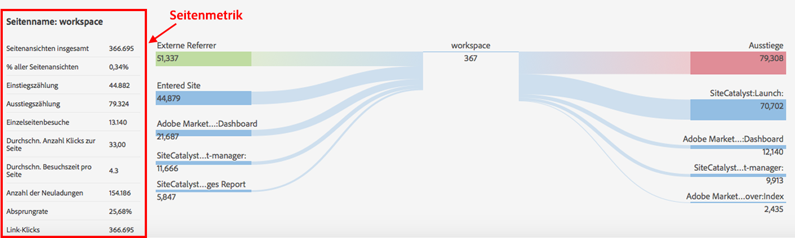

# Seitendetails

Auf der Registerkarte „Seitendetails“ wird der Seitenbericht als Tabelle und der Seitenflussbericht als BowTie-Diagramm (Schmetterlingsgraf) angezeigt.

## Seitenbericht {#section_2335A9EFE57B4A7687B397DF2098CC6B}

Dieser Bereich zeigt Traffic-Metriken auf der besuchten Webseite. Wenn Sie eine Webseite besuchen, für die der Analytics-Seiten-Tag nicht implementiert ist, wird der Bereich nicht angezeigt.

## Seitenflussbericht {#section_D6EDE78CF7124758BF846E57ADABA234}

Die linke Seite enthält die vorherige Seiten und verweisende Stellen (extern), die alternativ erweitert werden können, um die vier Einträge mit den besten Ergebnissen für jede Kategorie anzuzeigen.

Die rechte Seite enthält die vier nächsten Seiten mit den besten Ergebnissen und die Anzahl der Ausstiege.

Wenn eine URL für eine in dieser Auswahl enthaltene interne Seite verfolgt wurde, wird die Seite als Link angezeigt. Dann können Sie auf diese Seite klicken und den Pfad der Seiten mit der höchsten Affinität verfolgen. Dieser Bericht ermöglicht Ihnen also, aus der Perspektive einer Webanalyse interaktiv durch Ihre Webseiten zu navigieren.

Der Seitenflussbericht ist nur im Standardmodus verfügbar.

| **Seitenfluss** | **Beschreibung** |
|---|---|
| Externer Referrer | URL von anderen Sites, die auf die aktuelle Seite verweisen |
| Vorherige Seiten | Nennt die interne Seite in der Report Suite vor der aktuellen Seite. |
| Nächste Seiten | Die Seite, die nach dem Verlassen der aktuellen Seite besucht wird |
| Siteausstiege | Anzahl derjenigen, die die Site nach dem Anzeigen der Seite vollständig verlassen haben |

