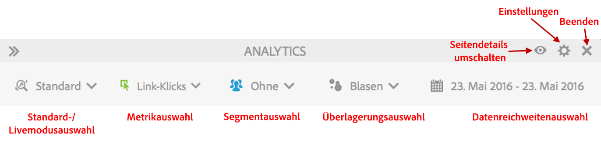
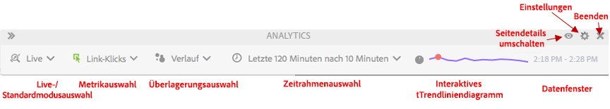

# Standardmodus im Vergleich zum Livemodus

Activity Map bietet zwei Basismodi, um zusätzliche Berichte für die Seitenaktivität zu erstellen.

* Standardmodus, in dem der Bericht [Links auf Seite](/help/analyze/activity-map/activitymap-links-report.md) die Linkdaten für einen einzelnen Tag oder für einen vollständigen, mehrere Tage umfassenden Datumsbereich anzeigt.
* Der Livemodus zeigt Aktivitätstrends in Echtzeit an.

Durch Klicken auf die Schaltfläche „Modus“ in der Symbolleiste kann zwischen den beiden Modi umgeschaltet werden.

## Standardmodus  {#section_0C755F30B7EC4A13A62AB9A391AF51E6}

Im **Standardmodus** können Sie den Datumsbereich in der Symbolleiste wie unten gezeigt auswählen.

In diesem Modus werden Handelsmetriken ohne aktivierte Option „Teilnahme“ linear zugewiesen. Nehmen wir mal an, ein Benutzer klickt auf der Startseite auf einen „iPod mini“-Link und navigiert dann durch 3 weitere Seiten. Auf der 4. Seite kauft dieser Benutzer einen iPod mini für 200 €. Dabei wird dem „iPod mini“-Link ein Teilhabeumsatz in Höhe von 200 € und ein (linear zugewiesener) Umsatz von 50 € (200 geteilt durch 4) zugeteilt.

F: Was passiert, wenn auf verschiedenen Teilen einer Seite Links mit demselben Linknamen vorkommen? Werden den Links separat Werte zugewiesen, da sie zwar in verschiedenen Bereichen stehen, aber auf der Seite denselben Linknamen aufweisen?

A: Das hängt von der Aggregation der Linkdaten ab. In Activity Map wird Link-ID|-Region für eine bestimmte Seite einbezogen, daher würden sich die entsprechenden Daten auf die Kombination „Link-ID|-Region“ beziehen. In diesem Fall wäre die Angabe „Link|Region“ spezifisch, da sich der Seitenbereich unterscheidet. Die zugeteilten Umsätze für die erste Kombination aus Link|Region würden sich in diesem Fall daher von allen Umsätzen des zweiten Links unterscheiden. In Adobe Analytics können Sie sich allerdings nur den Link-ID-Bericht (anstatt eines „Link|Region“-Berichts) für eine bestimmte Seite (nach Link aufgeteilt) ansehen. In diesem Fall werden Umsätze für alle Linkvorkommnisse aggregiert.

## Livemodus  {#section_D619B77D89A840F0B1C2DEA2715A516A}

Im **Livemodus** werden Analytics-Daten in Inkrementen von 1 bis 15 Minuten in Trendform angezeigt. Bei diesem Modus steht die Analyse und Überwachung kurzfristiger Trends auf der Webseite im Vordergrund.

Der Livemodus ist eine Reaktion auf die Bedürfnisse von publizierenden Unternehmen. Diese Unternehmen müssen Microtrends zur Beliebtheit von Links auf einigen wichtigen Seiten überwachen. Die Möglichkeit, schnell zu erkennen, welche Links schlechter abschneiden oder besonders beliebt sind, ist für publizierende Unternehmen von wesentlicher Bedeutung.

>[!IMPORTANT]
>
>Virtual Report Suites sind nicht mit dem Livemodus kompatibel, sondern nur mit dem Standardmodus.

