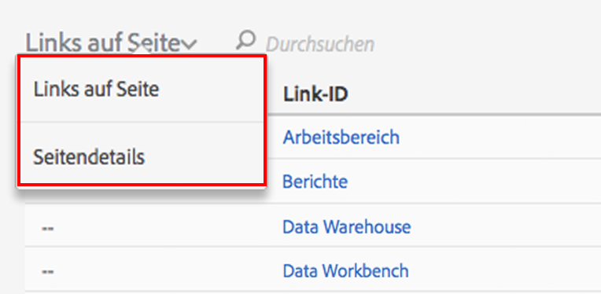

# Activity Map-Benutzeroberfläche

Die Activity Map-Benutzeroberfläche besteht aus zwei Teilen:

* Oben wird das Fenster mit der Webseite, den eingefügten Überlagerungen und der Symbolleiste angezeigt.
* Unten befindet sich ein Bereich für Berichte.

## Oberer Bereich {#section_2DA8ACD35D4C4ACBA32C13EFB5317E7C}

Im oberen Bereich können Sie Ihre Webseite mit der [eingefügten Symbolleiste](/help/analyze/activity-map/activitymap-standard-live.md) und den [Linküberlagerungen](/help/analyze/activity-map/activitymap-gainerslosers.md) sehen. Über den Links werden Blasen angezeigt, in denen Sie den Rang und die Gesamtzahl der Klicks sehen.

Wenn Sie den Mauszeiger über die einzelnen Linküberlagerungen bewegen, erhalten Sie Zugriff auf zusätzliche Linkdetails:

## Unterer Bereich für Berichte {#section_21B129D69B7A4F918E975E8E66DB02EE}

Am unteren Rand der Seite können Sie den Bericht [Links auf Seite](/help/analyze/activity-map/activitymap-links-report.md) und den Bericht [Seitendetails](/help/analyze/activity-map/activitymap-page-flow.md) sehen, die eine Zusammenfassung der aktuellen Webseitenstatistik sowie Seitenflussinformationen anzeigen.

Der Bericht „Links auf Seite“ bietet Ihnen eine Tabellenansicht der Links auf der aktuellen Seite, einschließlich zusätzlicher Klickinformationen. Der Bericht „Seitendetails“ stellt Analysedaten zu den Seiten dar, die vor und nach dem Besuch der aktuell angezeigten Seite aufgerufen wurden.

